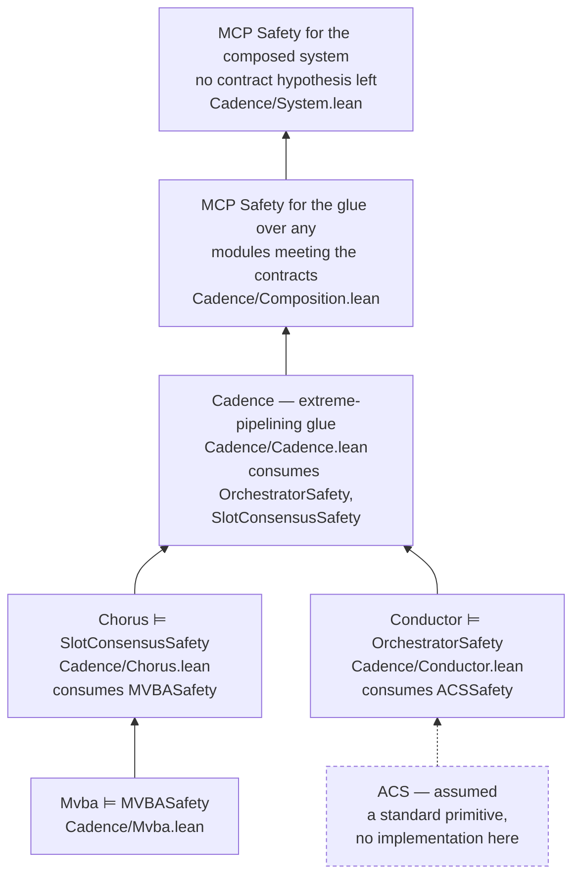
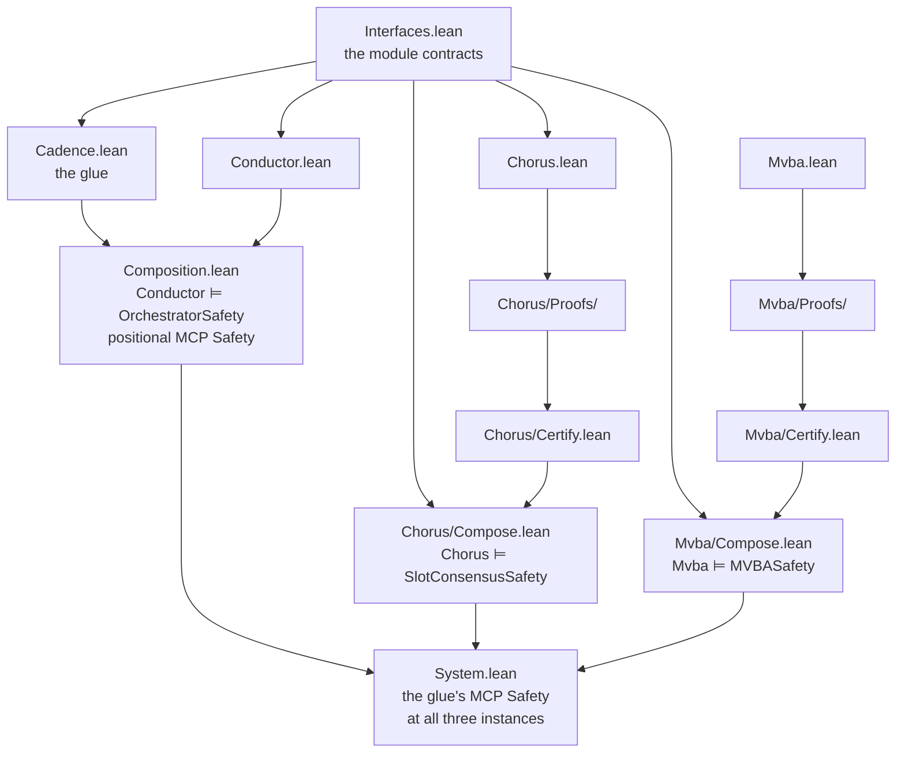

# Cadence — machine-checked verification (Veil / Lean 4)

A formal verification of the [**Cadence**](https://www.category.xyz/cadence)
BFT consensus protocol (see [§ The protocol paper](#the-protocol-paper)): the
per-slot consensus **Chorus**, the window-based orchestrator **Conductor**, the
pipelining **Cadence** layer that composes them, and the fallback
receipt/propose layer.

Written in [Veil](https://github.com/larskuhtz/veil) on Lean 4. Veil is an
embedded DSL: a `.lean` file *is* the model, and elaborating the file *runs*
its verification. There is no separate proof script — `lake build` elaborates
the files, the verification commands fire during elaboration, and **if any of
them fails, the build fails**.

> **Status.** The SMT solver is not in the trust base: every discharge is
> reconstructed as a Lean proof term and re-checked by the kernel. Every end
> theorem is pinned to exactly `propext` / `Classical.choice` / `Quot.sound`
> — Lean's three standard axioms — with no `sorry` and no trusted solver
> verdict. The receipt layer additionally keeps a bug from an earlier version
> of the paper as a machine-checked refutation.

**Start here:** [`Cadence.lean`](./Cadence.lean) — the audit root. It imports
every finished result and re-derives each axiom's footprint as a build-checked
pin, so the whole trust base can be read off one page.

---

## Map of the development

The paper decomposes Cadence into modules and proves the top-level properties
from their specifications. The formalisation mirrors that decomposition: each
paper module is a type class in
[`Cadence/Interfaces.lean`](./Cadence/Interfaces.lean), and each layer is a
Veil model that **implements** one contract and **consumes** the contracts
below it.



| Layer | Paper | Model | Proves | Consumes |
|---|---|---|---|---|
| Pipelining glue | `algorithm:cadence` | [`Cadence/Cadence.lean`](./Cadence/Cadence.lean) | MCP Safety (positional) | Orchestrator, SlotConsensus |
| Slot scheduling | `mod:orchestrator_2` | [`Cadence/Conductor.lean`](./Cadence/Conductor.lean) | `Conductor.orchestratorSafety` | ACS |
| Per-slot consensus | `mod:slotconsensus` | [`Cadence/Chorus.lean`](./Cadence/Chorus.lean) | `Chorus.slotConsensusSafety` | MVBA |
| Byzantine agreement | `mod:mvba` | [`Cadence/Mvba.lean`](./Cadence/Mvba.lean) | `Mvba.mvbaSafety` | — |
| Fallback receipts | `alg:fallback` | [`Cadence/FallbackReceipt.lean`](./Cadence/FallbackReceipt.lean) | meta-block validity by construction | — |

The receipt layer implements no contract: it refines one step *inside*
Chorus's fallback path — assembling a valid meta-block from received receipts
— at a finer per-validator grain than the Chorus model uses.

Each arrow reads "fills the contract constraint above it", and each is a Lean
instance rather than a correspondence argued in prose — except the dashed
one, which marks the single contract nothing here implements. What each
implementation does **not** prove of its contract is the field list of a
class it supplies no instance of; see
[docs/CompositionContracts.md](./docs/CompositionContracts.md) §5.

---

## Audit Guide

### A. Machine-checked

You do not need to trust this project's authors, for any of the
following claims. They are re-derived by the machine on every build, and a violation
is a build failure.

| What is guaranteed | How it is enforced |
|---|---|
| Every stated theorem has a **complete proof**, checked by Lean's kernel | the build; plus the axiom pins in [`Cadence.lean`](./Cadence.lean) — a `sorry` anywhere shows up as the axiom `sorryAx` and fails the pin |
| The trust base has not drifted (no extra axiom crept in) | `#guard_msgs in #print axioms <thm>` for every end theorem, in [`Cadence.lean`](./Cadence.lean) and at each result's own site |
| **cvc5's verdicts are not believed.** Every solver discharge is reconstructed as a Lean proof term and re-checked by the kernel | all models elaborate with `veil.smt.trust false`; if a proof cannot be reconstructed, the cell fails |
| **Nothing is stubbed.** Every Chorus verification condition (one per action × property, plus a does-not-throw check per action), and every one of the receipt layer's and of the MVBA instantiation's, has a real, statement-matching, kernel-checked theorem in scope | the pinned `#veil_status` lines in `Cadence/Chorus/Certify.lean`, `Cadence/FallbackReceipt/Certify.lean` and `Cadence/Mvba/Certify.lean`, each asserting *all* cells real with the axiom union over all of them |
| The verification conditions are the ones the model states — they are not re-typed by hand anywhere | the proof files read their statements out of the model's own persisted registry; identity is by construction |
| **The composition is not a transcription.** The glue, the Conductor and Chorus consume the sub-protocol contracts as *class constraints* over abstract states (`instantiate orch : OrchestratorSafety …`, `instantiate sc : SlotConsensusSafety …`, `instantiate acs : ACSSafety …`, `instantiate mvba : MVBASafety …`), so no contract property is restated as a guard or invariant; the implementations' instances (`Conductor.orchestratorSafety`, `Chorus.slotConsensusSafety`, `Mvba.mvbaSafety`) are checked against the same classes. Two stated *bridges* remain — the ACS median range and the MVBA decision's certificate check — each the interpretation of a class parameter in the consumer's vocabulary rather than a restatement (docs/CompositionContracts.md §7) | the `instantiate` lines in `Cadence/Cadence.lean`, `Cadence/Conductor.lean` and `Cadence/Chorus.lean`; the instance definitions' types; `Cadence/System.lean`, which instantiates the glue's end theorem at the instances, with `Mvba.mvbaSafety` filling Chorus's constraint, and leaves no contract hypothesis |
| **What is not proven about the composition is a type, not prose.** Each implementation's unproven contract obligations are the fields of a class it has *no instance of* — stated over the very transition system it proved, so they are written down once and nowhere else | `OrchestratorTemporal` / `orchestrator_of_temporal` (`Cadence/Composition.lean`), `SlotConsensusTemporal` / `slotConsensus_of_temporal` (`Cadence/Chorus/Compose.lean`), `MVBATemporal` / `mvba_of_temporal` (`Cadence/Mvba/Compose.lean`) — each join paired with a `rfl` lemma that it hands back exactly the proven fragment |
| The receipt rules of the paper's **v1** really are broken | `Cadence/FallbackReceipt/PreFix.lean` pins the model checker's counterexample; the file builds only if the bug is still found, verbatim |
| The MVBA instantiation's invariants are **load-bearing**, not merely true: remove the lock check and agreement fails | `Cadence/Mvba/NoLock.lean` pins the model checker's counterexample to the mutant; the file builds only if the violation is still found, verbatim |

In short: `lake build` succeeding is the claim. You can re-derive any pin
yourself — drop a `#guard_msgs in` line, or run `#print axioms <name>` in a
scratch file (see [Working on the models](#working-on-the-models) below).

The script `scripts/container.sh check` re-runs **Lean's kernel over every
declaration in the development** — every reconstructed Chorus proof
included — in **4 minutes**, with no SMT solver, no tactic execution and no
elaboration. Forcing the elaborator to redo the whole project from source on
top of that is a further 9 minutes; re-solving every verification condition
with cvc5 from scratch, about 90 minutes. What each of those does and does not
establish — and how both differ from simply *importing* prebuilt `.olean`
files, which are trusted rather than re-checked — is the audit ladder in
[docs/Container.md](./docs/Container.md) §3–§4.

### B. To be checked by an auditor

Machine checking establishes that the proofs are complete. It cannot
establish that the *statements* are the right ones. Three questions remain
for a human reader:

1. **Does the model faithfully describe the protocol?** The models are the
   `.lean` files listed under [What is where](#what-is-where); each carries a
   long header explaining its modelling choices, and
   [docs/ChorusDesign.md](./docs/ChorusDesign.md) is the full design-rationale
   document for the big one. The abstractions deliberately taken (chunk
   indices, erasure coding, payload bytes, single slot for Chorus) are listed
   in [docs/Architecture.md](./docs/Architecture.md) §4 item 5 and
   [docs/ChorusDesign.md](./docs/ChorusDesign.md) §3.4 and §8.
2. **Are the top-level properties the right properties?** The end
   theorems, in the paper's own vocabulary, are tabulated in
   [`Cadence.lean`](./Cadence.lean) and in [What is proven](#what-is-proven)
   below. The paper's *module contracts* — the interfaces the layers are
   proven against, stated in full as type classes (every property of each
   paper module, safety and liveness alike) and consumed by the models as
   class constraints — are [`Cadence/Interfaces.lean`](./Cadence/Interfaces.lean);
   [docs/CompositionContracts.md](./docs/CompositionContracts.md) explains the
   encoding and names the seams that remain.
3. **Are the meta-theoretic assumptions sound?** Everything deliberately kept
   outside Lean — the network abstraction's soundness contract, the fairness
   axioms and the fairness-to-liveness reduction, the cryptographic
   primitives, the timing/quantitative module obligations — is a **named,
   complete inventory**: [docs/Architecture.md](./docs/Architecture.md) §4.
   That inventory is the audit checklist. It is short on purpose.

Item 3 lists assumptions *by name*, and the fairness and oracle axioms appear
verbatim in the Lean sources where they are consumed — `grep -rn '(A-'
Cadence/` enumerates them — so the inventory's completeness is checkable. The
one assumption without that property is the network contract, which is why it
is item 1 of the inventory and a standing rule in [CLAUDE.md](./CLAUDE.md): a
violation of it would not fail the build.

*The file [docs/AuditReport.md](./docs/AuditReport.md) contains an audit report
that was created by [Aristotle (Harmonic)](https://aristotle.harmonic.fun) for
the revision bfeee8c of this project against the version 2 of the Cadence
paper published on arxiv.*

---

## What is proven

Three methods appear in the table; [docs/Architecture.md](./docs/Architecture.md)
§2 defines them and gives the per-module counts.

* **sweep** — one inductive-invariant verification condition per action ×
  property, discharged by cvc5 with **proof reconstruction**, so every
  discharge is a Lean proof term the kernel re-checks. For the three large
  models the proofs live in per-action files and the per-VC evidence is
  pinned by `#veil_status`.
* **composition** — plain Lean over the persisted VC theorems: an induction
  over reachable states, then the module contract's instance.
* **model check** — exhaustive exploration of a concrete instance
  (`n = 4`, `f = 1`), used only where it is complete evidence.

Every row below is axiom-pinned at `[propext, Classical.choice, Quot.sound]`
in [`Cadence.lean`](./Cadence.lean).

| Claim | Where | Method |
|---|---|---|
| **Agreement** — correct validators never finalize conflicting proposal vectors | `Cadence/Chorus.lean` (`agreement_pos`, `agreement_pos_neg`) → `Chorus.slotConsensusSafety` | sweep + composition |
| **Proposal inclusion** (censorship resistance, under the paper's synchrony premise) | `Cadence/Chorus.lean` → instance field | sweep + composition |
| **Hiding until the deadline** (protocol half) | `Cadence/Chorus.lean` (`hiding_until_deadline`) | sweep; the cryptographic half is axiomatised (`Cadence/Primitives.lean`) |
| **Speculative-finality revertibility** ("reverted only if the proposer is the culprit") | `Cadence/Chorus.lean` (`speculative_agreement_*`) | sweep, conditional on `no_equivocation` + `no_invalid_encoding` — the paper's full culprit set: equivocation, or committing to an invalidly encoded root |
| **Fair-progress liveness content** (no livelock of fair actions — strictly stronger than deadlock-freedom) | `Cadence/Chorus.lean`, liveness section | sweep + the named temporal assumptions ([docs/Liveness.md](./docs/Liveness.md)) |
| **Progress dichotomy** — the liveness case split as one theorem: in any reachable state where every honest validator has cast its path vote, either commitQCs exist for every proposer from honest votes alone, or the MVBA stands invoked with decide-enabling evidence for every proposer, for **every** `n = 3f+1` | `Cadence/Chorus/Progress.lean` (`progress_dichotomy_of_saturation`); its counting inputs — the evidence pigeonhole and certificate formation — are separately stated and pinned in `Cadence/Chorus/Pigeonhole.lean` and `Cadence/Chorus/Counting.lean` | plain Lean over reachable states |
| **Network-level build totality** — any supermajority of accepted receipts (Byzantine members included) yields a buildable fallback meta-block entry per proposer: the state-level half of "every correct validator can propose", for **every** `n = 3f+1` | `Cadence/Chorus/Counting.lean` (`build_totality_of_reachable`) | plain Lean over reachable states |
| **MCP Safety, positional form** — for the glue over *any* orchestrator and slot consensus satisfying the contracts, and **for the composed system** (the glue running the Conductor's and Chorus's own transition systems, Chorus running the `Mvba` model's as its MVBA; no contract hypothesis left) | `Cadence/Composition.lean` (`positional_log_safety`), `Cadence/System.lean` (`system_positional_log_safety`) | sweep (against the contracts as class constraints) + composition |
| **`Conductor ⊨ OrchestratorSafety`**, **`Chorus ⊨ SlotConsensusSafety`** — the state-level fragments of the paper's module contracts, every field proven (including the two-state fields: monotonicity of the observables, frames, the paper's Monotonicity) | `Cadence/Composition.lean` (`Conductor.orchestratorSafety`), `Cadence/Chorus/Compose.lean` (`Chorus.slotConsensusSafety`) | composition, over persisted VC theorems and Veil's transition bodies |
| **The joins toward the full contracts** — given an `OrchestratorTemporal` instance at the proven fragment (Totality, `B`-Boundedness, `R`-Recovery, the execution model) the Conductor is a full `Orchestrator`; given a `SlotConsensusTemporal` one (the participation interface, Termination, Quiescence, the clock) Chorus is a full `SlotConsensus`. This development supplies neither, and that is precisely the claim about what is unproven. Integrity's timing half and Hiding's protocol half are first-order and *are* proven — they sit in the fragments | `orchestrator_of_temporal`, `slotConsensus_of_temporal` | plain Lean; what is unproven is a hypothesis, never an axiom |
| **Fallback meta-block "valid by construction"**, including the counting argument, for **every** `n = 3f+1` | `Cadence/FallbackReceipt.lean` + `Cadence/FallbackReceipt/Totality.lean` | sweep + composition |
| **The v1 receipt rules are broken** — the rules as published in `arXiv:2607.02275v1`, before the fix that v2 carries; the bug, mechanically reproduced | `Cadence/FallbackReceipt/PreFix.lean` | exhaustive model check; the counterexample trace is pinned in the build |
| **MVBA agreement, integrity and external validity** — the three safety properties of `mod:mvba`, for the leader-based instantiation of the paper repository's *internal supplement* (views, timeouts, timeout certificates, the lock; the referent is pinned to a paper-repository commit in the model's header and is not yet part of the published paper) | `Cadence/Mvba.lean` (`agreement`, `integrity`, `external_validity`) → `Mvba.mvbaSafety` | sweep + composition |
| **`Mvba ⊨ MVBASafety`** — the state-level fragment of the paper's MVBA contract, every field proven, including the two inputs, their observables and **Quiescence**; given an `MVBATemporal` instance (the clock, the admissible-run model, `ℓ_MVBA`-Termination — four fields, nothing safety-shaped) the instantiation is a full `MVBA`. Chorus consumes the class as a constraint and `Cadence/System.lean` fills it with this instance | `Cadence/Mvba/Compose.lean` (`Mvba.mvbaSafety`, `mvba_of_temporal`) | composition, over persisted VC theorems and Veil's transition bodies |
| **The MVBA's lock check is load-bearing** — with the `Pre-Prepare` handler's lock check removed, two correct validators decide different vectors: the mutation test showing the instantiation's invariants are needed, not merely true | `Cadence/Mvba/NoLock.lean` | exhaustive model check of a restriction of the mutant (every run of which is a run of the mutant); the counterexample trace is pinned in the build |

What is *not* proven in Lean — timing bounds, the scheduling (fairness)
assumptions and the fairness-to-liveness reduction (the liveness argument's
entire *state-level* content **is** machine-checked —
[docs/Liveness.md](./docs/Liveness.md)), the cryptographic primitives,
the monotone-network soundness contract — is the named assumption inventory in
[docs/Architecture.md](./docs/Architecture.md) §4. For the two sub-protocol
implementations, the temporal part of that inventory is also a *type*: the
`…Temporal` classes above list, field by field, what each still owes of its
paper contract — and the absence of an instance is how the development says
it does not have one.

---

## Checking the proofs

The quickest check needs no build at all. Prebuilt images — this project
already built and verified inside the image — are published for `linux/arm64`
and `linux/amd64`. [`scripts/container.sh`](./scripts/container.sh) pulls what
it needs on first use (~4 GiB, once):

```bash
RUNTIME=podman scripts/container.sh check    # kernel-re-check every proof — 4 min, no solver
RUNTIME=podman scripts/container.sh verify   # re-verify against the checkout's sources
```

`RUNTIME` selects `podman`, `docker`, or Apple's `container`. The two commands
are tiers 1 and 2 of an audit ladder that ends at "re-solve every verification
condition from scratch". What each tier does and does not establish — in
particular, what a prebuilt `.olean` proves — is
[docs/Container.md](./docs/Container.md) §3–§4. Every tier, including the
last, also runs natively on Linux and macOS ([below](#building-natively));
the container just fixes the environment.

## Working on the models

The `dev` image is the same environment with the sources mounted. Open the
folder in VS Code with the **Dev Containers** extension —
[`.devcontainer/`](./.devcontainer) uses the published image — or work from a
terminal:

```bash
RUNTIME=podman scripts/container.sh shell    # interactive shell in the workspace
RUNTIME=podman scripts/container.sh verify   # staged re-verification, after an edit
```

Opening a file costs what it elaborates: `Cadence/Chorus.lean` runs no
invariant sweep but elaborates the model plus its background does-not-throw
checks (a couple of minutes); a `Cadence/Chorus/Proofs/` file re-proves one
action's cells (seconds with a warm cache, minutes cold); the consumer files
load prebuilt `.olean`s in seconds. To suppress solving entirely while
editing, set `VEIL_NO_VERIFY=1` in the *editor's* environment — the
devcontainer already does; never set it in a shell profile, since `lake build`
must still verify. Every skipped command reports a visible
`⏭ skipped (veil.noVerify)` warning, so "no errors" in this mode never means
"verified".

The development workflow and the model-specific rules are in
[CLAUDE.md](./CLAUDE.md). Building the images yourself — needed only when the
dependency tree changes — is [docs/Images.md](./docs/Images.md).

### Building natively

Requires [elan](https://github.com/leanprover/elan); the pinned toolchain and
the dependency tree are fetched automatically on the first build. Building also
needs a system `clang` with a version-matched `libc++` development package
(providing the compiler's resource-dir headers): that is a transitive native
dependency of the cvc5 binding used for proof reconstruction, whose build
compiles an FFI shim with a hardcoded `clang -std=c++17 -stdlib=libc++`
invocation. elan's bundled toolchain `clang` does not ship those headers and
cannot substitute.

```bash
LEAN_NUM_THREADS=4 lake build   # everything: models, all 76 per-action proof
                                # files, composition certificates, end
                                # theorems, the audit root's axiom pins,
                                # and the monitor
```

Bound the parallelism on the **first** build, as above. `lean-smt` and
`lean-auto` compile their own native plugins, and if that build is OOM-killed
mid-link the half-written libraries are left in place and considered
up-to-date, so every later build fails in milliseconds while loading them.
Recovery is `rm -rf .lake/packages/{auto,smt}/.lake/build`. Lake has no `-j`
flag; `LEAN_NUM_THREADS` is the only control.

**Memory.** `lake build` schedules all 76 proof files — 41 Chorus, 25 MVBA,
10 receipt-layer — at once, and a *cold* proof file peaks around 5 GB of
resident memory (lake has no job cap). On a machine with less than ~64 GB,
build in stages instead — the same work in the same order, batched:

```bash
scripts/revalidate.sh          # staged full build, batched
BATCH=3 scripts/revalidate.sh  # ... narrower batches, for a cold run
scripts/revalidate.sh /tmp     # ... and write the RSS sample log there
```

`BATCH` is how many proof files solve concurrently. The default of 6 suits a
warm cache; a *cold* run is both memory- and CPU-bound, and on a 14-core /
36 GB machine measured 32.0 GB peak at `BATCH=6` against 20.7 GB at
`BATCH=3` — with one near-budget verification condition timing out spuriously
at the wider setting. Use `BATCH=3` cold, `BATCH=1` on eight cores or fewer.

Individual pieces, for iteration:

```bash
lake build Cadence.Chorus                    # the per-slot consensus MODEL (no sweep) — ~2 min
lake build Cadence.Chorus.Proofs.Vote        # one Chorus action's ~100 proof cells
lake build Cadence.Chorus.Certify            # composition certificate + the #veil_status audit pin
lake build Cadence.Mvba Cadence.Mvba.Certify # the MVBA model and its certificate
lake build Cadence.Cadence Cadence.Conductor # the two small models, sweeps included
lake build Cadence.FallbackReceipt           # receipt model + its n=4 exhaustive model check
lake build Cadence                           # the audit root: every axiom pin, re-derived
```

**Reading the output.** Verification results are marked `✅` proven, `❌`
counterexample, `💥` solver crash, `⏱` timeout, and `♻` proof-cache replay
(kernel-checked). Count **all four** of the first group: grepping only for
`❌` hides timeouts and crashes. A healthy build has only `✅` and `♻`.

**Two timing regimes.** Discharged proofs are cached on disk under
`.lake/build/veilcache/` and replayed (kernel-checked) on later builds, so a
re-validation is much cheaper than a first build. A first build re-solves all
~5 200 verification conditions and reconstructs every proof: budget around 85
CPU-minutes for the Chorus family. A warm re-validation replays them instead —
on a 14-core Apple-Silicon machine, deleting the project's oleans and running
`scripts/revalidate.sh` against a warm cache takes about 6½ minutes end to
end, every replay kernel-checked, peaking at 12 GB resident. The cache is a
build artefact, not shipped, and safe to delete at any time: it only ever
skips proof *search*, never checking.

Do not run other heavy jobs concurrently with a *cold* proof-file build: some
verification conditions sit close to the solver time budget, and stolen cores
turn them into spurious timeouts.

A native build works on macOS and Linux alike, from any checkout path. The
container path is for a *fixed, published* environment rather than to work
around a platform limitation — see [docs/Container.md](./docs/Container.md).

---

## How the proof fits together

### The commands that do the work

| Command | What it does |
|---|---|
| `veil module …` / `#gen_spec` (in the model files) | turns the declared state, actions and invariants into a transition system, and prepares one *verification condition* (VC) per action × property — "if the invariants hold and this action fires, this property still holds" — plus a does-not-throw VC per action |
| `#prove_action <Module> <action>` (one per file under `<Model>/Proofs/`) | re-creates every VC of one action from the module's persisted registry, discharges it with cvc5, **reconstructs** each `unsat` verdict as a Lean proof term that the kernel re-checks — the solver's word is never taken — persists the theorems, and emits the action's preservation lemma. Cells SMT cannot find carry a hand-written *tactic* in the same file (`#prove_vc … by <tactic>`) — the statement still comes from the registry — and are consumed after a statement check |
| `#gen_composition <Module>` (in `<Model>/Certify.lean`) | composes the per-action preservation lemmas into `<Module>.invariants_of_reachable` — every reachable state satisfies every invariant — plus one named `reachable_<property>` projection per property; kernel-checked at every step |
| `#veil_status <Module>` (pinned in `<Model>/Certify.lean`) | the audit command: walks the module's VC registry against the environment and reports, per VC, whether a real, statement-matching, kernel-checked theorem is in scope, and the axiom union over all of them. `#veil_status <Module> table` prints the full per-VC table |
| `#model_check` (receipt layer; the two refutations) | exhaustively explores a small concrete instance (`n = 4`, `f = 1`) — an independent, solver-free check over the same properties; and, in `FallbackReceipt/PreFix.lean` and `Mvba/NoLock.lean`, the mechanical refutations whose pinned counterexamples a green build requires |
| `#gen_theorems` (the small models `Cadence/Cadence.lean`, `Cadence/Conductor.lean`) | after an in-file `#check_invariants` sweep, persists each proven VC as a named theorem in the module's `.olean` |
| `#guard_msgs in #print axioms <thm>` | the trust-base pin: the build fails unless the theorem depends on *exactly* the expected axioms |

### How the files feed each other

The Chorus leg; the other legs are smaller instances of the same shape.

```
Cadence/Chorus.lean          the MODEL: state, actions, invariants. Elaborating it
   │                         persists every VC statement (the "VC registry") — it
   │                         runs no invariant sweep and persists no proofs
   ▼ imported by
Cadence/Chorus/Proofs/*.lean one file per action (41): #prove_action re-proves every
   │                         registered VC statement of that action → real
   │                         kernel-checked proofs, plus one exported preservation
   │                         lemma ("this action preserves all invariants"). The
   │                         manual quorum-intersection proofs live here too
   ▼ imported by
Cadence/Chorus/Certify.lean  #gen_composition: induction over all reachable states —
   │                         one case per action, applying its preservation lemma —
   │                         plus a named projection per property; ends in its
   │                         #guard_msgs axiom pin and the #veil_status audit pin
   ▼ imported by
Cadence/Chorus/Compose.lean      hand-written end theorems: Chorus ⊨ SlotConsensusSafety,
Cadence/Chorus/Pigeonhole.lean   and the evidence pigeonhole — each ending in its
                                 own #guard_msgs axiom pin
```

The per-action file layer exists for one reason: a module's proofs would
otherwise all have to sit in a single process's environment to be persisted,
which exceeds a 32 GB machine. One small file per action keeps every process
small, and the composition needs only one lemma per action. Those files are
ordinary hand-owned Lean files, scaffolded once by `#gen_proof_files`.

`Cadence/Cadence.lean` and `Cadence/Conductor.lean` are small enough to
persist their real proofs directly, and `Cadence/Composition.lean` consumes
them the same way. The receipt layer uses the same family shape and doubles
as the architecture's fast regression leg.

### What depends on what

The import graph is worth reading separately from the logical composition,
because the two run in opposite directions. A model that *consumes* a
contract does not import the module that implements it — it imports only
`Interfaces.lean`. The instances are joined up afterwards, and exactly one
file imports all three legs:



Two consequences worth noting. `Cadence.lean` and `Conductor.lean` import no
proof of any other module — their theorems are statements about *any* modules
meeting the contracts — so editing them never re-runs the Chorus family,
whereas editing a contract does. And `System.lean` is the single file where
the three legs meet; it is the only one that imports all of them.

The receipt layer imports none of this and is verified on its own terms.

---

## What is where

```
Cadence.lean                       AUDIT ROOT: every end theorem, every axiom pin
Cadence/
  Chorus.lean                      per-slot consensus MODEL — no sweep; consumes the
                                    MVBA as a class constraint (instantiate mvba);
                                    persists the VC registry (both proof encodings of
                                    each obligation); the audited cell count is the
                                    #veil_status pin in Chorus/Certify.lean
  Chorus/Proofs/                    one proof file per action (41): #prove_action —
                                    persisted real proofs + one preservation lemma each;
                                    the manual cells live here
  Chorus/Certify.lean               #gen_composition: reachability induction + named
                                    per-property projections (axiom- and audit-pinned)
  Chorus/Compose.lean               Chorus ⊨ SlotConsensusSafety + the join toward the
                                    full SlotConsensus  (axiom-pinned)
  Chorus/Pigeonhole.lean            evidence pigeonhole for every n = 3f+1  (axiom-pinned)
  Conductor.lean                   window-based orchestrator MODEL (+ sweep, traces, theorems)
  Cadence.lean                     extreme-pipelining MODEL (+ sweep, traces, theorems)
  Composition.lean                 Cadence + Conductor reachability inductions,
                                    Conductor ⊨ OrchestratorSafety + the join toward the
                                    full Orchestrator, positional MCP Safety
  System.lean                      the composed system: the glue's MCP Safety at the
                                    Conductor, Chorus and Mvba instances — the only
                                    file importing all three legs (axiom-pinned)
  FallbackReceipt.lean             fallback receipt/propose MODEL, the paper's v2 design
                                    (+ the n=4 exhaustive model check)
  FallbackReceipt/Proofs/, FallbackReceipt/Certify.lean
                                   the receipt layer's proof-file family (axiom-pinned)
  FallbackReceipt/Totality.lean    build totality for every n = 3f+1 (axiom-pinned)
  FallbackReceipt/PreFix.lean      the v1 rules, mechanically refuted (pinned counterexample)
  Mvba.lean                        leader-based MVBA MODEL — the internal supplement's
                                    instantiation, referent pinned in the header; no sweep,
                                    VC registry, three sat trace witnesses
  Mvba/Proofs/, Mvba/Certify.lean  the MVBA family's proof files (25; two manual cells) and
                                    certificate (axiom- and audit-pinned)
  Mvba/Compose.lean                Mvba ⊨ MVBASafety + the join toward the full MVBA
                                    (axiom-pinned)
  Mvba/NoLock.lean                 the lock check removed, mechanically refuted (pinned
                                    counterexample — the mutation test)
  Interfaces.lean                  the module contracts — SlotConsensus / Orchestrator / ACS /
                                    MVBA as two-level type classes over explicit state
                                    (the …Safety fragments the models consume; the full
                                    classes with every temporal obligation)
  Primitives.lean                  cryptographic primitive classes (ThresholdIBE, …)
  ByzQuorum.lean                   Byzantine-quorum instances, non-vacuity witnesses
  Windows.lean                     the ACS median lemma (plain Lean)
  Tooling.lean                     targeted #check_vc / #check_invariant commands
  Monitor/
    Alphabet.lean                  reflects Chorus.Label → published alphabet (JSON) + Rust stub
    ChorusMonitor.lean             model-conformance monitor (hand-written oracle) + CLI
    ChorusMonitorGen.lean          same monitor, instantiation generated by #gen_monitor
    TraceMutate.lean               corrupt a valid trace, to model implementation bugs
Containerfile                      multi-stage OCI image: toolchain / deps / dev /
                                    build / verified / verified-cache
.devcontainer/                     opens the dev image in VS Code
.github/workflows/                 CI: re-verify every commit; publish the images
scripts/                           staged build, container dispatch, monitor suites
traces/                            JSONL trace fixtures for the monitor
docs/                              see the reading guide below
```

---

## Model-conformance monitor

The proofs above establish Chorus's safety invariants over *all* reachable
states of the model. A separate, complementary question is whether a real
execution of the Rust implementation refines the model. The monitor answers
it by replaying a projected implementation trace against the model and
reporting whether the model *accepts* (simulates) it — it runs the model's own
action bodies, one trace label at a time, and a failed guard means the
implementation diverged. It is **not** model checking and not a re-proof.

```bash
scripts/run-chorus-monitor.sh < traces/fast_path_negative.jsonl
#   → ACCEPTED — 18 step(s) simulated by the model ✓   (exit 0)

scripts/test-chorus-monitor.sh        # acceptance regression (both monitors must agree)
scripts/test-monitor-divergence.sh    # negative regression: every mutated trace must be REJECTED
scripts/test-single-node-monitor.sh   # per-node projection mode
```

Design, scope, the emitter contract and the full flag reference:
[docs/Monitor.md](./docs/Monitor.md).

---

## Reading guide

The documentation is layered, so that a reader can stop at the level of
detail they need. Nothing below assumes familiarity with Lean or with formal
verification; the deeper layers assume progressively more.

### Level 1 — what is claimed (about an hour)

| | |
|---|---|
| The end theorems and the trust base on one page | [`Cadence.lean`](./Cadence.lean) |
| The verification architecture: how the layers correspond, the four methods, the trust bases | [docs/Architecture.md](./docs/Architecture.md) §1–§3 |
| **The audit checklist** — everything the machine does *not* establish, by name | [docs/Architecture.md](./docs/Architecture.md) §4 |

### Level 2 — is it the right claim?

| | |
|---|---|
| The module contracts — every property of each paper module, as type classes | [`Cadence/Interfaces.lean`](./Cadence/Interfaces.lean) |
| How the modules are composed, what the composition proves, and the seams that remain | [docs/CompositionContracts.md](./docs/CompositionContracts.md) |
| The liveness claim: what is machine-checked, what stays temporal, and why | [docs/Liveness.md](./docs/Liveness.md) |
| The paper's Δ-bounds against the untimed models | [docs/Bounds.md](./docs/Bounds.md) |
| Whether the models still match the paper, and how to re-check that mechanically | [docs/PaperAlignment.md](./docs/PaperAlignment.md) |
| The paper itself, and how it is cited | [§ The protocol paper](#the-protocol-paper) |

### Level 3 — one layer at a time

Each model can be read on its own; the contracts are the only interface
between them.

| Layer | Design rationale | Source |
|---|---|---|
| **Chorus** (per-slot consensus) | [docs/ChorusDesign.md](./docs/ChorusDesign.md) — the network abstraction and its soundness contract (§3), the state-locality contract with a paper analogue per relation (§3.5), the invariant map (§6), the liveness argument (§7), abstractions to review (§8) | [`Cadence/Chorus.lean`](./Cadence/Chorus.lean) |
| **MVBA** | the model header of [`Cadence/Mvba.lean`](./Cadence/Mvba.lean) — the specification it is read against, the state, the abstractions, and the safety argument; [docs/MvbaPlan.md](./docs/MvbaPlan.md) for the decisions behind it | [`Cadence/Mvba.lean`](./Cadence/Mvba.lean) |
| **Conductor** and the **glue** | [docs/ConductorDesign.md](./docs/ConductorDesign.md) | [`Cadence/Conductor.lean`](./Cadence/Conductor.lean), [`Cadence/Cadence.lean`](./Cadence/Cadence.lean) |
| **Fallback receipts** | [docs/ChorusDesign.md](./docs/ChorusDesign.md) §7.2 (the bug record) | [`Cadence/FallbackReceipt.lean`](./Cadence/FallbackReceipt.lean) |

Every model file carries a header that states its scope, its abstractions and
its property coverage; those headers are authoritative where they and a
design document disagree.

### Level 4 — reproducing and extending

| | |
|---|---|
| Using the published images; **what a prebuilt `.olean` proves**, and the audit ladder | [docs/Container.md](./docs/Container.md) |
| What the forked Veil provides beyond upstream, and why | [docs/Dependencies.md](./docs/Dependencies.md) |
| The model-conformance monitor (implementation traces against the model) | [docs/Monitor.md](./docs/Monitor.md) |
| Building and publishing the images (maintainers) | [docs/Images.md](./docs/Images.md) |
| How to *work on* the models: workflow, build commands, model-specific traps | [CLAUDE.md](./CLAUDE.md) |

### Records

These are dated documents kept as evidence, not as descriptions of the
current state.

| | |
|---|---|
| Open items and deferred work | [docs/TODO.md](./docs/TODO.md), [docs/ChorusDesign.md](./docs/ChorusDesign.md) §9 |
| The external audit of this artefact | [docs/AuditReport.md](./docs/AuditReport.md) — frozen at the revision it audited (`bfeee8c`); inline notes mark what has since been closed |
| How the verification reached this state | [docs/History.md](./docs/History.md) |
| The workflow this repository is arranged for | [docs/Scenario.md](./docs/Scenario.md) |

## The protocol paper

The models are verified against the Cadence preprint:

> Kushal Babel, Fatima Elsheimy, Lioba Heimbach, Mohammad Mussadiq Jalalzai,
> Tobias Klenze, Jovan Komatovic, Jason Milionis, Mike Setrin, Victor Shoup.
> **Cadence: Extreme Pipelining with Multiple Concurrent Proposers.**
> arXiv:[2607.02275](https://arxiv.org/abs/2607.02275) \[cs.DC].

This development verifies **v2** (2026-07-07). v1 (2026-07-02) contained a
liveness bug in the fallback receipt rules, corrected in v2. Both versions are
modelled: [`Cadence/FallbackReceipt.lean`](./Cadence/FallbackReceipt.lean)
verifies the v2 design, and
[`Cadence/FallbackReceipt/PreFix.lean`](./Cadence/FallbackReceipt/PreFix.lean)
mechanically refutes the v1 rules.

### Paper Revisions

| arXiv | date | paper-repo commit | note |
|---|---|---|---|
| v1 | 2026-07-02 | `89322be` | the pre-fix design `PreFix.lean` refutes |
| v2 | 2026-07-07 | `3efdbfe` | what this development verifies |
| — | 2026-09-03 | `026dc8b` | the **internal supplement**'s MVBA instantiation — the referent of `Cadence/Mvba.lean` (not yet published) |

The paper repository also contains a second, **internal** document — an
implementation supplement that is not yet part of the published paper.
Exactly one model depends on it:
[`Cadence/Mvba.lean`](./Cadence/Mvba.lean) is the supplement's leader-based
MVBA instantiation (`sec:mvba-instantiation`), read against paper-repository
commit `026dc8b` and pinned to that commit in the model's header. The
supplement has neither tags nor versions, so a later change to its
`alg_mvba.tex` or `subsec:mvba-correctness` is the trigger to re-read the
model against the new commit and move the pin
([`docs/MvbaPlan.md`](./docs/MvbaPlan.md) §0). Everything else in this
repository is verified against v2 alone. What the supplement changes on
paper, and how the two documents relate, is
[`docs/PaperAlignment.md`](./docs/PaperAlignment.md) §2 and §4.

### Resolving a citation

The sources and documentation cite the paper by its LaTeX `\label` names —
`lemma:chorus-agreement`, `alg:fallback`, `mod:slotconsensus`,
`line:fb-pathvote-guard`. Citations are to v2 unless the surrounding text says
otherwise.

These labels are grep targets rather than hyperlinks: the PDF is compiled with
`hypertexnames=false` and carries no label-named destinations, and arXiv's HTML
rendering substitutes its own generated ids. To resolve one, fetch the paper
source, whose file layout is what the references name (`src/p2_chorus.tex`,
`src/alg_fallback.tex`, `src/p2_conductor_proofs.tex`, …):

```bash
mkdir -p papers/cadence && curl -sL https://arxiv.org/e-print/2607.02275v2 \
  | tar -xz -C papers/cadence
grep -rn 'label{lemma:chorus-agreement}' papers/cadence/src/
```

The compiled PDFs of both versions are checked in under [`paper/`](./paper);
the unpacked source tree `papers/cadence/` is deliberately gitignored and
exists only after this fetch.
