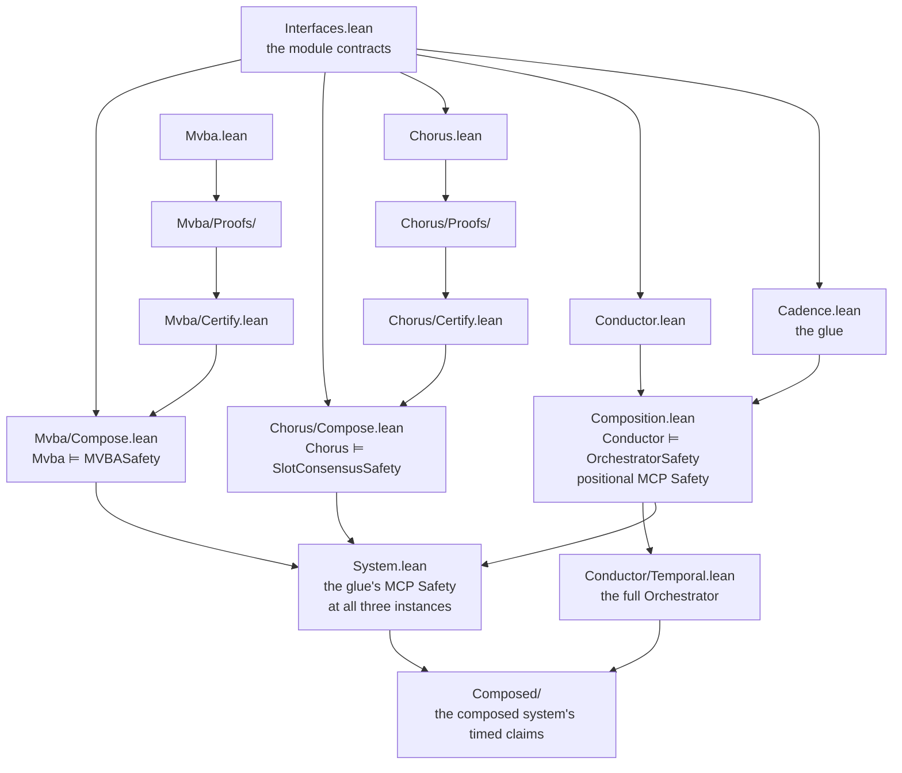

# Cadence — machine-checked verification (Veil / Lean 4)

A formal verification of the [Cadence](https://www.category.xyz/cadence)
BFT consensus protocol (arXiv:[2607.02275](https://arxiv.org/abs/2607.02275))
in [Veil](https://github.com/larskuhtz/veil) on Lean 4: the per-slot
consensus Chorus, the leader-based MVBA inside it, the window-based
orchestrator Conductor, the extreme-pipelining layer that composes them, and
the fallback receipt layer. The development corresponds to revision
`48cac9a` of the paper repository ([§ The protocol paper](#the-protocol-paper)).

Every theorem is checked by Lean's kernel from Lean's three standard
axioms. SMT solver results are rebuilt as Lean proofs and checked by the
kernel too, so the solver is not trusted.

**To read what is proven, start with
[the guide](https://larskuhtz.github.io/cadence/guide/).** It states the
claims and what they rest on, and shows how to audit the models and the
contracts. [Cadence.lean](Cadence.lean) lists every end result with its
axiom pin.

**To re-check the proofs**, see [Checking the proofs](#checking-the-proofs).
**To work on the models**, see [Working on the models](#working-on-the-models)
and [CLAUDE.md](CLAUDE.md).


Each arrow is a Lean instance filling a contract, a type class in
[Interfaces.lean](Cadence/Interfaces.lean); the dashed box is the ACS, an
assumed module ([the guide, chapter 1](https://larskuhtz.github.io/cadence/guide/approach/)).

This page is for building, developing and maintaining the development:

* [Checking the proofs](#checking-the-proofs)
* [Working on the models](#working-on-the-models), [Building natively](#building-natively)
* [How the proof fits together](#how-the-proof-fits-together)
* [What is where](#what-is-where)
* [Continuous integration](#continuous-integration)
* [Model-conformance monitor](#model-conformance-monitor)
* [Documentation](#documentation)
* [The protocol paper](#the-protocol-paper), [Resolving a citation](#resolving-a-citation)

---

## Checking the proofs

The quickest check needs no build at all. Prebuilt images — this project
already built and verified inside the image — are published for `linux/arm64`
and `linux/amd64`. [scripts/container.sh](scripts/container.sh) pulls what
it needs on first use (~4 GiB, once):

```bash
RUNTIME=podman scripts/container.sh check    # kernel-re-check every proof — minutes, no solver
RUNTIME=podman scripts/container.sh verify   # re-verify against the checkout's sources
```

`RUNTIME` selects `podman`, `docker`, or Apple's `container`. The two commands
are tiers 1 and 2 of an audit ladder that ends at "re-solve every verification
condition from scratch". What each tier establishes — in particular, what a
prebuilt `.olean` proves — is
[docs/Container.md](docs/Container.md) §3–§4, and
[the guide's chapter 7](https://larskuhtz.github.io/cadence/guide/checking/)
explains it for readers. Every tier, including the last, also runs natively
on Linux and macOS ([below](#building-natively)); the container fixes the
environment.

## Working on the models

The `dev` image is the same environment with the sources mounted. Open the
folder in VS Code with the **Dev Containers** extension —
[.devcontainer/](.devcontainer) uses the published image — or work from a
terminal:

```bash
RUNTIME=podman scripts/container.sh shell    # interactive shell in the workspace
RUNTIME=podman scripts/container.sh verify   # staged re-verification, after an edit
```

Opening a file costs what it elaborates: [Cadence/Chorus.lean](Cadence/Chorus.lean) runs no
invariant sweep but elaborates the model plus its background does-not-throw
checks (minutes); a [Cadence/Chorus/Proofs/](Cadence/Chorus/Proofs) file re-proves one
action's cells (seconds with a warm cache, minutes cold); the consumer files
load prebuilt `.olean`s in seconds. To suppress solving entirely while
editing, set `VEIL_NO_VERIFY=1` in the *editor's* environment — the
devcontainer already does; never set it in a shell profile, since `lake build`
must still verify. Every skipped command reports a visible
`⏭ skipped (veil.noVerify)` warning, so "no errors" in this mode never means
"verified".

The development workflow and the model-specific rules are in
[CLAUDE.md](CLAUDE.md). Building the images yourself — needed only when the
dependency tree changes — is [docs/Images.md](docs/Images.md).

### Building natively

Requires [elan](https://github.com/leanprover/elan); the pinned toolchain and
the dependency tree are fetched automatically on the first build. Building also
needs a system `clang` with a version-matched `libc++` development package
(providing the compiler's resource-dir headers): that is a transitive native
dependency of the cvc5 binding used for proof reconstruction, whose build
compiles an FFI shim with a hardcoded `clang -std=c++17 -stdlib=libc++`
invocation. elan's bundled toolchain `clang` does not ship those headers and
cannot substitute.

```bash
LEAN_NUM_THREADS=4 lake build   # everything: models, every proof file
                                # (one per action), composition
                                # certificates, end theorems, the audit
                                # root's axiom pins, and the monitor
```

Bound the parallelism on the **first** build, as above. `lean-smt` and
`lean-auto` compile their own native plugins, and if that build is OOM-killed
mid-link the half-written libraries are left in place and considered
up-to-date, so every later build fails in milliseconds while loading them.
Recovery is `rm -rf .lake/packages/{auto,smt}/.lake/build`. Lake has no `-j`
flag; `LEAN_NUM_THREADS` is the only control.

**Memory.** `lake build` runs as many `lean` processes at once as
`LEAN_NUM_THREADS` allows, which defaults to the core count. A *cold* proof
file takes several GB of resident memory, so on most machines the core count
is too many. The script sets the cap from the
memory available:

```bash
scripts/revalidate.sh          # one lake build, cap derived from memory
JOBS=4 scripts/revalidate.sh   # ... with an explicit cap
BATCH=1 scripts/revalidate.sh  # staged build, one proof file at a time
scripts/revalidate.sh /tmp     # ... and write the RSS sample log there
```

`JOBS` is the number of concurrent `lean` processes. Past the default more
slots do not help, because
the build is bound by its longest dependency chain. On few cores keep `JOBS`
low (CI's 4-core runner uses `JOBS=2`), since concurrent solvers slow each
other enough to push a near-budget cell over its timeout. The staged `BATCH`
mode is what the image build uses.
The script's header has the measurements.

Individual pieces, for iteration:

```bash
lake build Cadence.Chorus                    # the per-slot consensus MODEL (no sweep)
lake build Cadence.Chorus.Proofs.Vote        # one Chorus action's proof cells
lake build Cadence.Chorus.Certify            # composition certificate + the #veil_status audit pin
lake build Cadence.Mvba Cadence.Mvba.Certify # the MVBA model and its certificate
lake build Cadence.Cadence Cadence.Conductor # the two small models, sweeps included
lake build Cadence.FallbackReceipt           # receipt model + its n=4 exhaustive model check
lake build Cadence                           # the audit root: every axiom pin, re-derived
```

**Reading the output.** Verification results are marked `✅` proven, `❌`
counterexample, `💥` solver crash, `⏱` timeout, and `♻` proof-cache replay
(kernel-checked). Count **all four** of the first group: grepping only for
`❌` hides timeouts and crashes. A healthy build has only `✅` and `♻`.

**Two timing regimes.** Most verification conditions are frame obligations
(the action writes nothing the property reads), which Veil closes without
calling the solver at all; the rest are solved by cvc5, and those
reconstructed proofs are cached on disk under `.lake/build/veilcache/` and
replayed, kernel-checked, on later builds. A first build therefore solves
every solver-touched condition cold, and a re-validation replays them — both
in minutes rather than hours on a workstation, run through
[scripts/revalidate.sh](scripts/revalidate.sh);
[docs/Container.md](docs/Container.md) §4 has measured times per audit tier.
The cache is a build artefact, not shipped, and safe to delete at any time:
it only ever skips proof *search*, never checking.

Do not run other heavy jobs concurrently with a *cold* proof-file build: some
verification conditions sit close to the solver time budget, and stolen cores
turn them into spurious timeouts.

A native build works on macOS and Linux alike, from any checkout path. The
container path is for a *fixed, published* environment — see
[docs/Container.md](docs/Container.md).

---

## How the proof fits together

Each model file states its state, actions and properties; elaborating it
records one verification condition per action and property. One proof file
per action discharges those conditions with cvc5 and rebuilds each result as
a kernel-checked Lean proof; a certificate file composes them into an
induction over reachable states and pins the result. The guide's
[chapter 7](https://larskuhtz.github.io/cadence/guide/checking/) walks through
the commands and the trust at each step:


The per-action file layer keeps every `lean` process small: a module's proofs
would otherwise all sit in one process's environment to be persisted. Those
files are ordinary hand-owned Lean files, scaffolded once by
`#gen_proof_files`. [Cadence/Cadence.lean](Cadence/Cadence.lean) and
[Cadence/Conductor.lean](Cadence/Conductor.lean) are small enough to persist
their proofs directly.

### What depends on what

The import graph runs opposite to the logical composition. A model that
*consumes* a contract does not import the module that implements it — it
imports only [Interfaces.lean](Cadence/Interfaces.lean). The instances are
joined up afterwards, in [System.lean](Cadence/System.lean), the one file
that imports all three legs; the composed system's timed claims build on it.


```mermaid
flowchart TD
    IF["Interfaces.lean<br/>the module contracts"]

    IF --> GLUE["Cadence.lean<br/>the glue"]
    IF --> COND["Conductor.lean"]
    IF --> CHOR["Chorus.lean"]
    IF --> CCOMP["Chorus/Compose.lean<br/>Chorus ⊨ SlotConsensusSafety"]
    IF --> MCOMP["Mvba/Compose.lean<br/>Mvba ⊨ MVBASafety"]

    GLUE --> COMP["Composition.lean<br/>Conductor ⊨ OrchestratorSafety<br/>positional MCP Safety"]
    COND --> COMP

    CHOR --> CPROOFS["Chorus/Proofs/"] --> CCERT["Chorus/Certify.lean"] --> CCOMP

    MVBA["Mvba.lean"] --> MPROOFS["Mvba/Proofs/"] --> MCERT["Mvba/Certify.lean"] --> MCOMP

    COMP --> SYS["System.lean<br/>the glue's MCP Safety<br/>at all three instances"]
    CCOMP --> SYS
    MCOMP --> SYS

    COMP --> CTEMP["Conductor/Temporal.lean<br/>the full Orchestrator"]
    SYS --> COMPOSED["Composed/<br/>the composed system's timed claims"]
    CTEMP --> COMPOSED
```

So editing [Cadence/Cadence.lean](Cadence/Cadence.lean) or
[Cadence/Conductor.lean](Cadence/Conductor.lean) never re-runs the Chorus
family, and editing a contract re-runs everything. The receipt layer imports
none of this and is verified on its own terms.

---

## What is where

```
Cadence.lean                       AUDIT ROOT: every end theorem, every axiom pin
Cadence/
  Interfaces.lean                  the module contracts — SlotConsensus / Orchestrator / ACS /
                                    MVBA as two-level type classes over explicit state
  Chorus.lean                      per-slot consensus MODEL — no sweep; consumes the MVBA as
                                    a class constraint; persists the VC registry
  Chorus/Proofs/                    one proof file per action (#prove_action); the manual
                                    cells live here
  Chorus/Certify.lean               #gen_composition: reachability induction, per-property
                                    projections; the #veil_status audit pin
  Chorus/Compose.lean               Chorus ⊨ SlotConsensusSafety, and the join toward the
                                    full SlotConsensus
  Chorus/Pigeonhole.lean, Chorus/Counting.lean, Chorus/Progress.lean
                                   the counting steps and the fair-progress case split,
                                    for every n = 3f+1
  Chorus/Liveness.lean, Chorus/Termination.lean
                                   the run-level termination claim, its premises, its proof
  Chorus/Schedule.lean, Chorus/Timeline.lean, Chorus/TimedTermination.lean,
  Chorus/Totality.lean, Chorus/Inclusion.lean
                                   the timing model; termination within 5Δ + ℓ_MVBA,
                                    totality within Δ, proposal inclusion
  Chorus/Temporal.lean              Chorus ⊨ SlotConsensus in full
  Chorus/Witness.lean               one model meeting every premise of the Chorus liveness
                                    claims (non-vacuity)
  Mvba.lean                        leader-based MVBA MODEL, the internal supplement's
                                    instantiation; no sweep; VC registry
  Mvba/Proofs/, Mvba/Certify.lean  its proof files and certificate (audit-pinned)
  Mvba/Compose.lean                Mvba ⊨ MVBASafety, and the join toward the full MVBA
  Mvba/NoLock.lean                 the lock check removed, mechanically refuted (the
                                    mutation test; a pinned counterexample)
  Mvba/Progress.lean, Mvba/Rank.lean, Mvba/Liveness.lean
                                   the untimed termination claim and its proof
  Mvba/Schedule.lean, Mvba/Bound.lean, Mvba/BoundedTermination.lean
                                   the timing model and the bound ℓ_MVBA
  Mvba/Temporal.lean               Mvba ⊨ MVBA in full
  Mvba/Witness.lean                one model meeting every premise of both termination
                                    claims (non-vacuity)
  Conductor.lean                   window-based orchestrator MODEL (+ sweep, traces, theorems)
  Conductor/Schedule.lean          its timing model and its three timed claims, stated
  Conductor/Induction.lean, Conductor/Boundedness.lean, Conductor/Recovery.lean
                                   Totality, (2W − p)-Boundedness, (2Wτ)-Recovery
  Conductor/Temporal.lean          Conductor ⊨ Orchestrator in full, for any ACS meeting
                                    its contract
  Conductor/IdealAcs.lean          the ACS contract's ideal model, a consistency witness
  Cadence.lean                     extreme-pipelining MODEL, the glue (+ sweep, traces,
                                    theorems)
  Composition.lean                 the glue's and the Conductor's reachability inductions,
                                    Conductor ⊨ OrchestratorSafety, positional MCP Safety
  System.lean                      MCP Safety for the composed system: the glue at the
                                    Conductor, Chorus and Mvba instances
  Composed/                        the composed system's timed run, its premises and its
                                    claims: Corollary 4, Lemma 5, Liveness, censorship
                                    resistance
  Composed/Witness.lean, Composed/Witness/
                                   one model meeting every premise of the composed claims
                                    (non-vacuity)
  FallbackReceipt.lean             fallback receipt/propose MODEL (+ the n=4 exhaustive
                                    model check)
  FallbackReceipt/Proofs/, FallbackReceipt/Certify.lean
                                   its proof files and certificate (audit-pinned)
  FallbackReceipt/Totality.lean    build totality for every n = 3f+1
  Primitives.lean                  cryptographic primitive classes (ThresholdIBE, …)
  QuorumCounting.lean              the quorum counting facts beyond intersection
  ByzQuorum.lean                   Byzantine-quorum instances, non-vacuity witnesses
  Windows.lean                     slot/window theory and the ACS median lemma
  AcsMedian.lean                   the ACS median bracket, from the contract
  ViewOrder.lean                   what a view counter needs beyond a total order
  Fairness.lean, Timed.lean        runs, enabledness and fairness; timed runs and bounded
                                    fairness after GST
  PartProjection.lean              a part of a composed run, read as a run of its contract
  ProofPrelude.lean                shared option blocks of the proof files
  Tooling.lean                     targeted #check_vc / #check_invariant commands
  Monitor/                         the model-conformance monitor (below)
docs/                              reference documents and records (below)
docs/guide/                        the guide: one Verso chapter file per page
docs/diagrams/                     the diagrams, one SVG each
scripts/                           builds, container dispatch, the site, the docs checks,
                                    the monitor suites
spikes/                            small reproductions behind design decisions
traces/                            JSONL trace fixtures for the monitor
paper/                             the compiled PDFs of arXiv v1 and v2
Containerfile                      multi-stage OCI image: toolchain / deps / dev /
                                    build / verified / verified-cache
.devcontainer/                     opens the dev image in VS Code
.github/workflows/                 CI (below)
```

Every axiom-pinned file ends its results in a `#guard_msgs in #print axioms`
line; [Cadence.lean](Cadence.lean) collects them.

---

## Continuous integration

| Workflow | When | What it does |
|---|---|---|
| [verify.yml](.github/workflows/verify.yml) | every push to master, every pull request | pulls the published `verified` image and re-verifies the commit's sources against it (audit tier 2a), with all markers asserted; runs the monitor suites; in parallel, kernel-replays every stored proof with `leanchecker` (tier 1) |
| [publish-images.yml](.github/workflows/publish-images.yml) | every push to master | rebuilds the `verified` and `verified-cache` images, verifying the project inside the build; rebuilds the `deps` image when the toolchain or the dependency pins change |
| [docs.yml](.github/workflows/docs.yml) | after `publish-images` succeeds on master | renders the site (the guide, the sources, the trust boundary) in the `verified` image and deploys it to GitHub Pages |

A commit that changes a model or a proof file re-solves the affected
verification conditions cold in `verify`, because the `verified` image ships
no proof cache. Each workflow's header has the details;
[docs/Images.md](docs/Images.md) covers the images.

---

## Model-conformance monitor

The monitor replays a projected implementation trace against the Chorus
model and reports whether the model accepts it. It is outside every
theorem's trust base; [the guide's chapter 7](https://larskuhtz.github.io/cadence/guide/checking/)
says what it is for.

```bash
scripts/run-chorus-monitor.sh < traces/fast_path_negative.jsonl
#   → ACCEPTED — 18 step(s) simulated by the model ✓   (exit 0)

scripts/test-chorus-monitor.sh        # acceptance regression (both monitors must agree)
scripts/test-monitor-divergence.sh    # negative regression: every mutated trace must be REJECTED
scripts/test-single-node-monitor.sh   # per-node projection mode
```

Design, scope, the emitter contract and the full flag reference:
[docs/Monitor.md](docs/Monitor.md).

---

## Documentation

[The guide](https://larskuhtz.github.io/cadence/guide/) introduces the
content and links each content document in [docs/](docs) from the chapter it
belongs to. For development and maintenance:

| Document | What it covers |
|---|---|
| [CLAUDE.md](CLAUDE.md) | the development workflow, the build commands, the model-specific rules |
| [docs/Container.md](docs/Container.md) | using the published images; what a prebuilt `.olean` proves; the audit ladder |
| [docs/Images.md](docs/Images.md) | building and publishing the images |
| [docs/Dependencies.md](docs/Dependencies.md) | what the Veil fork provides beyond upstream, and why |
| [docs/Documentation.md](docs/Documentation.md) | the documentation site: the guide, the rendered sources, the trust boundary, the checks |
| [docs/VersoIssues.md](docs/VersoIssues.md) | Verso's gaps the site works around, and which workaround to delete when each is fixed |
| [docs/Monitor.md](docs/Monitor.md) | the model-conformance monitor |
| [docs/History.md](docs/History.md) | how the verification reached this state |
| [docs/AuditReport.md](docs/AuditReport.md) | the external audit by [Aristotle (Harmonic)](https://aristotle.harmonic.fun), frozen at the revision it audited (`bfeee8c`) |
| [docs/Scenario.md](docs/Scenario.md) | the workflow this repository is arranged for |

## The protocol paper

> Kushal Babel, Fatima Elsheimy, Lioba Heimbach, Mohammad Mussadiq Jalalzai,
> Tobias Klenze, Jovan Komatovic, Jason Milionis, Mike Setrin, Victor Shoup.
> **Cadence: Extreme Pipelining with Multiple Concurrent Proposers.**
> arXiv:[2607.02275](https://arxiv.org/abs/2607.02275) \[cs.DC].

The development corresponds to revision `48cac9a` of the paper repository:
the main body, whose public versions are on arXiv, together with its
internal supplement, which specifies the MVBA. The target's one home, with
its full hash and the review behind "corresponds", is
[docs/PaperAlignment.md](docs/PaperAlignment.md) §0; the commit from which
the development corresponds is tagged `paper-target/48cac9a`. The guide's
[chapter 2](https://larskuhtz.github.io/cadence/guide/claims/) covers the
target, access to it, and the findings for the paper's authors.

arXiv v1's fallback receipt rules had a liveness bug, fixed in v2; the model
checker's counterexample to the v1 rules is at the tag
[`v1-receipt-refutation`](https://github.com/larskuhtz/cadence/tree/v1-receipt-refutation).

### Resolving a citation

The sources and documentation cite the paper as a reader sees it in the
target's rendered PDF, with the LaTeX label in parentheses as the
secondary key: Lemma 9 (`lemma:chorus-agreement`), Algorithm 5, line 7
(`line:fb-pathvote-guard`), Module 1 (`mod:slotconsensus`). The main body
and the supplement are separate documents, so a supplement citation says
so: Supplement, Section 1 (`sec:mvba-instantiation`), Supplement,
Algorithm 1, line 31 (`line:mvba:qc-decide`). Every citation is to the
target revision.

The authority for every such reference is the label map
[docs/paper-labels.tsv](docs/paper-labels.tsv): each label of the two
documents at the target, with its rendered reference and its page,
generated by machine from a build of the target. To look a label up, grep
the map. To regenerate it, for instance at a new target, run
`scripts/paper-labels.sh` (it reads the paper checkout with `git archive`
and builds both documents with `tectonic`); `scripts/paper-cites.sh` then
checks every citation in the repository against it. The labels are not
hyperlinks: the PDF is compiled with `hypertexnames=false` and carries no
label-named destinations, and arXiv's HTML substitutes its own ids.

The compiled PDFs of arXiv v1 and v2 are checked in under [paper/](paper).
