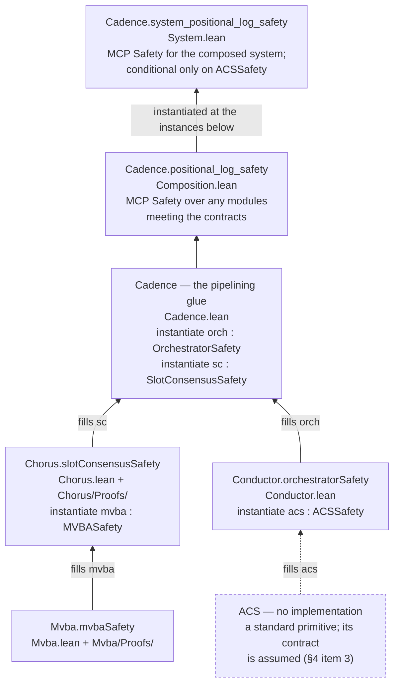

# Cadence verification — architecture

*Top-level design document for this formalisation. For orientation, build
instructions, and the evidence-auditing guide, start at
[README.md](../README.md); for the end theorems and their trust base on
one page, [Cadence.lean](../Cadence.lean). This file explains how the
formalisation is structured, what each part establishes and by what
method, and exactly where its trust boundaries and meta-theoretic seams
lie — **§4 is the audit checklist**: everything the machine does not
establish, in one place. The per-model design rationale lives one level
down: [ChorusDesign.md](ChorusDesign.md) for the Chorus model, and
[ConductorDesign.md](ConductorDesign.md) plus the module headers of
[Cadence/Cadence.lean](../Cadence/Cadence.lean) and
[Cadence/Conductor.lean](../Cadence/Conductor.lean) for the
composition-layer models.*

## 1. What is being verified

[Cadence](https://www.category.xyz/cadence) (`arXiv:2607.02275`; the
paper target is [PaperAlignment.md](PaperAlignment.md) §0, and the root
[README.md](../README.md) says how to resolve the label names used here) is a BFT consensus design with three layers, and the
formalisation mirrors that decomposition one-to-one:

* **Chorus** (Appendix C (`section:slot_agreement`)) — the per-slot one-shot
  consensus: `k` concurrent proposers, a two-round fast path, and a
  fallback path (fallback voting → MVBA → a final commit round).
  Modelled in [Cadence/Chorus.lean](../Cadence/Chorus.lean).
* **Conductor** (Appendix D (`section:conductor-formal`), the ACS version) — the
  window-based orchestrator that schedules slots. Modelled in
  [Cadence/Conductor.lean](../Cadence/Conductor.lean).
* **Cadence** (Appendix B (`section:framework`)) — the extreme-pipelining glue that
  runs one slot-consensus instance per slot under the orchestrator and
  assembles the MCP log. Modelled in [Cadence/Cadence.lean](../Cadence/Cadence.lean).

An auxiliary model covers the layer where the protocol's per-validator
reasoning is most intricate: the **fallback receipt/propose layer**
([Cadence/FallbackReceipt.lean](../Cadence/FallbackReceipt.lean) and companions), the
rules by which each validator turns the evidence it has received into a
valid proposal (§5).

A further model goes one level *below* the published paper: the **MVBA
instantiation** ([Cadence/Mvba.lean](../Cadence/Mvba.lean) and companions).
Module 3 (`mod:mvba`) is an interface in the paper; the leader-based protocol that
implements it lives in the paper repository's *internal supplement*, which
is not yet part of the published paper and has neither tags nor versions,
so the model pins the paper-repository commit it was read against in its
header ([MvbaPlan.md](MvbaPlan.md) §0). Its safety properties are the
three of Module 3 (`mod:mvba`), proven as for Chorus. It supplies the `MVBA` contract's
instance, which Chorus consumes as a class constraint and
[Cadence/System.lean](../Cadence/System.lean) fills in (§4 item 3).

### 1.1 How the layers correspond

Each paper module is a type class in
[Cadence/Interfaces.lean](../Cadence/Interfaces.lean); each layer of the
protocol is a Veil model that *implements* one contract and *consumes* the
contracts below it. The implication chain runs bottom-up: each arrow reads
"fills the contract constraint above it", and each is a Lean instance rather
than a correspondence argued in prose. The one dashed arrow marks the one
contract this development does not implement.

| Paper module | Contract class | Implementation | Instance | Still owed |
|---|---|---|---|---|
| Module 1 (`mod:slotconsensus`) | `SlotConsensusSafety` / `SlotConsensus` | [Cadence/Chorus.lean](../Cadence/Chorus.lean) | `Chorus.slotConsensusSafety` | `SlotConsensusTemporal` |
| Module 2 (`mod:orchestrator_2`) | `OrchestratorSafety` / `Orchestrator` | [Cadence/Conductor.lean](../Cadence/Conductor.lean) | `Conductor.orchestratorSafety` | `OrchestratorTemporal` |
| Module 3 (`mod:mvba`) | `MVBASafety` / `MVBA` | [Cadence/Mvba.lean](../Cadence/Mvba.lean) | `Mvba.mvbaSafety`, `Mvba.mvbaTemporal`, the full `Mvba.mvbaFull` | nothing |
| Module 4 (`mod:acs`) | `ACSSafety` / `ACS` | — (out of scope) | — | the whole contract |

The fallback receipt/propose layer
([Cadence/FallbackReceipt.lean](../Cadence/FallbackReceipt.lean)) implements
no contract: it refines one step *inside* Chorus's fallback path (assembling
a valid meta-block from received receipts) at a finer per-validator grain
than the Chorus model uses, and is verified on its own terms (§5).

[CompositionContracts.md](CompositionContracts.md) is the full account of
this layer: the two-level class design, what each instance proves, and the
seams that remain.

## 2. The methods

Four verification methods are combined — the numbering is a catalogue,
**not** a ranking of strength or soundness; every claim is checked by
at least one machine, and the trust base of each artefact is stated
(and, where possible, pinned in CI by `#guard_msgs`).

**Method 1 — inductive invariants, SMT-discharged** (labelled "sweep"
in the tables below). Each protocol model declares its safety
properties and helper invariants; Veil generates one verification
condition per (action × property) pair and discharges them with cvc5.

This table is the canonical home for these counts; other documents point
here rather than repeating them.

| Module | Actions | Declarations | VCs | Discharge |
|---|---|---|---|---|
| [Cadence/Chorus.lean](../Cadence/Chorus.lean) | 46 | 9 safety + 92 invariants + 1 step property | 4 840 | cvc5, **proof-reconstructed** (kernel-checked), + 15 manual Lean proofs: 14 for e-matching-divergent cells (three of them the Byzantine assembly actions' copies of the collector's cells), 1 for solver-budget headroom (`vote × committed_pos_frozen`); the MVBA enters as a class constraint, so its axioms are hypotheses of every cell |
| [Cadence/Mvba.lean](../Cadence/Mvba.lean) | 28 | 3 safety + 47 invariants + 1 step property | 1 507 | cvc5, **proof-reconstructed** (kernel-checked), + 5 manual Lean proofs for the argument-carrying cells (the lock-persistence step, at both actions that create a prepare certificate; cross-view certificate agreement, at both actions that create a commit certificate; and agreement at the decision `form_own_commitqc` makes) |
| [Cadence/FallbackReceipt.lean](../Cadence/FallbackReceipt.lean) | 9 | 1 safety + 20 invariants | 220 | cvc5, **proof-reconstructed** (kernel-checked, no trusted step) |
| [Cadence/Conductor.lean](../Cadence/Conductor.lean) | 7 | 5 safety + 15 invariants + 3 step properties | 189 | cvc5, **proof-reconstructed** (kernel-checked); the ACS enters as a class constraint |
| [Cadence/Cadence.lean](../Cadence/Cadence.lean) | 6 | 4 safety + 21 invariants | 182 | cvc5, **proof-reconstructed** (kernel-checked); the sub-protocols enter as class constraints, so the contract axioms are hypotheses of every cell |

The VC count is not arbitrary and can be recomputed from the model: one
condition per (label × safety-or-invariant), where the labels are the actions
plus the initializer; one per (action × step property); and one does-not-throw
condition per label. For the first three modules the total is pinned in the
build by `#veil_status` (§6); for the last two it is reported by the in-file
sweep.

**All five modules run with proof reconstruction** (`veil.smt.trust
false`): every ✅ is a proof re-checked by Lean's kernel, not a trusted
solver verdict. Where the VCs are discharged differs by module size:
[Cadence/Cadence.lean](../Cadence/Cadence.lean)/[Conductor.lean](../Cadence/Conductor.lean) run an in-file sweep
(`#check_invariants`); [Cadence/Chorus.lean](../Cadence/Chorus.lean)/[FallbackReceipt.lean](../Cadence/FallbackReceipt.lean)/[Mvba.lean](../Cadence/Mvba.lean)
only *state* their VCs (a persistent registry) and the per-action proof
files discharge them (§6). A per-cell fallback ladder (seed retries → the
alternative two-state encoding → manual Lean proofs) absorbs
reconstruction-resistant cells; no trusted islands are needed.

**Method 2 — exhaustive model checking (concrete instances).** Used
only where it is a *complete* method or strictly redundant — **no claim
about the final protocol rests on a bounded-instance check**:

* the **mutation test** of the MVBA instantiation
  ([Cadence/Mvba/NoLock.lean](../Cadence/Mvba/NoLock.lean)): with the
  `Pre-Prepare` handler's lock check removed, the checker exhibits two
  correct validators deciding differently — exhibiting a reachable
  counterexample is complete evidence regardless of instance size, and
  it is found on a restriction of the mutant every run of which is a run
  of the mutant — which shows the proven invariants of
  [Cadence/Mvba.lean](../Cadence/Mvba.lean) are load-bearing and not merely true; the trace is
  pinned verbatim in the build;
* a **redundant regression check** over the receipt layer's structural
  invariants (23 975 states) — defense in depth alongside their
  unbounded SMT proofs, and a non-vacuity witness (the explored graph
  contains proposing runs).

**Method 3 — plain-Lean composition over reachable states.** Every
discharged VC is persisted as a named, kernel-checked theorem
(`#gen_theorems` in the small modules, `#prove_action` in the
proof-file families), and inductions over the generated `reachable`
relation assemble them into "every reachable state satisfies the
invariant clump" (`invariants_of_reachable`, plus one named
`reachable_<property>` projection per conjunct — emitted by
`#gen_composition` for all five verified modules: in the families'
`Certify.lean` files, and in [Cadence/Composition.lean](../Cadence/Composition.lean) for the two small
ones), from which the paper's
*module contracts* ([Cadence/Interfaces.lean](../Cadence/Interfaces.lean)) are
instantiated. The contracts are type classes over an explicit abstract
state, in two levels — a first-order fragment the consuming Veil model
`instantiate`s as a class constraint (so the properties are the solver's
hypotheses, never restated), and the full class with every temporal and
quantitative obligation over explicit runs
([CompositionContracts.md](CompositionContracts.md)):

* `Conductor ⊨ OrchestratorSafety` (`Conductor.orchestratorSafety`, every
  field proven — the two-state fields from Veil's transition bodies) and
  the paper's **positional MCP Safety** (Definition 1 (`def:safety`) over ordered logs) —
  [Cadence/Composition.lean](../Cadence/Composition.lean);
* `Chorus ⊨ SlotConsensusSafety` (`Chorus.slotConsensusSafety`) —
  [Cadence/Chorus/Compose.lean](../Cadence/Chorus/Compose.lean), over the composed
  certificate and named per-property projections of
  [Cadence/Chorus/Certify.lean](../Cadence/Chorus/Certify.lean);
* the **composed system** — the glue's MCP Safety instantiated at those two
  instances, conditional only on the Conductor's ACS contract `ACSSafety`
  (`Cadence.system_positional_log_safety`,
  [Cadence/System.lean](../Cadence/System.lean));
* what the Conductor and Chorus still owe of their *full* contracts is a
  **missing class instance**, no `OrchestratorTemporal` or
  `SlotConsensusTemporal` at the fragment each proved, with a definition
  (`…_of_temporal`) that joins the two levels when one is supplied; these
  are §4 item 4 as types, restated nowhere;
* the MVBA's temporal level **is** instantiated: `Mvba.mvbaTemporal`
  (`MVBATemporal` with `ℓ_MVBA`-Termination, the supplement's `O(fΔ)`) at
  `Mvba.mvbaSafety`, the fragment the composed system runs, joined into the
  full `MVBA` as `Mvba.mvbaFull`, from named hypotheses (§4 item 4) —
  [Cadence/Mvba/Temporal.lean](../Cadence/Mvba/Temporal.lean);
* build totality of the receipt layer for **every** `n = 3f+1` —
  [Cadence/FallbackReceipt/Totality.lean](../Cadence/FallbackReceipt/Totality.lean),
  kernel-checked end-to-end;
* the **liveness argument's state-level content**, for every
  `n = 3f+1` — theorems rather than assumptions: the *progress
  dichotomy* (`Chorus.progress_dichotomy_of_saturation`,
  [Cadence/Chorus/Progress.lean](../Cadence/Chorus/Progress.lean) — in
  any reachable state where every honest validator has cast its path
  vote, per-proposer commitQCs from honest votes alone, or the MVBA
  invoked with evidence in the form of the decision handlers' bridge); its
  counting inputs — certificate formation and the fast-dominant
  commitQC ([Cadence/Chorus/Counting.lean](../Cadence/Chorus/Counting.lean)),
  the evidence pigeonhole
  ([Cadence/Chorus/Pigeonhole.lean](../Cadence/Chorus/Pigeonhole.lean));
  and *network-level build totality*
  (`Chorus.build_totality_of_reachable`): a buildable meta-block entry
  from **any** accepted receipt supermajority, Byzantine members
  included. [Liveness.md](Liveness.md) is the one-page summary;
* **Chorus termination over runs**, for every `n = 3f+1`
  (`Chorus.termination`,
  [Cadence/Chorus/Termination.lean](../Cadence/Chorus/Termination.lean)): the temporal argument on
  top of that content, from the named premises of §4 item 2, consuming
  `Mvba.termination` for the MVBA arm. Untimed;
* **Chorus's timed claims over timed runs**: `d_tot`-totality
  (`Chorus.totality`, [Cadence/Chorus/Totality.lean](../Cadence/Chorus/Totality.lean))
  and ℓ-termination at the paper's `5Δ + ℓ_MVBA` (`Chorus.timed_termination`,
  [Cadence/Chorus/TimedTermination.lean](../Cadence/Chorus/TimedTermination.lean)),
  with the sharper `4Δ + ℓ_MVBA` from the same premises
  (`Chorus.timed_termination_tight`), under the timing model of
  [Cadence/Chorus/Schedule.lean](../Cadence/Chorus/Schedule.lean). The
  contract field `SlotConsensusTemporal.termination` still has no instance
  (S5).

**Method 4 — documented meta-theory.** What is deliberately *not*
inside Lean is stated as named assumptions and audited by hand (§4).
This is the one method that is weaker than the others — which is
exactly why §4 exists as its complete, auditable inventory.

## 3. Property coverage (what is proven, where)

The paper's headline properties and their formal counterparts:

| Paper claim | Formal artefact | Method |
|---|---|---|
| Chorus Agreement (Lemma 9 (`lemma:chorus-agreement`)) | `safety [agreement_pos]`, `[agreement_pos_neg]`; instance field `agreement` in [Cadence/Chorus/Compose.lean](../Cadence/Chorus/Compose.lean) | sweep + composition |
| Chorus integrity | `safety [integrity_pos]`, `[integrity_pos_neg]` | sweep |
| Proposal inclusion / censorship resistance (Lemma 10 (`lemma:chorus-proposal-inclusion`)) | `safety [proposal_inclusion]`, `[proposal_inclusion_no_neg]` (premise `all_honest_recorded`); instance field `proposal_inclusion` | sweep + composition |
| Hiding until the deadline (Lemma 7 (`lemma:chorus-hiding`)) | protocol half: `safety [hiding_until_deadline]`; crypto half axiomatised (`ThresholdIBE`, [Cadence/Primitives.lean](../Cadence/Primitives.lean)) | sweep + axiom |
| Speculative-finality revertibility claim | `safety [speculative_agreement_pos]`, `[..._pos_neg]` (conditional on `no_equivocation` and `no_invalid_encoding`) | sweep |
| Chorus termination (Lemma 11 (`lemma:chorus-termination`)), bound-erased: every correct validator finalizes the slot, at every `n = 3f+1` | `Chorus.termination` ([Cadence/Chorus/Termination.lean](../Cadence/Chorus/Termination.lean)), from the premises `FJustice`, `MvbaAdmissible`, `ValidBridge` of [Cadence/Chorus/Liveness.lean](../Cadence/Chorus/Liveness.lean) (§4 item 2); consumes `Mvba.termination`; untimed (no `5Δ + ℓ_MVBA` bound) | sweep + Lean over runs |
| Chorus ℓ-termination, timed (Lemma 11 (`lemma:chorus-termination`)): every correct validator finalizes by `max(t, GST) + 5Δ + ℓ_MVBA` (plus `9δ` local steps), at every `n = 3f+1`; and by `4Δ + ℓ_MVBA + 8δ` from the same premises (F4) | `Chorus.timed_termination`, `Chorus.timed_termination_tight` ([Cadence/Chorus/TimedTermination.lean](../Cadence/Chorus/TimedTermination.lean)), from the timing model of [Cadence/Chorus/Schedule.lean](../Cadence/Chorus/Schedule.lean), `ValidBridge` and the caller's four conditions; consumes the MVBA contract's `T.termination`; at the system's MVBA `Chorus.timed_termination_atMvba` | Lean over timed runs |
| Chorus `d_tot`-totality (Proposition 4 (`prop:chorus-totality`)): `Δ + 2δ` after the first correct finalization, at a participation tolerance `d` in general | `Chorus.totality`, `Chorus.totality_paper` ([Cadence/Chorus/Totality.lean](../Cadence/Chorus/Totality.lean)) | Lean over timed runs |
| "Fallback meta-block valid by construction" (Algorithm 5 (`alg:fallback`) build rule) | `certified_propose` (all `n`, SMT) + `build_totality_of_reachable` (all `n = 3f+1`, kernel-checked) | sweep + Lean |
| Evidence pigeonhole (per-proposer evidence always forms from `2f+1` honest fallback entries — the counting step of Lemma 11 (`lemma:chorus-termination`)'s fallback branch) | `evidence_pigeonhole_of_reachable` ([Cadence/Chorus/Pigeonhole.lean](../Cadence/Chorus/Pigeonhole.lean)), all `n = 3f+1` | sweep + Lean |
| Certificate formation (`FBCert`/`fbCommitQC` from all-honest participation; a per-proposer commitQC from any supermajority of honest fast commit votes — the counting steps of Lemma 11 (`lemma:chorus-termination`)'s other branches) | `fbcert_of_honest_fallback_votes`, `fbcommitqc_of_honest_commit_votes`, `commitqc_of_honest_fast_dominant` ([Cadence/Chorus/Counting.lean](../Cadence/Chorus/Counting.lean)), all `n = 3f+1` | Lean (commitQC leg: sweep + Lean) |
| Progress dichotomy (Lemma 11 (`lemma:chorus-termination`)'s case split as one statement: saturated reachable state ⇒ per-proposer commitQCs from honest votes alone, or MVBA invoked with per-proposer decide evidence) | `progress_dichotomy_of_saturation` ([Cadence/Chorus/Progress.lean](../Cadence/Chorus/Progress.lean)), all `n = 3f+1` | sweep + Lean |
| The MVBA's lock check is load-bearing (Supplement, Lemma 8 (`lem:lock-persistence`)'s premise; the mutation test of [docs/MvbaPlan.md](MvbaPlan.md) §4): without it, two correct validators decide differently | pinned model-checker violation, [Cadence/Mvba/NoLock.lean](../Cadence/Mvba/NoLock.lean) | model check |
| Conductor as the paper's orchestrator, state-level: open-prefix agreement, Monotonicity, Integrity (at most once), the observables' monotonicity and frames; boundedness in interval form | Conductor sweep + `Conductor.orchestratorSafety` ([Cadence/Composition.lean](../Cadence/Composition.lean)) | sweep + composition |
| MCP Safety, positional form (Definition 1 (`def:safety`)) — for the glue over any contract instances, and for the composed system | `positional_log_safety` ([Cadence/Composition.lean](../Cadence/Composition.lean)); `system_positional_log_safety` ([Cadence/System.lean](../Cadence/System.lean)) | composition |
| Conductor/Cadence temporal claims (totality, ℓ-liveness, recovery, termination, quiescence) | fields of the `…Temporal` classes in [Cadence/Interfaces.lean](../Cadence/Interfaces.lean), stated over timed runs; the unproven subset per implementation is the field list of `OrchestratorTemporal` / `SlotConsensusTemporal`, of which this development supplies no instance | not proven — §4 item 4 |
| MVBA agreement, integrity, external validity (Module 3 (`mod:mvba`); the internal Supplement, Theorem 1 (`thm:agreement`) at the entries level and Supplement, Lemma 9 (`lem:external-validity`), for its leader-based instantiation — [Cadence/Mvba.lean](../Cadence/Mvba.lean)'s header pins the referent) | `safety [agreement]`, `[integrity]`, `[external_validity]` in [Cadence/Mvba.lean](../Cadence/Mvba.lean); instance fields of `Mvba.mvbaSafety` in [Cadence/Mvba/Compose.lean](../Cadence/Mvba/Compose.lean) | sweep + composition |
| MVBA Quiescence (Module 3 (`mod:mvba`)), and the module's inputs and their observables | proven in `Mvba.mvbaSafety` ([Cadence/Mvba/Compose.lean](../Cadence/Mvba/Compose.lean)) from the transition bodies | composition |
| MVBA `ℓ_MVBA`-Termination (Module 3 (`mod:mvba`); the internal Supplement, Theorem 2 (`thm:termination`), `O(fΔ)` at `k = f + 1`) | `Mvba.bounded_termination` ([Cadence/Mvba/BoundedTermination.lean](../Cadence/Mvba/BoundedTermination.lean)); the contract field in `Mvba.mvbaTemporal` ([Cadence/Mvba/Temporal.lean](../Cadence/Mvba/Temporal.lean)), under the timing model and hypotheses of §4 item 4 | Lean over timed runs |

## 4. The meta-assumption inventory

**This is the audit checklist.** Everything the Lean artefacts do *not*
establish, in one place; each item names where it is stated and why it is
believed sound. Nothing else in this repository requires a leap of faith —
the rest is re-derived by the machine on every build (see §6 and the pins
in [Cadence.lean](../Cadence.lean)).

The list is meant to be *checkable for completeness* rather than taken on
trust. Every assumption below has a **name**, and the named fairness and
oracle axioms — (F-justice), (F-byz), (A-sc-termination),
(A-sc-totality), (A-leader-rotation) — appear verbatim in the Lean sources at the points where
they are consumed, so `grep -rn '(A-' Cadence/` enumerates the consumers
and would expose an axiom that had crept in without being listed here. The
network contract (item 1) is the exception and the reason item 1 comes
first: its names live in [ChorusDesign.md](ChorusDesign.md) §3.1.1 rather
than in the code, and no tool checks it — the sources speak of "monotone"
relations, and it takes a human to confirm each use is positive.

1. **The monotone-network contract (M-update)+(M-frame)**
   ([ChorusDesign.md](ChorusDesign.md) §3.1–§3.3): safety in the
   monotone model implies safety under asynchrony only if network
   relations are consulted positively. Veil does not enforce (M-frame);
   it is audited by hand, with two documented scoped exception
   categories (`fb_sign_neg`'s witnessed quorum, and seven *self-row*
   reads — a guard
   consulting a row of `msg_proposer_signed`/`msg_commit_cast`
   negatively, where the row is indexed by, and writable only by, the
   acting validator itself — enumerated in ChorusDesign.md §3.1).
2. **Liveness premises** — the premises of `Chorus.termination`
   ([Cadence/Chorus/Termination.lean](../Cadence/Chorus/Termination.lean)), each a named `Prop` in
   [Cadence/Chorus/Liveness.lean](../Cadence/Chorus/Liveness.lean) and a hypothesis of the theorem,
   never an axiom; [Liveness.md](Liveness.md) §2 has them in short.
   The liveness argument's state-level content is kernel-checked — the
   fair-progress invariants of the sweep, and the theorems of
   [Cadence/Chorus/Progress.lean](../Cadence/Chorus/Progress.lean),
   [Cadence/Chorus/Counting.lean](../Cadence/Chorus/Counting.lean) and
   [Cadence/Chorus/Pigeonhole.lean](../Cadence/Chorus/Pigeonhole.lean) —
   and so is the temporal argument over runs. What has to be believed is
   that the premises describe the executions that matter:
   * **(F-justice)**, `FJustice`: correct validators' actions are weakly
     fair for the messages of correct senders — an action enabled from some
     point on, whose messages came from correct validators, eventually
     fires (weak suffices: apart from each action's fired-once guard, which
     only its own firing sets, enabledness is monotone in this model). It
     asks nothing of a Byzantine validator's messages, since the paper's
     network delivers only between correct validators. Proposing a value to
     the MVBA is fair as one action per validator and value, and handing a
     decided MVBA certificate to one's own MVBA as one action per receiver,
     whatever state the MVBA ends in. (The per-validator implementation
     refinement of building that proposal is the receipt layer, §5.)
   * **(F-byz)**: Byzantine actions are unfair. This is not a premise but
     the absence of one: no fairness is asked of the `byz_*` labels, so no
     progress relies on adversarial help.
   * **`MvbaAdmissible`**: the run's MVBA steps, read as a run of the MVBA
     model, satisfy the MVBA's own scheduling premises — weak fairness of
     its honest actions for correct senders, and (A-viewsync), stated with
     [Cadence/Mvba/Liveness.lean](../Cadence/Mvba/Liveness.lean)'s definitions. It includes that the
     run takes infinitely many MVBA steps (`Component.Scheduled`), and it
     supplies the labels, since the composed run records only the MVBA's
     states.
   * **`ValidBridge`**: the MVBA's `Valid` holds exactly for meta-blocks
     whose entries carry certificates on Chorus's network — certified
     meta-blocks are `Valid`, and the ones a correct validator decided or
     holds in its MVBA are certified. It is the
     **cryptographic seam** between the two models (certificates cannot
     be forged and are publicly verifiable), the run-level form of the one
     stated bridge of item 3, and **not a fairness assumption**.

   **(A-mvba) is retired.** It was the assumption that the MVBA,
   invoked with per-proposer evidence, terminates. `Chorus.termination`
   applies `Mvba.termination` to the run's MVBA steps instead, and derives
   that theorem's four caller premises (every correct validator proposes;
   none is abandoned before deciding; decided certificates are handed on,
   by Chorus's handoff `accept_mvba_commitqc`; the availability shares
   arrive, (F-avail), by Chorus's availability report `mvba_avail_ready`,
   since R16). The timed (Δ-avail) is derived from the same rows since R19
   (`Chorus.availWithin_of_timedJustice`, under the schedule's
   `Δ ≤ Δ_sync`; F15, [Bounds.md](Bounds.md) §6.4.2), so the timed claim at
   the system's MVBA assumes only the MVBA's own scheduling. `MvbaAdmissible` and `ValidBridge`
   are what it leaves. The name survives in the prose of
   [Cadence/Chorus.lean](../Cadence/Chorus.lean),
   [Cadence/Interfaces.lean](../Cadence/Interfaces.lean) and
   [Cadence/FallbackReceipt.lean](../Cadence/FallbackReceipt.lean), which a `grep` for `(A-` still
   finds; aligning those comments re-solves proof families, so it waits
   for the next edit there ([TODO.md](TODO.md) § Liveness). The premises
   can all hold at once: one model and one run meet every premise of
   `Chorus.termination`, of the timed `TimedTerminationClaim` (proven as
   `Chorus.timed_termination`) and of `TotalityClaim` (`Chorus.termination_premises_satisfiable`,
   `Chorus.timedTermination_premises_satisfiable`,
   `Chorus.totality_premises_satisfiable`; the ledger is
   [Bounds.md](Bounds.md) §6.4.5). The
   MVBA's side of the argument puts one assumption on this list in an
   unusual place:
   **(A-viewsync)**, a premise of the untimed `Mvba.termination`, is the
   view timer stated as ordering constraints: timers do fire, and one
   honest-led view's timer waits for a correct validator's decision. The theorem
   therefore reads *given enough time, the protocol decides*. It is no
   longer an assumption of the stack: the timed premises imply it
   (`Mvba.aViewSync_of_sync`), and they are the supplement's kind, bounded
   delays after GST and a timeout above the latency
   ([Liveness.md](Liveness.md) §2.1 in short, [Bounds.md](Bounds.md)
   §6.2 in full). Why the untimed shape is forced is
   [MvbaPlan.md](MvbaPlan.md) §3.7. Chorus makes the same move one
   layer up, replacing `s.deadline − Δ ≥ GST` by the protocol-level
   consequence `all_honest_recorded`; no Cadence model carries a GST marker,
   and GST appears only in [Interfaces.lean](../Cadence/Interfaces.lean)'s `TimedRun`, where the
   undischarged temporal obligations are stated. And
   **(A-leader-rotation)** — [Mvba.lean](../Cadence/Mvba.lean)'s `assumption
   [leader_honest_cofinal]`, that above every view there is an honest-led
   one. It is the model-level stand-in for round-robin rotation over
   `n = 3f+1` with at most `f` Byzantine leaders, and it is stated as a
   model `assumption` rather than as a hypothesis of the liveness theorems
   because the fair-progress invariants it will serve are sweep cells and
   only a model `assumption` reaches the solver. The price is that it is a
   conjunct of `assumptions th`, hence of `Mvba.mvbaSafety`'s `init`: the
   MVBA's three **safety** results are claimed for leader schedules
   with cofinally many honest leaders rather than for every schedule.
   Nothing in their proofs needs it, so the narrowing is formal rather than
   material — but it is a narrowing, and it is why the assumption is
   listed here and not only in [MvbaPlan.md](MvbaPlan.md) §3.3.
3. **Primitive contracts as axioms**: `ThresholdIBE` (cryptographic
   hiding — genuinely an assumption, as for any crypto primitive;
   [Cadence/Primitives.lean](../Cadence/Primitives.lean)) and the `ACS`
   module contract ([Cadence/Interfaces.lean](../Cadence/Interfaces.lean))
   — a standard primitive whose implementation is out of scope, so no
   instance exists and every field is assumed. What *is* machine-checked
   is the consumption side for ACS: the Conductor takes `ACSSafety` as a
   class constraint, so it assumes exactly the class, with one stated
   bridge (the median-range `require` of `acs_decide`, justified by the
   class's quantitative validity through [Windows.lean](../Cadence/Windows.lean)). The `MVBA`
   contract is **not** on this list, on either side: `Mvba.mvbaSafety`
   ([Cadence/Mvba/Compose.lean](../Cadence/Mvba/Compose.lean)) instantiates
   its state-level fragment from the leader-based protocol of the paper
   repository's internal supplement ([Cadence/Mvba.lean](../Cadence/Mvba.lean);
   the referent is the paper target), every field proven, and `Mvba.mvba_of_temporal` leaves
   only the timed fields (item 4); Chorus *consumes* the class as a
   constraint (`instantiate mvba : MVBASafety …`) with
   [Cadence/System.lean](../Cadence/System.lean) filling it with that instance, so no MVBA
   property is assumed anywhere in the composed system. What that
   consumption leaves is **one stated bridge**, of the
   same kind as the ACS median bridge: Chorus's decision handlers
   `require` the decided entry's certificate against Chorus's own network
   relations (`vote_quorum_pos j m ∨ (fb_quorum_pos j m ∧ fbcert)`, resp.
   the negative form), which is what the class's `Valid` — a parameter
   fixed before the module's state exists — *means* in a model whose
   signatures are network relations. It is documented at the handlers
   ([Cadence/Chorus.lean](../Cadence/Chorus.lean)), in [ChorusDesign.md](ChorusDesign.md) §4 and in
   [CompositionContracts.md](CompositionContracts.md) §7 item 1; it
   removes no behaviour of a correct MVBA (public verifiability plus
   `external_validity`) and is safety-conservative if the MVBA were wrong.
   Chorus's two assumptions about the entry-vector projections
   (`mval_pos_functional`, `mval_pos_neg_excl`) are theorems at the
   instantiation ([Cadence/System.lean](../Cadence/System.lean), `chorusTheory_assumptions`); the
   one genuine hypothesis is that the abstract MVBA state Chorus starts
   from is initial. Note what is *not* on this list:
   the `ByzNodeSet` quorum interface and its counting extension
   `ByzNodeSetCounting` are **not** an assumption gap — their axioms are
   Lean-proven for the concrete `byzNodeSetFin` instance family, which
   covers every deployment size `n = 3f+1` with any Byzantine set of size
   `≤ f` (and `byzNodeSetFinGen`, every `n ≥ 3f+1`). The three liveness-side extensions are
   not gaps either, and are deliberately *outside* the interfaces the
   models instantiate, so that no safety theorem acquires them; each is
   discharged for a concrete witness, and a liveness theorem carries
   whichever it uses as a visible hypothesis. Two are in
   [Cadence/ByzQuorum.lean](../Cadence/ByzQuorum.lean) — `ByzNodeSetEnum`
   (a quorum's members as a list) and `ByzNodeSetHonestQuorum` (a
   supermajority of correct validators, which the intersection axioms do
   not give), both discharged for the same `n ≥ 3f+1` family. The third is
   [Cadence/ViewOrder.lean](../Cadence/ViewOrder.lean)'s `ViewOrderEnum`,
   the view dimension's counterpart, discharged for `Nat`: every view has
   an immediate successor, and the views at or below one are finitely many.
   The successor field is not a proof convenience — `Mvba.sync_view` is
   guarded on `vord.next pv v`, so a view with nothing directly above it is
   a view no validator can leave, and no assumption about scheduling or the
   network would unstick it. An end-to-end example instantiation
   of the remaining class stack (a `ThresholdIBE` model instance) is open
   work ([ChorusDesign.md](ChorusDesign.md) §9). Signatures are not a
   class at all: each signed message type is its own network relation, so
   the models take for granted that a signature of one type cannot be
   presented as one of another. A deployment obtains that by the
   supplement's domain-separation rule, a tag unique to each message type
   at the start of the signed bytes (Supplement, Section 10.5 (`sec:domain-separation`);
   [ChorusDesign.md](ChorusDesign.md) §3.1).
4. **Temporal/quantitative module obligations**: totality, termination,
   `d_tot`-totality, Quiescence, boundedness, recovery — *fields* of the
   full contracts `Orchestrator`, `SlotConsensus`,
   `SlotConsensusWithTotality`, `ACS`, `MVBA` in
   [Cadence/Interfaces.lean](../Cadence/Interfaces.lean), stated over timed
   runs with an implementation-defined admissible-execution model. For the
   Conductor and Chorus the exact unproven subset is the field list of a
   class that has **no instance** at the fragment they proved:
   `OrchestratorTemporal` ([Cadence/Composition.lean](../Cadence/Composition.lean);
   Totality, `B`-Boundedness, `R`-Recovery, the execution model) and
   `SlotConsensusTemporal` ([Cadence/Chorus/Compose.lean](../Cadence/Chorus/Compose.lean);
   the participation interface as contract fields, the clock, Termination,
   Quiescence — the model has the participation window as actions, state
   and gates, and Termination is proven untimed as `Chorus.termination`;
   the timed claims are proven as theorems, `Chorus.timed_termination` and
   `Chorus.totality`, but not yet as the class's fields).
   The meta-axiom names
   ((A-orch-totality), (A-orch-boundedness), (A-orch-recovery),
   (A-sc-termination), (A-sc-totality), (A-acs-termination),
   (A-acs-totality)) are those fields' docstrings.
   **`MVBATemporal` has an instance**, `Mvba.mvbaTemporal`
   ([Cadence/Mvba/Temporal.lean](../Cadence/Mvba/Temporal.lean)), at
   `Mvba.mvbaSafety`, the fragment [Cadence/System.lean](../Cadence/System.lean) plugs into
   Chorus, and it is proven from named hypotheses, none of them an axiom:
   * finitely many validators (`Fintype node`);
   * the classes `ByzNodeSetHonestQuorum` and `ViewOrderEnum`;
   * (A-leader-rotation-k), a correct leader in every `k` consecutive
     views;
   * a view-timeout schedule that is capped and eventually exceeds the
     chain's latency;
   * a cancellative, Archimedean, linearly ordered time monoid.

   Its `Admissible` is the timing model of
   [Cadence/Mvba/Schedule.lean](../Cadence/Mvba/Schedule.lean): bounded
   weak fairness after GST per label, a punctual view timer, and
   availability within `Δ_sync`, each a named premise
   ([Bounds.md](Bounds.md) §6.2.4). What an auditor has to believe of
   it is that those clauses are the supplement's timing assumptions;
   `admissible_exists` proves that they can be met. The caller's side of
   the contract is three antecedents of `termination`: every correct party
   proposes by `t`, proposes a `Valid` value, and does not abandon early.
   One concrete model meets all of these premises together, and the
   untimed theorem's too (`Mvba.timedTermination_premises_satisfiable`,
   `Mvba.termination_premises_satisfiable`; [Bounds.md](Bounds.md) §6.3).
   The models are untimed; the latency bounds proven,
   `Mvba.bounded_termination`, `Chorus.totality` and
   `Chorus.timed_termination`, are over timed runs, which carry the clock
   beside the models' untimed states.
5. **Scope**: single slot for Chorus (slot independence is argued, not
   modelled), no epochs/proposer rotation, chunk indices and
   erasure-code arithmetic abstracted
   ([ChorusDesign.md](ChorusDesign.md) §3.4, §8), payload bytes not
   modelled.
6. **Composition seams**: (a) the glue's records of the slot-consensus
   inputs it does not drive into the contract (`sc_abandoned`, `proposed`)
   are its own, as the paper's local variables are — that its call *is*
   the instance's input is trace-level refinement, out of scope
   ([ChorusDesign.md](ChorusDesign.md) §10.1); (b) the two fault patterns
   — the shared `FaultModel` and Chorus's `ByzNodeSet.is_byz` — meet in the
   hypothesis `hbyz` of `system_positional_log_safety`; (c) an
   implementation's `Admissible` execution model is data it defines
   (non-vacuity is a class axiom, the definition is one line to read).
   All three are named in [CompositionContracts.md](CompositionContracts.md) §7.
7. **Trusted tooling**: Veil's VC generation and the concrete model
   checker are part of the trusted computing base everywhere (as is
   Lean's kernel). cvc5's `unsat` verdicts are *not* trusted — every
   sweep reconstructs its proofs kernel-checked (§6) — but its `sat`
   verdicts on the `sat trace` reachability sanity checks are (a wrong
   model there could only make a non-vacuity check vacuous, never a
   safety claim wrong). What sits inside that surface, and why an
   unrecognised action statement fails the build rather than being
   silently mistranslated, is
   [Dependencies.md](Dependencies.md) § "Trusted computing base".

## 5. The receipt layer: why it has its own model

Chorus's monotone network abstracts away how a validator *observes*
certificates ([ChorusDesign.md](ChorusDesign.md) §8, "EquivCert is the pair
of proposer signatures"), but the MVBA's termination needs every correct
validator to propose a valid meta-block assembled from what it holds
locally. The fallback receipt rules (Algorithm 5 (`alg:fallback`)) are that per-validator
step: a receipt restriction plus an atomic build at propose time.
[ChorusDesign.md](ChorusDesign.md) §7.2 explains why the rules are shaped
this way and which half of them is load-bearing. The paper's v1 had a
liveness bug at exactly this step, fixed in v2; the model checker's
counterexample to the v1 rules is preserved at the git tag
`v1-receipt-refutation`.

Two artefacts of this development follow:

* the **fallback commit round** and the tightened wire format are modelled
  in [Cadence/Chorus.lean](../Cadence/Chorus.lean) rather than documented away; and
* the receipt/propose layer has its own per-validator model,
  [Cadence/FallbackReceipt.lean](../Cadence/FallbackReceipt.lean), which
  verifies the rules — "valid by construction" by SMT, and the counting
  argument for every `n = 3f+1`, kernel-checked.

## 6. Trust base

The solver is not in it: every discharge is reconstructed as a Lean proof
term and re-checked by the kernel. The table below gives the axiom base per
artefact, each pinned by `#guard_msgs` where marked. Every pin is *also*
re-derived in the audit root [Cadence.lean](../Cadence.lean), so the whole
table can be read off one file:

| Artefact | Axioms | Pinned |
|---|---|---|
| `Cadence.positional_log_safety`, `Conductor.orchestratorSafety`, `Conductor.orchestrator_of_temporal` ([Cadence/Composition.lean](../Cadence/Composition.lean)) | `propext, Classical.choice, Quot.sound` | ✓ |
| `Cadence.system_positional_log_safety` ([Cadence/System.lean](../Cadence/System.lean)) | same | ✓ |
| `Chorus.invariants_of_reachable` + per-property projections ([Cadence/Chorus/Certify.lean](../Cadence/Chorus/Certify.lean)) | same | ✓ + `#veil_status`: 4997/4997 real |
| `FallbackReceipt.invariants_of_reachable` ([Cadence/FallbackReceipt/Certify.lean](../Cadence/FallbackReceipt/Certify.lean)) | same | ✓ + `#veil_status`: 220/220 real |
| `FallbackReceipt.build_totality_of_reachable` ([Cadence/FallbackReceipt/Totality.lean](../Cadence/FallbackReceipt/Totality.lean)) | same | ✓ |
| `Chorus.slotConsensusSafety`, `Chorus.slotConsensus_of_temporal` ([Cadence/Chorus/Compose.lean](../Cadence/Chorus/Compose.lean)) | same | ✓ |
| `Chorus.evidence_pigeonhole_of_reachable` ([Cadence/Chorus/Pigeonhole.lean](../Cadence/Chorus/Pigeonhole.lean)) | same | ✓ |
| `Mvba.invariants_of_reachable` + per-property projections ([Cadence/Mvba/Certify.lean](../Cadence/Mvba/Certify.lean)) | same | ✓ + `#veil_status`: 1507/1507 real |
| `Mvba.mvbaSafety`, `Mvba.mvba_of_temporal` ([Cadence/Mvba/Compose.lean](../Cadence/Mvba/Compose.lean)) | same | ✓ |
| `Mvba.bounded_termination`, `Mvba.aViewSync_of_sync` ([Cadence/Mvba/BoundedTermination.lean](../Cadence/Mvba/BoundedTermination.lean)) | same | ✓ |
| `Mvba.mvbaTemporal`, `Mvba.timed_termination`, `Mvba.admissible_exists`, `Mvba.mvbaFull` ([Cadence/Mvba/Temporal.lean](../Cadence/Mvba/Temporal.lean)) | same | ✓ |
| `Mvba.timedTermination_premises_satisfiable`, `Mvba.termination_premises_satisfiable` ([Cadence/Mvba/Witness.lean](../Cadence/Mvba/Witness.lean)) | same | ✓ |
| `Chorus.termination_premises_satisfiable`, `Chorus.timedTermination_premises_satisfiable`, `Chorus.totality_premises_satisfiable` ([Cadence/Chorus/Witness.lean](../Cadence/Chorus/Witness.lean)) | same | ✓ |
| `Chorus.totality`, `Chorus.totality_paper` ([Cadence/Chorus/Totality.lean](../Cadence/Chorus/Totality.lean)) | same | ✓ |
| `Chorus.timed_termination`, `Chorus.timed_termination_atMvba`, `Chorus.timed_termination_tight`, `Chorus.timed_termination_tight_atMvba` ([Cadence/Chorus/TimedTermination.lean](../Cadence/Chorus/TimedTermination.lean)) | same | ✓ |
| the `MvbaNoLock` refutation ([Cadence/Mvba/NoLock.lean](../Cadence/Mvba/NoLock.lean)) | expected model-checker violation (trace) | ✓ |

cvc5's `unsat` verdicts are trusted nowhere: every discharge runs with proof
reconstruction (`veil.smt.trust false`), so every proof is re-checked by
Lean's kernel. No composition consumes a stub: every pinned artefact rests on
persisted, kernel-checked proof terms.

The mechanism that makes this fit on a 32 GB machine is the
**verified-module file family**, sketched as a diagram in
[README.md](../README.md) § "How the files feed each other". A model file
([Cadence/Chorus.lean](../Cadence/Chorus.lean), [Cadence/FallbackReceipt.lean](../Cadence/FallbackReceipt.lean), [Cadence/Mvba.lean](../Cadence/Mvba.lean))
elaborates the transition system and persists
its VC *statements* in an olean-carried registry — it runs no solver
and persists no proofs. One proof file per action
(`<Model>/Proofs/<Action>.lean`) re-creates that action's VCs from the
registry — statements identical to what the model declares, by
construction — discharges them (cvc5 + reconstruction), persists every
proof as a kernel-checked theorem in its own small olean, and exports
one "this action preserves the invariants" lemma; keeping each action's
proofs in their own process/olean is what bounds memory (~5 GB per file
cold). The quorum-intersection cells that SMT cannot find are manual
`#prove_vc … by <tactic>` cells in their actions' proof files, consumed
after a statement check — the statement itself always comes from the
registry, and the tactics project invariant conjuncts by name
(Veil's `veil_inv_have`), so nothing in a proof file restates or
hand-indexes what the model declares. `<Model>/Certify.lean` composes the per-action lemmas
(`#gen_composition`) into `invariants_of_reachable` plus named
per-property projections, pins the axiom base, and re-audits the whole
set with a pinned `#veil_status` line — per VC, a real,
statement-matching, kernel-checked theorem must be in scope, or the
build fails.

What remains trusted is inventoried in §4 item 7 — Lean's kernel,
Veil's VC generation, the model checker where used, and the solver's
`sat` verdicts on non-load-bearing `sat trace` checks.

## 7. The verification pipeline this rests on

The tool itself is a fork of Veil, developed separately; its changes are
documented there, one branch per change. This repository records only *which*
capabilities it depends on and why — [Dependencies.md](Dependencies.md).

Four of them explain the shape of the file tree:

* a **persistent registry of VC statements** plus cross-file proving
  commands, so one model's proofs can be spread over many small files (§6);
* a **kernel-replaying proof cache**, which makes re-validation cost minutes
  and be deterministic rather than solver-seed-dependent;
* **composition emission** and the **`#veil_status`** audit command, which
  make the reachability certificates and the "nothing is stubbed" claim
  machine-derived rather than narrated;
* scaling fixes without which a module at Chorus's VC scale does not
  elaborate at all.

One measurement bounds what a future scaling effort can win: reconstruction
proof terms of the same action share 65–92 % of their term mass. Most of a
single term is not about that action at all; it is the SMT pipeline
re-deriving the same embedding of the shared hypothesis context, once per
verification condition. Hoisting that shared processing into named,
once-checked lemmas is the next structural lever, and is worth roughly that
share.

## 8. History

Decision history and per-build records intentionally live outside this
document: [History.md](History.md) (build history, per-module status) and
the git log; a past state worth keeping whole is tagged (the v1 receipt
counterexample, §5).
