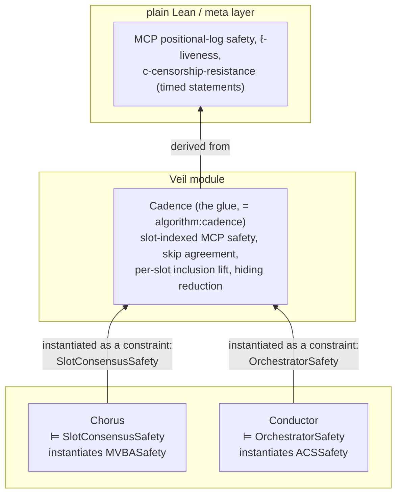

# Conductor & Cadence — module decomposition and design

*The design rationale for the two smaller Veil models and the composition
layer that joins them to Chorus: §1 how the paper describes the Conductor,
§2 the module decomposition and the class layer, §3 what is safety-shaped in
the Conductor versus what stays meta, §4 the Cadence glue module and where
the top-level properties live, §5 how "Chorus ⊨ SlotConsensus" is discharged.
Lean sources cite these sections by number. For what is proven read
[README.md](../README.md) and [Architecture.md](Architecture.md); the
models' own headers ([Cadence/Conductor.lean](../Cadence/Conductor.lean),
[Cadence/Cadence.lean](../Cadence/Cadence.lean)) are authoritative where
they and this document disagree.*

## 1. Source map (what to read)

The rendered paper describes the Conductor twice, **consistently on ACS**:

* Section 5 (`section:conductor-overview`), the overview: validators propose first-slot *deadlines* for the next
  window, feed them into an off-the-shelf **ACS**, and take the
  **median** of the decided vector as the agreed deadline.
* Appendix D (`section:conductor-formal`), the formal treatment: windows
  over **ACS** (Module 4 (`mod:acs`)) — each validator proposes the next window's
  *first slot* (deadlines are fixed, read-only data), ACS decides a set
  of ≥ 2f+1 (validator, slot) pairs, and everyone opens the window
  starting at the **median** of the decided slot numbers. This is the
  version the proofs cover (Algorithm 7 (`algorithm:conductor`); Integrity,
  Lemma 12 (`lemma:conductor-integrity`); Monotonicity, Lemma 13
  (`lemma:conductor-monotonicity`); (2W−p)-Boundedness, Lemma 14
  (`lem:boundedness`); Totality, Lemma 15 (`lemma:conductor-totality`);
  (2Wτ)-Recovery, Lemma 16 (`lemma:conductor-recovery`)).

The model follows the **formal** version, since that is the one the paper
proves. The informal↔formal difference is deliberate and confirmed by the
paper's authors: the overview agrees on the first slot's *deadline*, the
formal part on the first *slot* over read-only deadlines — the same idea
under two equivalent views (moving deadlines ↔ skipping slots, the
orchestrator of Appendix B.1 (`subsection:building_blocks_framework`)).

One source-tree hazard: the paper repository also carries an older
**deadline-MVBA** draft of the Conductor with a leftover reviewer comment
("Not compatible with API. It assumes MVBA"). It is not part of the
rendered paper, so its labels have no rendered number and are absent from
the label map ([paper-labels.tsv](paper-labels.tsv)); a citation of one
fails `scripts/paper-cites.sh`.

The composition lives in Appendix B (`section:framework`): Module 1 (`mod:slotconsensus`) (the
interface Chorus implements), Module 2 (`mod:orchestrator_2`) (the interface
Conductor implements: Totality, Integrity, Monotonicity, B-Boundedness,
R-Recovery), Algorithm 1 (`algorithm:cadence`) (the glue: opened/skipped bookkeeping,
pending set, `ready_to_append` log assembly), and
Appendix B.3 (`subsection:correctness_cadence`) (MCP Safety / ℓ-Liveness /
c-Censorship-Resistance / Hiding / B-Bounded-Concurrency from the two
module contracts). The MCP problem definition (logs, consistency, the
four properties) is Appendix A (`section:formal_problem_definition`).

## 2. Architecture: three modules + a class layer

The **contract pattern** ([CompositionContracts.md](CompositionContracts.md)) is the same at every
level: the consumed module's contract is a type class over an *explicit
abstract state*, which the consumer holds as state of its own and reads
through the class's observables. The consumer `instantiate`s the contract's
state-level fragment as a class constraint — Veil hands every axiom of an
instantiated class to the solver — so the contract's properties are *used* in
the consumer's verification conditions and never restated as `require`s. The
consumed module's transitions appear as an oracle step (`orch_step`,
`sc_step`, `acs_step`, `mvba_step`: any transition the contract allows) plus
the consumer-driven input transitions.

The paper's liveness and quantitative properties are fields of the
`…Temporal` class over the safety instance, stated over runs. The
Conductor, Chorus and the MVBA each have an instance of theirs, proven from
named hypotheses; the ACS is an assumed module and has none. Each module is
verified independently against the contract; the instances and the
composed theorem are §5.

Two consumptions leave a stated **bridge** — a guard that interprets a class
parameter in the consumer's own vocabulary, because the parameter is fixed
before the consumer's state exists: the Conductor's ACS median range (§3),
and Chorus's certificate check on a decided MVBA entry
([CompositionContracts.md](CompositionContracts.md) §7).

### The class layer ([Cadence/Interfaces.lean](../Cadence/Interfaces.lean))

The contracts live in their own file rather than in
[Cadence/Primitives.lean](../Cadence/Primitives.lean) so that editing a contract does not force the
whole cryptographic-primitive import closure to rebuild. Each paper module
is **two classes**: a first-order
`…Safety` fragment (state, transitions, observables, the paper's safety
properties, monotonicity and frames) that a Veil module `instantiate`s, and
the full class extending it with every remaining property over explicit
runs — the obligation lists of the class docstrings are renderings of the
fields, not substitutes for them.

* `SlotConsensus` (family over slots) — agreement, slot safety, proposal
  inclusion (conditional on the synchrony premise) in the fragment;
  termination, hiding's protocol residue, quiescence and the participation
  interface in the full class. `d_tot`-totality and `ℓ`-termination are
  *not* part of Module 1 (`mod:slotconsensus`) — they are Chorus-specific
  strengthenings (Proposition 4 (`prop:chorus-totality`), Lemma 11 (`lemma:chorus-termination`)) that
  Conductor's proofs consume (Lemma 15 (`lemma:conductor-totality`), via
  Φ_oc = ℓ_chorus + d_tot) — and live in `SlotConsensusWithTotality`.
  Instances: `Chorus.slotConsensusSafety` (§5), and the temporal and timing
  levels `Chorus.chorusTemporal` and `Chorus.chorusWithTotality`, joined as
  `Chorus.slotConsensusFull`
  ([Cadence/Chorus/Temporal.lean](../Cadence/Chorus/Temporal.lean)).
* `ACS` — agreement, genuine validity, integrity, the `propose` input in
  the fragment; quantitative validity, ℓ-termination, Δ-totality,
  quiescence in the full class (Module 4 (`mod:acs`)). No instance (standard
  primitive); the Conductor consumes the fragment as its `acs` constraint.
* `Orchestrator` — open-prefix agreement, Monotonicity, Integrity's
  at-most-once half, the `complete` input in the fragment; Integrity's
  totality, B-boundedness and R-recovery in the temporal class
  (Module 2 (`mod:orchestrator_2`)); Integrity's timing half is first-order and sits in
  the fragment. Instances: `Conductor.orchestratorSafety`, and the temporal
  and `d_tot` levels `Conductor.conductorTemporal` and
  `Conductor.conductorWithTotality`, joined as `Conductor.conductorFull`
  ([Cadence/Conductor/Temporal.lean](../Cadence/Conductor/Temporal.lean)),
  for an arbitrary ACS meeting its contract.
* `MVBA` — agreement, integrity, external validity, the two inputs and
  one-step quiescence in the fragment; ℓ_MVBA-termination in the temporal
  class (Module 3 (`mod:mvba`)). Instance: `Mvba.mvbaSafety`
  ([Cadence/Mvba/Compose.lean](../Cadence/Mvba/Compose.lean)), consumed by Chorus and plugged in by
  [Cadence/System.lean](../Cadence/System.lean); its `MVBATemporal` instance is `Mvba.mvbaTemporal`
  ([Cadence/Mvba/Temporal.lean](../Cadence/Mvba/Temporal.lean)), so the full contract is proven.

## 3. The Conductor Veil module

### What is safety-shaped (SMT-checkable), from the paper's own proofs

* **Window-entry integrity and order** — a validator enters each window
  at most once, and window ω only after ω−1.
* **Cross-window slot monotonicity** — the decided first slot of ACS[ω]
  is ≥ last slot of window ω−1 + 1 (paper: `s ≥ s' + W`). Via the ACS
  oracle's agreement + the honest propose-guard (`s* > last[cw]`,
  Algorithm 7, line 40 (`line:sstar-guard`)) + median range validity (see below).
* **Window-assignment agreement** — any two correct validators that
  place slot s in a window place it in the same window; hence the same
  deadline (the Conductor-module "Safety").
* **Opened-set structure** — `opened_i` is a union of per-window
  intervals of width W; windows' intervals are disjoint and increasing.
  The width is the invariant `[win_bounds_shift]`: a window's boundary and
  last slot are the shifts `win_boundary` and `win_last` of its first
  (ingredient 1 below).
  This replaces the paper's cardinality statement ("exactly ω·W slots")
  with an interval formulation that stays in relational logic.
* **Boundedness as interval inclusion** — from the `ready_for_next_window`
  guard: on entering ω+1, all opened slots outside the last W−p of
  window ω are completed. Invariant: every opened-but-uncompleted slot
  lies in the last two windows' tail intervals. The numeric bound
  (2W−p) is a one-line corollary at the meta/Lean level — do **not**
  attempt cardinality counting in SMT.
* **Integrity part 2** ("no open before the slot's starting time") —
  trivial given the clock-guard on the open action (see §4, clocks);
  the real content is the clock-synchronization assumption.

### What is proven over timed runs

* **Totality** (d_tot) and **(2Wτ)-Recovery** are temporal in the paper: a
  per-window induction ("if all windows before ω went well…"), the four
  parameter assumptions (`(p−1)τ + Φ_oc + ℓ ≤ Wτ` and the rest), and
  T₁/T_p bookkeeping. They are proven in plain Lean over timed runs of the
  model (`Conductor.totality`, `Conductor.recovery`;
  [ConductorBounds.md](ConductorBounds.md)), with the model's invariants as
  the state-level facts. The ACS's termination and totality are the
  assumed module's.
* The **parameter assumptions** (Algorithm 7, lines 7–10
  (`line:assumption-one`–`line:assumption-four`)) are fields of the
  schedule and feed only the timing lemmas
  ([Premises.md](Premises.md) §9.2).

### Modelling ingredients beyond Chorus's

1. **Ordered slot/window theory.** Chorus deliberately avoided
   arithmetic; Conductor needs slot numbers with order and *window
   structure*. The window→interval assignment **cannot** be static
   uninterpreted theory (`win_of`, `win_first/win_last` with Horn
   axioms): a window's first slot is decided at runtime by `ACS[ω]`
   (Algorithm 7, line 48 (`line:median-compute`)), so the assignment is execution-dependent
   state. The encoding therefore splits — static order structure only
   (`TotalOrderWithMinimum` on `slot` and `window`, no `+W` arithmetic in
   the SMT layer), with the intervals themselves as oracle state in the
   Conductor. That split introduces **no new axioms**; the details are in
   [Cadence/Windows.lean](../Cadence/Windows.lean). What *is* static is a
   window's width: the immutable shift functions `win_last` and
   `win_boundary` (the `+ (W − 1)` of Algorithm 7, line 52
   (`line:last-update`), and the `+ p` of Algorithm 7, line 23
   (`line:ready-check`): the first slot readiness does not ask to be
   complete) map a window's first slot to its last slot and readiness
   boundary.
   `acs_decide` records exactly that interval, and window 1 is the shifts
   of slot 1 (`[genesis_window]`). The solver sees them as uninterpreted
   functions with `s ≤ win_boundary s ≤ win_last s`, which is the paper's
   `0 ≤ p ≤ W − 1`; the instance at
   `slot := ℕ` fixes the arithmetic.
2. **Median / range validity.** The median of the decided ACS set lies
   between two correct proposals (≤ f faulty among ≥ 2f+1) — order-statistics
   counting, of the same species as the `ByzNodeSet` counting axioms. The
   model uses both halves: `acs_decide` requires two correct witness
   pairs from a correct decider's decided set, `(r1, s1)` with
   `s1 ≤ first` (which separates the windows) and `(r2, s2)` with
   `first ≤ s2` (which recovery's timing reads). That the median meets
   them is a Lean theorem from the ACS contract,
   `Cadence.acs_median_bracket` ([Cadence/AcsMedian.lean](../Cadence/AcsMedian.lean)),
   through the median lemma of [Cadence/Windows.lean](../Cadence/Windows.lean)
   and the contract's one-slot-per-validator field. This is one of the two
   stated bridges (§2).
3. **Abstract clock.** A monotone global `now` (an ordered type, advanced by
   a nondeterministic tick action) with guards such as
   `require start_time s ≤ now` on `open`. Timing *properties* stay meta; the
   clock exists only to make guards like "not before the starting time" and
   "propose on time vs late" expressible. The second is `acs_propose`'s
   `s*` rule (Algorithm 7, lines 39–41
   (`line:sstar-compute`–`line:sstar-update`)): the earliest slot whose
   starting time has not passed at `now`, or the first slot beyond the
   current window if that one lies within it. Starting times strictly
   increase (`[start_time_strict]`, the τ-spacing of Appendix A.1
   (`subsection:mcp-preliminaries`), whose arithmetic the instance at
   `slot := ℕ` fixes), and the clock starts at slot 1's starting time. Clock synchronization across
   validators — which the paper assumes — is therefore an explicit modelling
   assumption of the threat model. This is the Conductor analogue of Chorus's
   `Phase` enum, shared across slots rather than per-slot.
4. **Multi-slot indexing.** Conductor state is genuinely multi-slot
   (opened/completed per slot). That is ordinary Veil relation indexing; only
   Chorus is deliberately single-slot.

### Adversary

The Conductor has no Byzantine message surface beyond ACS: its only inputs
are local `completed(s)` callbacks and ACS decisions. Byzantine influence
enters in two places — (i) ACS decided sets containing up to f faulty pairs
(one per Byzantine validator, `ACSSafety.decided_unique`), covered by the
median-range `require` that `Cadence.acs_median_bracket` justifies, and (ii) Byzantine validators' own ACS proposals, which
are internal steps of the ACS instance and which the contract leaves
unconstrained. The module therefore needs no quorum machinery of its own;
`ByzNodeSet` enters only through the median lemma.

## 4. The Cadence glue module and the top-level properties

Algorithm 1 (`algorithm:cadence`) is its own small Veil module:

* State (per validator): `opened`, `skipped`, `pending(s, v)`,
  `appended(s, v)` (the log as a slot-indexed relation — the ordered-list
  view is recovered from slot order).
* Sub-protocol state and oracle steps: `os : ostate` and
  `sc_state s : scstate`, advanced by `orch_step`/`sc_step` — any internal
  transition the respective `…Safety` contract allows. `opened`,
  `finalized`, `completed` are ghosts reading the contracts' observables.
* Handlers: `on_open(i, s)` — reacts to `orch.opened`, drives the
  slot-consensus instance's `participate` input; `on_propose(i, s, p)` — the
  proposer's `propose` input; `on_finalize(i, s, v)` — reacts to
  `sc.finalized`, buffers the vector (`delivered`), and drives the
  orchestrator's `complete` input and the instance's `abandon` input in one
  step. The records of the glue's calls are the instances' own.
* Protocol actions: append when `ready_to_append` (every smaller slot
  skipped-or-appended — expressible relationally), `record_skip`.

**Slot-indexed MCP safety, in the glue module (SMT):**

* per-slot log agreement: honest i, j with `appended(i, s, v)` and
  `appended(j, s, v')` ⇒ `v = v'` (from the finalize oracle's agreement);
* skip agreement: if honest i appended for s, no honest j that has
  resolved past s skipped s (from orchestrator totality+monotonicity —
  note the *safety-usable* residue of totality here is the paper's
  argument "j opened a higher slot without opening s ⇒ j never opens s,
  contradicting totality"; in the monotone model this becomes an
  invariant relating `appended`/`skipped` across validators, discharged
  from the contract's `open_prefix_agreement` and `monotonicity` axioms);
* per-slot inclusion lift: under the `all_honest_recorded`-style premise
  the finalized v contains the correct proposer's proposal — this is
  imported through the SlotConsensus oracle's (conditional) inclusion
  require, instantiated by Chorus's `proposal_inclusion`;
* bounded concurrency: the participation interval lies inside
  open-to-complete — an active instance is opened and not completed —
  which the orchestrator boundedness contract bounds (interval form).

**Positional/timed MCP statements, in plain Lean / meta:**

* Def. `safety` (prefix consistency of `local_log(p, t)` as ordered
  lists) follows from per-slot agreement + skip agreement by the paper's
  own two-case argument — a small list lemma over the slot-indexed
  relations; this is naturally a plain-Lean theorem *about* the glue
  module's reachable states, not an SMT invariant (positions are list
  arithmetic).
* ℓ-liveness and c-censorship-resistance carry real-time parameters
  (GST + R, ℓ_MVBA, …) — they compose the meta-layer termination /
  recovery axioms and live at the meta layer, exactly like Chorus's
  ℓ-termination does today.
* Hiding: the paper's composition lemma is one line — proposals flow only
  through per-slot instances — and at this abstraction the glue module has no
  other channel. It is therefore documented rather than proven here; the
  protocol-level share-gating theorem stays in Chorus
  (`hiding_until_deadline`).

**Where the top-level properties live.** They are not Conductor properties:
the orchestrator's interface never carries proposal vectors, so log agreement
is not expressible there. Nor are they proven from scratch in Lean. The
slot-indexed core is SMT-checked in the glue module, and only the
formulation-level lifting — list positions, wall-clock parameters — is plain
Lean or meta. That split mirrors the paper's own proof structure, which is
what keeps the model reviewable against it.

## 5. Connecting the layers (how "Chorus ⊨ SlotConsensus" becomes real)

Three pieces, all in place ([CompositionContracts.md](CompositionContracts.md) is the full record).

### 5.1 Consumption as class constraints

The glue holds the sub-protocols' abstract states and `instantiate`s the
contracts' state-level fragments; every property it needs is a class axiom
the solver has at the reachable abstract state. There is no restatement to
keep in sync, so no correspondence between a class field and a consumer's
`require` has to be audited by reading.

### 5.2 Lean instance theorems

`Conductor.orchestratorSafety` ([Cadence/Composition.lean](../Cadence/Composition.lean))
and `Chorus.slotConsensusSafety`
([Cadence/Chorus/Compose.lean](../Cadence/Chorus/Compose.lean)) package
each implementation's *own transition system* — its `init`, `next`,
`reachable`, its actions as the contract's input transitions — as an
instance of the fragment. The state-predicate fields are the persisted
reachable-state theorems, `exact`-level; the two-state fields (monotonicity
of the observables, frames, the paper's Monotonicity) are proven action by
action from Veil's pre-computed transition bodies. The temporal level is
the `…Temporal` class, instantiated for each implementation from named
hypotheses, and a definition (`…_of_temporal`) joins the two levels into
the full contract
([CompositionContracts.md](CompositionContracts.md) §5).
Trace-level refinement — that the implementation's runs *implement* the
consumer's oracle steps — remains the [ChorusDesign.md](ChorusDesign.md) §10.1 research
item; here the oracle steps *are* the implementation's transitions, which
is as close as a state-based composition comes.

### 5.3 The composed system

`Cadence.system_positional_log_safety` ([Cadence/System.lean](../Cadence/System.lean))
instantiates the glue's positional MCP Safety at the two instances: the
statement is about the glue running the Conductor's and Chorus's transition
systems. Its hypotheses are the modules' configurations, their agreement
on the fault pattern, and one contract: `ACSSafety`, the ACS the Conductor
runs per window, which this development does not implement. The composed
system's timed claims (Corollary 4, bounded concurrency, `𝓡`-Liveness,
censorship resistance) are proven over its timed runs in
[Cadence/Composed/](../Cadence/Composed/Schedule.lean)
([CompositionContracts.md](CompositionContracts.md) §6).

## 6. Stake weighting

Out of scope, but not precluded: every quorum argument in Chorus goes through
the `ByzNodeSet` *predicates* (`supermajority`, `greater_than_third`)
and its counting axioms — never through explicit cardinalities. A
stake-weighted deployment is a different *instance* of the same class
(supermajority = "> 2/3 of stake", plus re-proving the counting axioms under
weight arithmetic; all of them remain true with weight in place of count).
Three conventions keep that option open, and are followed throughout:

* no model or invariant cases on set sizes or node counts — only on the
  quorum predicates;
* new counting facts are `ByzNodeSet`-style axioms with instance proofs, so
  a weighted instance re-proves the same fields;
* the Conductor median lemma is stated over an abstract "correct majority in
  the decided set" predicate.

The genuinely open issue — weighted DA/erasure-chunk assignment — is a
protocol-design question (chunks-per-validator proportional to stake vs.
the f+1-of-n decode threshold) and does not block the consensus-layer
model; Chorus's chunk quorums would follow whatever quorum predicate the
weighted instance provides.

## 7. Scope notes

* The rendered paper's two Conductor descriptions agree on ACS; the
  deliberate overview↔formal difference (agree on the first slot's
  *deadline* vs. on the first *slot* over read-only deadlines) is the
  deadline↔slot equivalence of §1. The model follows the formal
  version. (The deadline-MVBA variant is an unrendered draft — see the §1
  source-tree note.)
* Validator-set changes, epochs and proposer rotation are outside the
  paper's consensus-layer treatment: `s.proposers` is an immutable
  per-slot relation (generalizing Chorus's single-slot `is_proposer`).
* Chorus's `participate()/abandon()` conformance — that the glue calls
  abandon only after finalize — is a documented scope note in Chorus; the
  glue module makes it structurally checkable, since its abandon record is
  gated on finalize.
