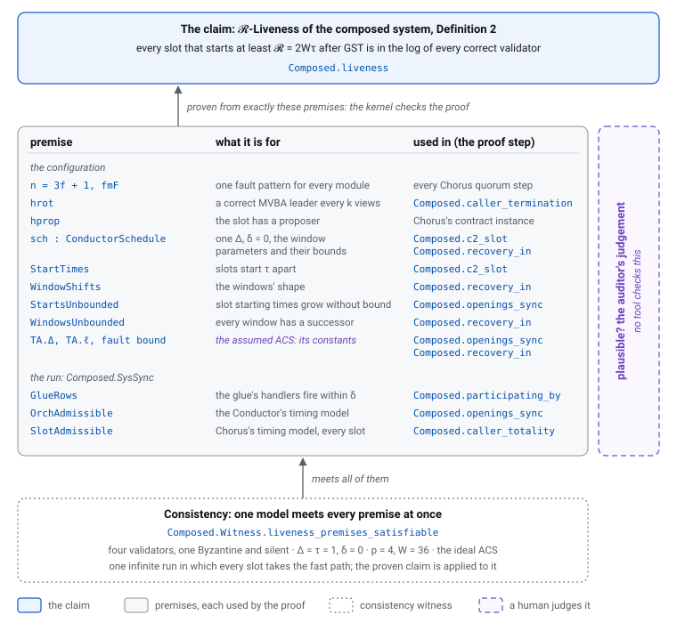

# The premises

*The ledger of the premises of every claim, each listed once.
[The guide's chapter 2](https://larskuhtz.github.io/cadence/guide/claims/) introduces them in plain words; this
page is the authority for the list.*

Every liveness claim of this development is conditional: it holds in every
run that meets its premises. The premises play the role of the claim's
axioms, so they are what an auditor has to believe. This page lists each
one once, says what it is for and why it is plausible, and points to the
evidence for the two properties the machine can check.

**What is machine-checked about the premises, and what is not.**

* **Consistency.** All premises of a claim hold together in one model: a
  *witness theorem* exhibits an instance and a run meeting every one of
  them at once. A claim whose premises could never hold together would be
  vacuous. Every claim below has its witness.
* **Each premise is used.** Every premise is consumed by some step of the
  claim's proof, so none of them can be dropped without a replacement.
  This is the best-effort half of independence (§7 says how it was
  checked).
* **Completeness** comes from the proofs: the claims are proven from
  exactly the premises listed, kernel-checked, with no further axiom
  ([Cadence.lean](../Cadence.lean) pins every axiom footprint).
* **Plausibility is the auditor's judgement.** No tool can check that a
  premise describes the runs a real network and a real implementation
  produce. Each entry below therefore says, in one line, why it is
  plausible on its own, and names the paper's sentence it formalises, or
  says that it is a modelling choice and where the choice is justified.

**How an entry reads.** The heading is the premise's Lean name and, where
it has one, its tag. Then, one line each:

* **Role** — what the premise is for, in plain words.
* **Plausible** — why a real environment or implementation meets it.
* **Satisfiable** — "obvious", or the witness theorem that shows it.
* **Used in** — the proof step that consumes it.
* **Paper** — the paper's statement it formalises, or "modelling choice"
  with a pointer to the justification.

The premises' definitions are in
[Chorus/Liveness.lean](../Cadence/Chorus/Liveness.lean),
[Chorus/Schedule.lean](../Cadence/Chorus/Schedule.lean),
[Mvba/Liveness.lean](../Cadence/Mvba/Liveness.lean) and
[Mvba/Schedule.lean](../Cadence/Mvba/Schedule.lean), and for the composed
system and the Conductor
[Composed/Schedule.lean](../Cadence/Composed/Schedule.lean) and
[Conductor/Schedule.lean](../Cadence/Conductor/Schedule.lean); each
docstring starts with the role line of this page.

## Contents

0. [The composed system: the premises of the end claims](#0-the-composed-system-the-premises-of-the-end-claims)
1. [The claims and their premises](#1-the-claims-and-their-premises)
2. [The setting: hypotheses on the instance](#2-the-setting-hypotheses-on-the-instance)
3. [Scheduling: the untimed premises](#3-scheduling-the-untimed-premises)
4. [Timing: the timed premises](#4-timing-the-timed-premises)
5. [The seam between Chorus and the MVBA](#5-the-seam-between-chorus-and-the-mvba)
6. [The caller's conditions](#6-the-callers-conditions)
7. [Independence: every premise is used](#7-independence-every-premise-is-used)
8. [What is not a premise](#8-what-is-not-a-premise)
9. [The Conductor's timed claims](#9-the-conductors-timed-claims)

## 0. The composed system: the premises of the end claims

*Read this section first. It is the whole list of what the composed timed
claims assume. Every condition one module needs from another is discharged
inside the composition, so what remains is about the environment and the
configuration: the network and the schedule, the fairness of each module's
honest steps, the assumed ACS, and the seam between Chorus and the MVBA.
The premises are fixed and type-checked in
[Composed/Schedule.lean](../Cadence/Composed/Schedule.lean). Each line
names the Lean lemma that uses it, and the witness that satisfies it. The
whole list holds at once in one model of the composed system, the
**composed witness** (§0.5): every line marked "not obvious" names the
theorem of [Composed/Witness/](../Cadence/Composed/Witness/) that meets it
there, and the four `…_premises_satisfiable` theorems meet them all
together.*

### 0.1 The claims

| Claim | What it says | Proven by |
|---|---|---|
| `Composed.Corollary4Claim` — Corollary 4 (`cor:chorus-correctness-within-cadence`) | in every admissible composed run, every slot's Chorus part meets every condition Chorus's timed contract takes from its caller: Δ-synchronized participation, C1, C2. Chorus's `ℓ`-Termination, `d_tot`-Totality and Termination then hold of every slot with no caller premise left | `Composed.corollary4`; `Composed.corollary4_bounded_termination`, `…_totality`, `…_termination` ([Composed/Corollary4.lean](../Cadence/Composed/Corollary4.lean)) |
| `Composed.BoundedConcurrencyClaim` — Lemma 5 (`lemma:cadence-bounded-concurrency`) at `𝓑 = 2W − p` | at every reachable state, no correct validator actively participates in `𝓑 + 1` slot instances | `Composed.boundedConcurrency` ([Composed/Concurrency.lean](../Cadence/Composed/Concurrency.lean)) |
| `Composed.LivenessClaim 𝓡` — `𝓡`-Liveness (Definition 2 (`def:liveness`), Lemma 2 (`lemma:cadence-liveness`)) | for every slot `s` with `s.deadline − Δ ≥ GST + 𝓡`, every correct validator appends a vector of slot `s` to its local log | `Composed.liveness` at the paper's `2Wτ`, `Composed.liveness_sharp` at `(W + p − 1)τ` ([Composed/Liveness.lean](../Cadence/Composed/Liveness.lean)) |
| `Composed.CensorshipClaim 𝓡` — `𝓡`-Censorship resistance (Definition 3 (`def:censorship-resistance`)) | for every slot `s` with `s.deadline − Δ ≥ GST + 𝓡` and every correct proposer `j` of `s`, `j` proposes some `P`, and every correct validator appends a vector of slot `s` that holds `P` for `j` | `Composed.censorship` at `2Wτ`, `Composed.censorship_sharp` at `(W + p − 1)τ` ([Composed/Censorship.lean](../Cadence/Composed/Censorship.lean)) |

Censorship resistance takes Liveness's premises and two more, marked (CR)
below: (P-incl) on every started slot, and a well-encoded root for a
correct proposer to propose.

### 0.2 The instance and the configuration

Lemma 5 takes only `WindowShifts`. Corollary 4 takes the lines marked (C4)
below; Liveness takes all of them.

* **`n = 3f + 1`, at most `f` Byzantine, one fault pattern** (`fmF`) —
  *Role:* "correct" is one notion for the Conductor, the ACS, every slot's
  Chorus and the glue. *Used in:* every Chorus quorum argument, through
  Chorus's instance (§2.1); the system's fault pattern is Chorus's, so no
  transport of the kind `System.lean`'s `hbyz` makes is needed. (C4)
  *Satisfiable:* obvious; `Fin 4`, `f = 1`, validator 3 Byzantine.
* **Chorus's configuration** at the system's (`Cadence.chorusTheory`,
  `Cadence.mvbaTheory`), with the view enumeration and
  (A-leader-rotation-k) (§2.3, §2.5) and a cancellative, Archimedean time
  (§2.6). *Used in:* Chorus's bounded termination (the MVBA's termination
  inside it) in `Composed.caller_termination`; its totality in
  `Composed.caller_totality`. (C4) *Satisfiable:* obvious; the Chorus
  witness's configuration (`k = 1`, validator 0 leading every view, `ℕ`),
  `Composed.Witness.hrot`.
* **The proposers.** The glue's per-slot proposer assignment is Chorus's,
  by construction in the censorship claim (`is_proposer j` in every slot),
  so no tie between the two is assumed. Chorus's configuration has one
  proposer set for all slots; per-slot rotation is out of scope
  ([ConductorDesign.md](ConductorDesign.md) §7).
* **A well-encoded root exists** (`∃ m, well_encoded m`) (CR) — *Role:*
  a correct proposer has a proposal to submit. *Plausible:* the paper's
  correct proposer encodes its ciphertext into a valid erasure encoding
  (the recovery guarantee). *Used in:* the `on_propose` row's
  enabledness (`Chorus.propose_exists` in `Composed.censorship_of`).
  *Paper:* Algorithm 2 (`alg:proposer-dissemination`). *Satisfiable:*
  obvious; every root is well-encoded.
* **The slot has a proposer** (`hprop`, §2.10) — *Role:* forms Chorus's
  contract instance. *Used in:* only through that instance
  (`Chorus.chorusTemporal`'s `admissible_exists`); no step of the composed
  proofs uses it. Reported, not removed. (C4) *Satisfiable:* obvious;
  validator 0.
* **`ConductorSchedule`** (§9.2): one `Δ`, one `δ`, the MVBA's constants,
  the window parameters, the four parameter assumptions:
  * **`D_eq`** — *Role:* Chorus's deadline is the Conductor's starting time
    plus `Δ`. *Used in:* C2 (`Composed.c2_slot`). (C4)
  * **`δ_zero`** — *Role:* each glue handler runs with its event. *Used
    in:* every glue row lands by `max(c, GST)` (`Composed.participating_by`,
    `Composed.ref_le_bound`); `d_tot = Δ` (`Composed.caller_totality`,
    `Composed.openings_sync`). (C4)
  * **`assm_one`–`assm_four`**, `τ_pos`, `p_lt_W` — *Used in:* Recovery
    (§9.2), through `Composed.recovery_in`.

  *Satisfiable:* not obvious as a whole (the four assumptions bound `W`
  from below by Chorus's own latency): `Composed.Witness.sch`, at
  `Δ = τ = 1`, `δ = 0`, the Chorus witness's MVBA schedule
  (`ℓ_MVBA = 24`, so `Φ_oc = 30`), `ℓ = 2`, `p = 4` and
  `W = p + Φ_oc + ℓ = 36`; the four assumptions are checked by `decide`,
  `D_eq` and `δ_zero` hold by definition.
* **`StartTimes`** — *Used in:* C2 (`Composed.c2_slot`, the starting time
  `start₀ + s • τ`), and Recovery. (C4) *Satisfiable:* obvious; slot `s`
  starts at `s`.
* **`StartsUnbounded`** — *Used in:* the Conductor's Totality inside
  `Composed.openings_sync`, and Recovery. (C4) *Satisfiable:* obvious at
  `ℕ`.
* **`WindowsUnbounded`**, **`WindowShifts`** — *Used in:* Recovery;
  `WindowShifts` also in Lemma 5 (`Composed.bounded_concurrency`, through
  `Conductor.boundedness`), its only premise. *Satisfiable:* obvious;
  windows are `ℕ`, a window's last slot is its first plus `W − 1`, its
  boundary its first plus `p`.
* **The assumed ACS** (`TA : ACSTemporal …`, P17), with **`TA.Δ = Δ`**
  (C4), **`TA.ℓ = ℓ`** and **at most `TA.fault_bound` Byzantine** — *Used
  in:* `TA.Δ = Δ` in the Conductor's Totality (`Composed.openings_sync`);
  the other two in Recovery (§9.2). *Satisfiable:* not obvious (an ACS
  meeting both levels of its contract): the ideal ACS,
  `Cadence.IdealAcs.acsTemporal`, at `Δ = 1`, `ℓ = 2`, `f = 1`
  (`Composed.Witness.TA`, `hΔ`, `hℓ`, `hfault`).

### 0.3 The run: `Composed.SysSync`

* **`GlueRows`** — *Role:* each of the glue's handlers fires within `δ` of
  its gate, the timed form of the glue's (F-justice). *Plausible:* the
  paper's handlers are atomic with the event they handle; a gate is the
  validator's own records and the output it handles. *Used in:*
  * `open_` (participation upon opening): `Composed.participating_by`,
    `Composed.partSync_composed`, `Composed.caller_totality`,
    `Composed.appended_of_all_open`; (C4)
  * `finalize` (completion and abandonment upon finalizing):
    `Composed.caller_totality`, `Composed.caller_termination`,
    `Composed.appended_of_all_open`;
  * `skip`: `Composed.liveness_of_opens`;
  * `append`: `Composed.appended_of_all_open`;
  * `propose` (CR): `Composed.censorship_of`, the proposer's proposal at
    the slot's starting time.

  *Paper:* the glue's handlers, Algorithm 1, lines 16–26
  (`line:implicit-skip`–`line:pending-remove`). *Satisfiable:* not
  obvious jointly with the rest: `Composed.Witness.glueRows`. Every handler
  fires in the clock reading its gate opens at, so at the last index of
  every reading each gate is closed.
* **`OrchAdmissible`** — *Role:* the Conductor meets its timing model on
  its part of the run: `Conductor.Admissible`, the Conductor instance's own
  `Admissible`, which is `Conductor.Sync` (§9.3) by name. *Used in:* its
  clock (`Composed.clock_le`, hence C2); the Conductor's Totality
  (`Composed.openings_sync`) and Recovery (`Composed.recovery_in`). (C4)
  *Satisfiable:* not obvious: `Composed.Witness.orchAdmissible`. The
  orchestrator's part is stepped at every index (its `tick` in place), its
  labelled run is the Conductor's own (`Composed.Witness.crun`), and it
  meets the rows, (P-open), one clock, and every window's ideal ACS with
  both of its timing guarantees.
* **`SlotAdmissible`** — *Role:* every slot a correct validator
  participates in meets Chorus's timing model on its part of the run:
  `Chorus.Admissible`, Chorus's instance's own `Admissible`, which names
  §3.1, §3.2, §4.1–§4.3 and §5.1 at the slot's deadline. *Used in:* every
  use of a Chorus field (`Composed.caller_totality`,
  `Composed.caller_termination`, `Composed.appended_of_all_open`). (C4)
  *Satisfiable:* not obvious: `Composed.Witness.slotAdmissible`. A slot is
  stepped exactly from its first step on (its initial state cannot
  stutter, `Composed.Witness.no_stutter_init`), and its part is then one
  labelled run, the same for every slot up to a shift of the clock
  (`Composed.Witness.srun`), meeting §3.1, §3.2, §4.1–§4.3 and §5.1 as the
  Chorus witness does.
* **`SlotInclusive`** (CR) — *Role:* (P-incl), Chorus's
  `DeadlineInclusive` (§4.8), on every started slot's part of the run.
  *Used in:* `Chorus.within_proposal_recorded_incl` in
  `Composed.censorship_of`: the proposer's chunk, delivered by the
  deadline, is recorded by every correct validator. *Satisfiable:* not
  obvious: `Composed.Witness.slotInclusive`; every correct validator
  records the proposer's chunk in the slot's first clock reading.

### 0.4 What is not a premise: the caller conditions

Every condition one module's claims take from its caller is a theorem
about the composed run ([Composed/Corollary4.lean](../Cadence/Composed/Corollary4.lean)):

| condition | of | discharged by |
|---|---|---|
| `AllParticipateBy t` (§6.1) | Chorus | `Composed.participating_by` |
| C1, `NoAbandonBeforeFinalizing` (§6.2) | Chorus | `Composed.c1_slot` |
| C2, `NoEarlyStart` (§6.3) | Chorus | `Composed.c2_slot` |
| `SyncParticipationWithin Δ` (§6.4) | Chorus | `Composed.sync_slot` with `Composed.openings_sync` |
| (R-tot) (§9.4) | the Conductor | `Composed.caller_totality` |
| (R-term) (§9.4) | the Conductor | `Composed.caller_termination` |
| no premature abandonment, Δ-synchronized proposals | the ACS | the Conductor's own proofs (§9, Proposition 12, Corollary 2) |

The MVBA's caller conditions (§6.5) are derived inside Chorus's claims
(§8).

### 0.5 The composed witness: every line at once

[Composed/Witness.lean](../Cadence/Composed/Witness.lean)
([ConductorBounds.md](ConductorBounds.md) §8.2). One model of the composed
system meets every line of §0.2 and §0.3 together:

| Claim | Its premises jointly satisfied by |
|---|---|
| Corollary 4 (`Corollary4Claim`) | `Composed.Witness.corollary4_premises_satisfiable` |
| Lemma 5 (`BoundedConcurrencyClaim`) | `Composed.Witness.boundedConcurrency_premises_satisfiable` (`WindowShifts`, and the reachable states of the run) |
| `𝓡`-Liveness, at `2Wτ` and `(W + p − 1)τ` (`LivenessClaim`) | `Composed.Witness.liveness_premises_satisfiable` |
| `𝓡`-Censorship resistance, at `2Wτ` and `(W + p − 1)τ` (`CensorshipClaim`) | `Composed.Witness.censorship_premises_satisfiable` |
| the Conductor's Totality, Boundedness and Recovery (§9) | `Composed.Witness.conductor_premises_satisfiable`, the caller's (R-tot) and (R-term) included |

*The model.* Four validators, validator 3 Byzantine and silent;
validator 0 proposes in every slot; `Δ = τ = 1`, `δ = 0`, `ℓ_ACS = 2`,
`p = 4`, `W = 36`; the ideal ACS. *The run.* Every clock reading `t` is one
block of 56 steps: each correct validator opens slot `t`, participates,
and validator 0 proposes; its chunk reaches everyone and the correct
validators record it. At `t + 1`, the slot's deadline, it takes the fast
path, every correct validator finalizes it, completes it at the Conductor,
abandons it and appends its vector; at `t + 2` and `t + 3` its arm
markers fire on a quiet instance. At each window's readiness boundary
`36k + 4`, every correct validator proposes slot `36(k + 1)` to the next
window's ACS, which decides at once; the interval is recorded and everyone
enters the window. Every window repeats the first, shifted by `Wτ` in time
and `W` in slot number, and every slot the one before it, shifted by `τ`.
GST is 0. Every handler fires in the clock reading its gate opens at, so
every row holds with nothing pending when the clock moves.

Each theorem proves the premises only, never a conclusion. As a check that
the premise set is the one the claims take, each proven claim is applied
to the model in [Composed/Witness.lean](../Cadence/Composed/Witness.lean).

## 1. The claims and their premises

Each row is a headline claim, the premises it takes (by the section of this
page that has them), and its witness. The safety claims take no run
premise; their hypotheses are §2's and the trust items of
[Architecture.md](Architecture.md) §4.

| Claim | Premises | Witness |
|---|---|---|
| `Chorus.termination` — every correct validator finalizes the slot | §2.1, §2.3, §2.4; `FJustice` §3.1, `MvbaAdmissible` §3.2; `ValidBridge` §5.1; `AllParticipate` §6.1, C1 §6.2 | `Chorus.termination_premises_satisfiable` |
| `Chorus.timed_termination_atMvba`, `…_tight_atMvba` — every correct validator finalizes by `max(t, GST) + 5Δ + ℓ_MVBA + 9δ` (tight: `4Δ + ℓ_MVBA + 8δ`) | §2.1, §2.3–§2.8 (§2.2 is a theorem of the family, `Chorus.hqeFin`); `TimedJustice` §4.1, `PhasePunctual` §4.2, `MvbaOwnTiming` §4.3; `ValidBridge` §5.1; `AllParticipateBy t` §6.1, C1 §6.2, C2 §6.3, `SyncParticipationWithin Δ` §6.4 | `Chorus.timedTermination_premises_satisfiable` |
| `Chorus.timed_termination`, `…_tight` — the same, for any MVBA contract `T` | as above, with `TimedMvbaAdmissible T` §4.3 in place of `MvbaOwnTiming`, and `0 ≤ ℓ_MVBA` §2.9 in place of the MVBA instance's §2.2 and §2.5–§2.7 | through the row above (at the system's MVBA, `0 ≤ ℓ_MVBA` is a theorem) |
| `Chorus.totality` — once one correct validator finalizes at `c`, all do by `max(c, GST) + max(Δ, d) + 2δ` | §2.1 (finitely many validators), §2.8; `TimedJustice` §4.1; C1 §6.2, `SyncParticipationWithin d` §6.4 | `Chorus.totality_premises_satisfiable` |
| `Chorus.chorusTemporal`, `Chorus.chorusWithTotality`, `Chorus.slotConsensusFull` — Chorus ⊨ the full `SlotConsensus` contract | the three rows above (`Admissible` names their run premises), and the non-empty proposer set §2.10 | `Chorus.admissible_exists` (every initial state) |
| `Mvba.termination` — every correct validator decides | §2.1, §2.2, §2.3, §2.4; `Mvba.FJustice` §3.3, (A-viewsync) §3.4, (F-avail) §3.5; `AllPropose`, `NoEarlyAbandon`, (F-relay) §6.5 | `Mvba.termination_premises_satisfiable` |
| `Mvba.bounded_termination`, `Mvba.timed_termination` — every correct validator decides by `max(t, GST) + ℓ_MVBA` | §2.1–§2.7; `Mvba.Sync` §4.4–§4.7; the timed caller conditions §6.5 | `Mvba.timedTermination_premises_satisfiable` |
| `Mvba.mvbaTemporal`, `Mvba.mvbaFull` — Mvba ⊨ the full `MVBA` contract | the row above (`Admissible` is `Mvba.Sync`) | `Mvba.admissible_exists` (every initial state) |
| `Conductor.totality`, `Conductor.boundedness`, `Conductor.recovery` — the Conductor's Totality, `(2W − p)`-Boundedness and `(2Wτ)`-Recovery | §9.1–§9.4 | `Composed.Witness.conductor_premises_satisfiable` (§0.5) |
| `Composed.corollary4`, `Composed.boundedConcurrency`, `Composed.liveness`, `Composed.liveness_sharp`, `Composed.censorship`, `Composed.censorship_sharp` — Corollary 4, Lemma 5 at `2W − p`, `𝓡`-Liveness and censorship resistance at `2Wτ` and `(W + p − 1)τ`, for the composed system | §0, with every caller condition discharged (§0.4) | `Composed.Witness.corollary4_premises_satisfiable`, `…boundedConcurrency…`, `…liveness…`, `…censorship…` (§0.5) |
| `Conductor.conductorTemporal`, `Conductor.conductorWithTotality`, `Conductor.conductorFull` — the Conductor ⊨ the full `Orchestrator` contract, for an arbitrary ACS | the three rows above (`Admissible` is `Conductor.Sync`); the instance's hypotheses are §9.5 | `Conductor.admissible_exists` (every initial state) |
| `Cadence.system_positional_log_safety` — two correct validators never disagree on a log position, in the composed system | `ACSSafety` (the ACS primitive, assumed: [Architecture.md](Architecture.md) §4 item 3); the quorum classes of §2.1; the three modules' configurations, with the models' assumptions of §2.4; that the Conductor and Chorus agree on who is Byzantine (`hbyz`, [CompositionContracts.md](CompositionContracts.md) §7) | — (a safety claim: it holds in every reachable state) |

"Finitely many validators" in the Chorus rows is `Fin n`; the timed claims
need it through the totality step, and `Chorus.totality` takes it as
`Fintype node` at any quorum system.

## 2. The setting: hypotheses on the instance

Hypotheses about the validators, the quorum system, the views, time and the
schedule. They constrain the *instance*, not the run, so every run of the
instance shares them. All of them are obvious; the witnesses meet them
with four validators, one Byzantine, views and clock `ℕ`, and `Δ = 1`.

### 2.1 Validators and faults

`n = 3f + 1` validators, `Fin n`, at most `f` of them Byzantine
(`byzNodeSetFin n f`, the Chorus claims); for the MVBA, any quorum system
satisfying `ByzNodeSet`'s axioms over finitely many validators
(`Fintype node`).

* **Role:** the fault threshold: any two supermajorities share a correct
  validator, and the correct validators are a supermajority.
* **Plausible:** the standard Byzantine setting; a deployment fixes `n`
  and tolerates `f` faults.
* **Satisfiable:** obvious; `ByzNodeSet`'s axioms are proven for every
  `n ≥ 3f + 1` and every Byzantine set of size at most `f`
  (`byzNodeSetFinGen`, [ByzQuorum.lean](../Cadence/ByzQuorum.lean)).
* **Used in:** Chorus: `honest_supermajority` (`saturation_fin`,
  `mvba_evidence_of_saturation`) and the counting class (the FallbackQC's
  correct signer, `eventually_fbcommit_sig`); timed: `honest_quorum_fin`
  (`within_all_saturated`). MVBA: finiteness gives the quorum enumeration
  (`ByzNodeSetEnum.ofFintype`) both termination proofs assemble
  certificates with, and the common deadline of `Mvba.aViewSync_of_sync`.
* **Paper:** Section 2 (`subsection:mcp-overview`): "`n = 3f + 1`
  validators, of which up to `f > 0` may be faulty".

### 2.2 A correct supermajority: `ByzNodeSetHonestQuorum`

* **Role:** some supermajority consists of correct validators only.
* **Plausible:** at most `f` of `3f + 1` are Byzantine, so the other
  `2f + 1` are such a set.
* **Satisfiable:** obvious; proven for every `n ≥ 3f + 1`
  ([ByzQuorum.lean](../Cadence/ByzQuorum.lean)), and at the Chorus family
  it is a theorem (`Chorus.hqeFin`), so the Chorus claims do not take it.
* **Used in:** `Mvba.termination` (`eventually_tc_below_good`,
  `terminates_of_settled_honest_view`), `Mvba.bounded_termination`
  (`within_tc`, `exists_good_view`).
* **Paper:** a consequence of §2.1; modelling choice to state it apart
  ([Architecture.md](Architecture.md) §4 item 3: the intersection axioms
  do not give it).

### 2.3 Views: `ViewOrderEnum`

* **Role:** every view has a next one, and finitely many lie below each.
* **Plausible:** views are a counter.
* **Satisfiable:** obvious; `ℕ` (`natViewOrderEnum`).
* **Used in:** the MVBA's view change: `eventually_tc_below_good` (an
  induction over the views below the good one), `Mvba.bounded_termination`
  (`ℓ_MVBA` counts `|below v_L|` views); Chorus reaches it only through
  `Mvba.termination` (`all_decided_of_all_input`).
* **Paper:** modelling choice; a view with nothing directly above it is a
  view no validator can leave ([Architecture.md](Architecture.md) §4
  item 3).

### 2.4 The models' assumptions

`Chorus.lean`'s `mvba_init` (the MVBA starts in an initial state),
`mval_pos_functional` and `mval_pos_neg_excl` (theorems at the system's
configuration, `chorusTheory_assumptions`); `Mvba.lean`'s
`leader_functional` (one leader per view). The system's configurations
fix the rest: `Cadence.chorusTheory`, and `Cadence.mvbaTheory`, whose
entry vector of a meta-block is its own entries (`ent :=
MetaBlock.entries`); the validity predicate and the leader schedule stay
arbitrary.

* **Role:** the configuration the claims are about: an MVBA that has not
  started, and a leader schedule.
* **Plausible:** a slot's MVBA instance starts fresh; a leader schedule
  is a function, and round-robin reaches every validator.
* **Satisfiable:** obvious; the witnesses use the MVBA's initial state and
  validator 0 as every view's leader.
* **Used in:** `abandoned_of_mvba_abandoned` and `eventually_mvba_complete`
  (`mvba_init`: the MVBA's records start empty and its reachability holds),
  `certified_certifiedVector` (`ent`), and the MVBA's safety invariants
  (`leader_functional`: one `Pre-Prepare` per view's leader). The MVBA
  model asks nothing more of the leader schedule; a correct leader is a
  liveness premise, `LeaderRotation` (§2.5).
* **Paper:** Supplement, Section 1.2 (`subsec:mvba-protocol`) (the leader
  schedule); `ent` is the paper's `entries(B)`. These are Veil model
  `assumption`s: their comments are in [Chorus.lean](../Cadence/Chorus.lean)
  and [Mvba.lean](../Cadence/Mvba.lean) and do not carry this page's role
  line, since a comment edit in a model file rebuilds its proof family.

### 2.5 A correct leader in every `k` views: `LeaderRotation`, (A-leader-rotation-k)

* **Role:** among any `k` consecutive views one has a correct leader.
* **Plausible:** round-robin over `n = 3f + 1` validators gives
  `k = f + 1`.
* **Satisfiable:** obvious; the witnesses take `k = 1`.
* **Used in:** `Mvba.bounded_termination` (`exists_good_view`: the good
  view is reached after fewer than `k` burnt views) and
  `Mvba.aViewSync_of_sync`; `Chorus.admissible_exists` takes the good view
  from it (`goodView_of_rotation`).
* **Paper:** Supplement, Section 1.2 (`subsec:mvba-protocol`): "every
  `f+1` consecutive views contain a correct leader".

### 2.6 Time

A cancellative, Archimedean, linearly ordered additive monoid.

* **Role:** clock readings can be added, compared and cancelled, and no
  time is beyond every multiple of a delay.
* **Plausible:** real time, or `ℕ` ticks.
* **Satisfiable:** obvious; `ℕ`.
* **Used in:** cancellation by `Mvba.bounded_termination`'s deadline
  arithmetic ([Bounds.md](Bounds.md) §6.2.8); the Archimedean property by
  `Mvba.admissible_exists` (a run's clock must be unbounded, the
  contract's non-Zeno field) and so by the two contract instances.
* **Paper:** Section 2 (`subsection:mcp-overview`) (synchronized clocks,
  a global notion of time); the algebra is a modelling choice
  ([Bounds.md](Bounds.md) §6.2.2).

### 2.7 The MVBA's schedule: `Mvba.Schedule`

`Δ` (network bound after GST), `δ` (local step), `ρ` (retransmission
interval), `Δ_sync` (availability), the view timeout `τ`, with `0 < Δ`,
the rest non-negative, (S-cap) `τ v ≤ τ_max`, and (S-ramp) from some view
`v_L` on every timeout exceeds the chain's latency `L_cert`.

* **Role:** the constants the bound is stated in, and a view timeout long
  enough for a view to decide.
* **Plausible:** the supplement's fixed timeout `T` is the case `τ`
  constant, `v_L` the first view; capped backoff also qualifies.
* **Satisfiable:** obvious; `Schedule.fixedNat`, the paper's fixed
  timeout.
* **Used in:** (S-ramp) by `good_view_decides` (the good view's budget
  covers its chain); (S-cap) by `synced_succ` (a burnt view costs at most
  `burn`); the non-negativity fields by `mvbaSchedule_ℓ_nonneg`, `Δ_pos`
  and `δ_nonneg` by `Chorus.totality` and every timeline milestone, and
  `ρ_nonneg` by `relayed_of_timedJustice`.
* **Paper:** Supplement, Section 1.2 (`subsec:mvba-protocol`), "Views,
  leaders, and timing parameters" (the fixed `T`); why a cap is needed is
  [Bounds.md](Bounds.md) §6.2.3, Finding 1.

### 2.8 The Chorus schedule: `Chorus.Schedule`

The MVBA's schedule, the slot's deadline `D`, and two inequalities.

* **`δ_le_Δ`** — *Role:* a local step is no slower than a network hop.
  *Plausible:* true at the paper's `δ = 0`, and for any implementation
  whose computation is faster than its network. *Used in:* every `Δ`-row
  milestone (`within_fb_sig`, `within_complete_fast_metablock`,
  `within_input_of_fbcert`, `within_chunk_delivered`,
  `within_finalized_late`), and the handoff's `δ ≤ Δ + ρ` in
  `timedMvbaAdmissible_of_rows`. *Paper:* modelling choice, F10
  ([Bounds.md](Bounds.md) §6.4.2).
* **`Δ_le_Δsync`** — *Role:* the MVBA's availability window covers one
  Chorus network hop. *Plausible:* the chunks the MVBA waits for are sent
  one hop earlier, by the FallbackQC's correct signer; true whenever the
  layers share `Δ`. *Used in:* `availWithin_of_timedJustice`, which
  derives the MVBA's (Δ-avail). *Paper:* modelling choice, F15
  ([Bounds.md](Bounds.md) §6.4.2), over Algorithm 5, line 12
  (`line:fb-redisseminate`) and the supplement's
  availability-synchronization assumption.
* **`D`** — the deadline, any value; its relation to the participation
  times is C2 (§6.3). *Used in:* `deadline_le_of_start` and the window
  arithmetic.
* **Satisfiable:** obvious; the witness takes `Δ = 1`, `δ = 0`, `D = 1`,
  `Δ_sync = 1`.

### 2.9 `0 ≤ ℓ_MVBA` (the generic timed claims only)

* **Role:** the MVBA contract's latency is not negative.
* **Plausible:** it is a latency.
* **Satisfiable:** obvious; at the system's MVBA it is a theorem
  (`mvbaSchedule_ℓ_nonneg`), so the `…_atMvba` forms do not take it.
* **Used in:** `within_finalized_late` (the MVBA's decision deadline comes
  after the proposals').
* **Paper:** modelling choice: an abstract contract's `ℓ` is any element
  of `time`.

### 2.10 The slot has a proposer (the contract instance only)

`∃ J, is_proposer J = true`, a hypothesis of `Chorus.chorusTemporal`,
`Chorus.chorusWithTotality` and `Chorus.slotConsensusFull`.

* **Role:** some validator is the slot's proposer; nobody has to propose.
* **Plausible:** a slot exists to carry proposals.
* **Satisfiable:** obvious; the witness has one proposer, validator 0.
* **Used in:** `Chorus.admissible_exists` only (`not_certified_of_idle`):
  with a proposer, nothing is certified before anybody signs, so
  `ValidBridge` holds with nothing to say in the idle run. With none, the
  empty meta-block would be certified everywhere.
* **Paper:** Appendix A.1 (`subsection:mcp-preliminaries`) allows an empty
  proposer set; finding P14 ([PaperAlignment.md](PaperAlignment.md) §6).

## 3. Scheduling: the untimed premises

The untimed claims say *given enough time, it terminates*. Their
scheduling premises are weak fairness: an action that stays enabled
eventually fires. Weak fairness over plain enabledness is the same premise
as weak fairness over state-changing steps here, because every fair action
fires once (`Chorus.justice_enabledMove`, `Mvba.enabledMove_of_enabled`).
Nothing is asked of a Byzantine validator's actions (F-byz).

### 3.1 `FJustice`, (F-justice) for Chorus

* **Role:** a correct validator's enabled step happens, for messages
  from correct senders.
* **Plausible:** messages between correct validators are delivered
  eventually, and a correct validator processes what it has received.
  Nothing is owed on a Byzantine validator's message, which may reach
  only some validators. The three inputs (`participate`, `abandon`,
  `propose`) are the caller's and carry no fairness.
* **Satisfiable:** obvious alone (a fair action disables itself when it
  fires); jointly with the families over every value,
  `Chorus.termination_premises_satisfiable`.
* **Used in:** every `eventually_*` step of `Chorus.termination`
  (`eventually_voted`, `eventually_saturated`, `eventually_mvba_complete`,
  `eventually_fbcommit_sig`, `eventually_committed_of_assignable`, …); the
  proposal family by `eventually_input`; the handoff family by
  `fRelay_of_fJustice`; the availability family by `fAvail_of_fJustice`.
* **Paper:** the untimed shadow of Lemma 11 (`lemma:chorus-termination`)'s
  setting, "every message between correct validators is delivered within
  `Δ`"; weak fairness is a modelling choice ([Liveness.md](Liveness.md)
  §2).

### 3.2 `MvbaAdmissible`

* **Role:** the MVBA's steps inside a Chorus run are scheduled as the
  MVBA's own termination theorem asks (§3.3 and §3.4 on the projection).
* **Plausible:** it is the MVBA's own scheduling premise, read on the
  MVBA's share of the run; the MVBA's caller premises are derived (§8).
* **Satisfiable:** `Chorus.termination_premises_satisfiable`.
* **Used in:** `all_decided_of_all_input`, which hands the projection to
  `Mvba.termination`.
* **Paper:** modelling choice: the composition of the two layers
  ([Liveness.md](Liveness.md) §2).

### 3.3 `Mvba.FJustice`, (F-justice) for the MVBA

* **Role:** a correct validator's enabled MVBA step happens, for a correct
  leader's proposal and correct quorums' votes.
* **Plausible:** as §3.1, for the MVBA's messages.
* **Satisfiable:** obvious alone; `Mvba.termination_premises_satisfiable`.
* **Used in:** every link of `Mvba.termination`'s decision chain
  (`eventually_preprepare_of_settled_leader`, `eventually_accepted_of_settled`,
  `eventually_msg_commit_of_prepare_quorum`, `eventually_tc_of_timed_out_quorum`,
  …).
* **Paper:** the untimed shadow of Supplement, Section 1.3
  (`subsec:mvba-correctness`)'s network; weak fairness is a modelling
  choice ([MvbaPlan.md](MvbaPlan.md) §3.1–§3.2).

### 3.4 `AViewSync`, (A-viewsync)

* **Role:** the view timer, as ordering constraints: timers below some
  correct-led view do fire, and that view's timer waits for a correct
  validator's decision.
* **Plausible:** it is what a timeout above the chain's latency gives
  after GST; the timed premises imply it (`Mvba.aViewSync_of_sync`).
* **Satisfiable:** a corollary of the timed premises, so it inherits their
  witness; `Mvba.termination_premises_satisfiable` checks it directly.
* **Used in:** "not too late" by `eventually_tc_below_good`; "not too
  early" by `terminates_of_good_view`.
* **Paper:** the untimed form of Supplement, Section 1.2
  (`subsec:mvba-protocol`)'s fixed timeout and Supplement, Theorem 2
  (`thm:termination`)'s good view; modelling choice for the untimed
  model ([Liveness.md](Liveness.md) §2.1).

### 3.5 `FAvail`, (F-avail)

* **Role:** a correct validator that accepted a value eventually has the
  value's availability shares.
* **Plausible:** the dissemination layer delivers the chunks.
* **Satisfiable:** obvious; `Mvba.termination_premises_satisfiable`.
* **Used in:** `eventually_msg_commit_of_prepare_quorum` (`Commit` waits
  for availability).
* **Paper:** Supplement, Lemma 5 (`lem:avail-progress`) and the
  supplement's availability-synchronization assumption, with the bound
  erased. Inside Cadence it is derived (§8).

## 4. Timing: the timed premises

The timed claims bound the latency. Their premises say that, after GST,
every step a correct validator owes happens within its bound. A window
opens at `max(clk, GST)`, so an obligation pending at GST is due a bound
after GST.

### 4.1 `TimedJustice`, (Δδ-justice)

* **Role:** each owed Chorus step happens within its hop's bound: `Δ` for
  a step that receives a message, `δ` for a local one.
* **Plausible:** after GST the network delivers within `Δ` and a correct
  validator computes within `δ`; the rows are owed only for correct
  senders, as in §3.1.
* **Satisfiable:** each row obvious alone; jointly (one clock, families
  over every value) `Chorus.timedTermination_premises_satisfiable` and
  `Chorus.totality_premises_satisfiable`.
* **Used in:** `Chorus.totality` (`within_assigned`, `within_finalized`),
  the timeline (`within_voted`, `within_fb_sig`, `within_cast`, the two
  proposal families in `within_input_of_*`), the round
  (`within_recorded`, `within_fbcommit_sig`, `within_finalized_late`), and
  the derivations of the MVBA's caller clauses (`relayed_of_timedJustice`,
  `availWithin_of_timedJustice`). The fast commit path's rows are used by
  no termination proof; they stay because the premise is "every step
  within its bound" ([Bounds.md](Bounds.md) §6.4.5).
* **Paper:** Lemma 11 (`lemma:chorus-termination`)'s setting, "after time
  `M`, every message between correct validators is delivered within `Δ`",
  and Proposition 4 (`prop:chorus-totality`).

### 4.2 `PhasePunctual`, (P-phase)

* **Role:** the slot's phase timers fire on time: not before their
  landmark (`D`, `D + Δ`, `D + 2Δ`), and by it.
* **Plausible:** validators have synchronized clocks, and a timer is a
  clock comparison.
* **Satisfiable:** obvious; the witness's markers fire at their
  landmarks.
* **Used in:** "by it" by `reached_within`, behind every milestone that
  waits for a phase; "not before" by `phase_pre_of_lt`
  (`within_entry_recorded`).
* **Paper:** the deadline timers of Appendix C.3
  (`subsection:chorus-protocol-overview`); the markers are a modelling
  choice ([Bounds.md](Bounds.md) §6.4.2).

### 4.3 `MvbaOwnTiming` (at the system's MVBA), `TimedMvbaAdmissible T` (generic)

* **Role:** the MVBA's steps inside the run meet the MVBA's own timing
  model: §4.4 and §4.5 on the projection (generic: the contract's
  `T.Admissible`).
* **Plausible:** it is the MVBA's own premise; the MVBA's two clauses on
  its caller (§4.6, §4.7) are derived from Chorus's rows (§8).
* **Satisfiable:** `Chorus.timedTermination_premises_satisfiable`.
* **Used in:** `within_all_decided`, the MVBA tail, through
  `T.termination`.
* **Paper:** modelling choice: the composition of the two layers
  ([Bounds.md](Bounds.md) §6.4.2).

### 4.4 `BoundedJustice`, (Δ-justice)

* **Role:** each owed MVBA step happens within its bound: `δ` local, `Δ`
  for a message sent at or after GST by correct senders and retained,
  `Δ + ρ` for a retransmitted timeout or timeout certificate.
* **Plausible:** it is the supplement's network clause by clause:
  delivery after GST, retransmission every `ρ`, one-view retention.
* **Satisfiable:** `Mvba.admissible_exists`, and with the rest
  `Mvba.timedTermination_premises_satisfiable`.
* **Used in:** the good view's chain (`good_view_decides`) and the view
  change (`within_tc`, `within_entered_above_of_tc`, `synced_succ`).
* **Paper:** Supplement, Section 1.3 (`subsec:mvba-correctness`)'s
  termination setting and Supplement, Section 10.3
  (`sec:reliable-delivery`) ([Bounds.md](Bounds.md) §6.2.4).

### 4.5 `TimerPunctual`, (T-timer)

* **Role:** a view timer fires exactly when the clock reaches entry plus
  timeout.
* **Plausible:** a timer is a clock comparison.
* **Satisfiable:** as §4.4.
* **Used in:** `synced_succ` and `good_view_decides` (a view lasts its
  budget, no less), `aViewSync_of_decision`.
* **Paper:** the view timer of Supplement, Section 1.2
  (`subsec:mvba-protocol`).

### 4.6 `AvailWithin`, (Δ-avail)

* **Role:** a correct validator holding a value has its availability
  shares within `Δ_sync`.
* **Plausible:** the availability layer's bound after GST.
* **Satisfiable:** as §4.4.
* **Used in:** `good_view_decides` (the `Commit` of the good view's
  chain). Inside Cadence it is derived (§8).
* **Paper:** Supplement, Section 1.2 (`subsec:mvba-protocol`),
  "Availability-synchronization assumption"; Supplement, Lemma 5
  (`lem:avail-progress`).

### 4.7 `Relayed`, (Δ-relay)

* **Role:** a decided commit certificate reaches every undecided correct
  validator within `Δ + ρ`.
* **Plausible:** the composing layer broadcasts the certificate a decision
  outputs and serves it again every `ρ`.
* **Satisfiable:** as §4.4.
* **Used in:** `within_decided_ref` (the last `Δ + ρ` of `ℓ_MVBA`). Inside
  Cadence it is derived (§8).
* **Paper:** Supplement, Lemma 13 (`lem:decision-propagation`).

### 4.8 `DeadlineInclusive`, (P-incl)

A chunk a correct validator holds, under a signed root of a proposer, at a
clock at or before the deadline `D` is recorded.

* **Role:** the paper's "by the deadline" read inclusively: a message
  delivered by the deadline is processed before the deadline handler. A
  chunk sent at `D − Δ` may arrive exactly at `D`, where the deadline
  marker may also fire (F31).
* **Plausible:** the paper's Proposition 3 reads it so; an implementation
  processes its inbox before the timer that closes it at the same instant.
* **Satisfiable:** `Chorus.Witness.deadlineInclusive`: the Chorus witness
  of §1 meets it, at any schedule.
* **Used in:** `Chorus.within_proposal_recorded_incl`, hence censorship
  resistance (§0). No other claim takes it: it is not part of
  `SyncAtMvba`.
* **Paper:** Proposition 3 (`prop:honest-positive-entry`), "by the
  deadline"; the tie is P19 ([PaperAlignment.md](PaperAlignment.md) §6).

## 5. The seam between Chorus and the MVBA

### 5.1 `ValidBridge`

* **Role:** the MVBA's validity check is Chorus's certificate check: a
  certified meta-block is `Valid`, and one a correct validator decided or
  accepted is certified.
* **Plausible:** certificates cannot be forged and are publicly
  verifiable, so validity *is* carrying genuine certificates. It is the
  cryptographic seam, not a scheduling assumption.
* **Satisfiable:** not obvious (it relates two sub-states);
  `Chorus.termination_premises_satisfiable` and
  `Chorus.timedTermination_premises_satisfiable`, with `valid := (· = v⋆)`
  ([Bounds.md](Bounds.md) §6.4.5).
* **Used in:** soundness by `eventually_committed_of_mvba_arm` and
  `within_finalized_late` (a correct validator can propose); completeness
  by `eventually_mvba_complete`, `within_recorded` (the decision handlers'
  check) and `eventually_fbcommit_sig` (a FallbackQC entry has a correct
  signer); the held-value clause by `fAvail_of_fJustice` and
  `availWithin_of_timedJustice`.
* **Paper:** Module 3 (`mod:mvba`)'s external validity, with `Valid` read
  as certificate verification; modelling choice for the composition
  ([CompositionContracts.md](CompositionContracts.md) §7 item 1). The
  accepted-value clause reads the MVBA's internal state: P12
  ([PaperAlignment.md](PaperAlignment.md) §6).

## 6. The caller's conditions

The module's caller controls these, not the scheduler. They are the
contract's own antecedents, and within Cadence the composition meets them.
All of them hold together in a run where everyone participates at `D − Δ`
and abandons only after finalizing, the Conductor's steady state.
C1 and C2 also appear, unnamed, as antecedents of the contract fields in
[Interfaces.lean](../Cadence/Interfaces.lean); their comments there do not
carry this page's role line, since Chorus.lean imports that file and a
comment edit would rebuild the Chorus family.

### 6.1 `AllParticipate`, `AllParticipateBy t`

* **Role:** every correct validator invokes `participate()` (by `t`).
* **Plausible:** the glue participates when it opens the slot.
* **Satisfiable:** obvious; the two termination witnesses.
* **Used in:** `eventually_committed_of_finalized`,
  `activeFrom_of_never_finalized`; timed, `exists_start`.
* **Paper:** Algorithm 1, line 17 (`line:participate`); Module 1
  (`mod:slotconsensus`)'s Termination.

### 6.2 `NoAbandonBeforeFinalizing`, C1

* **Role:** no correct validator invokes `abandon()` before it has
  finalized.
* **Plausible:** the glue abandons a slot only once it has finalized it.
  Without it the claim is false: finalizing is a gated rule.
* **Satisfiable:** obvious; all three Chorus witnesses.
* **Used in:** `activeFrom_of_never_finalized`,
  `eventually_committed_of_assignable`, totality's `within_assigned` and
  `within_finalized`, `activeUntil_of_not_finalized`, and
  `within_finalized_late`'s MVBA tail.
* **Paper:** Algorithm 1, line 23 (`line:abandon`); Module 1 does not
  state it, P13 ([PaperAlignment.md](PaperAlignment.md) §6).
* **Composition:** its state form is the glue's invariant
  `[abandoned_after_finalize]`, over the instance's own record of the
  input ([Cadence.lean](../Cadence/Cadence.lean)); the run form follows in
  the composed run ([ConductorBounds.md](ConductorBounds.md) §4.2).

### 6.3 `NoEarlyStart`, C2

* **Role:** no correct validator participates before `D − Δ`.
* **Plausible:** the Conductor opens a slot at its start time.
* **Satisfiable:** obvious; `Chorus.timedTermination_premises_satisfiable`.
* **Used in:** `deadline_le_of_start` (`D ≤ t + Δ`, in
  `within_finalized_late`).
* **Paper:** Lemma 12 (`lemma:conductor-integrity`); Module 1 does not
  state it, P13.
* **Composition:** the glue's invariant `[participating_opened]` (a
  correct validator participates only in an opened slot) with the
  orchestrator's `integrity_timing` is its state form; the deadline tie
  `D = start_time + Δ` and the run form come with the composed run
  ([ConductorBounds.md](ConductorBounds.md) §4.2).

### 6.4 `SyncParticipationWithin d`

* **Role:** once one correct validator participates at `c`, all do by
  `max(c, GST) + d`; the contract's case is `d = Δ`.
* **Plausible:** the Conductor opens a slot at every correct validator
  within `Δ` of the first after GST.
* **Satisfiable:** obvious; `Chorus.totality_premises_satisfiable` and
  `Chorus.timedTermination_premises_satisfiable`.
* **Used in:** `Chorus.totality` (the finalizer's peers participate in
  time); the timed claims through totality, on the early-finalization
  branch.
* **Paper:** Definition 5 (`def:delta-synchronized-participation`),
  supplied by Lemma 15 (`lemma:conductor-totality`).

### 6.5 The MVBA's caller: `AllPropose`, `NoEarlyAbandon`, `FRelay` (F-relay)

Untimed: every correct validator invokes `propose`; none is abandoned
before deciding; a correct validator's decided certificate is handed on to
whoever can take it. Timed (the fields of `MVBATemporal.termination`):
every correct validator proposes by `t`, proposes a `Valid` value, and is
not abandoned before `max(t, GST) + ℓ_MVBA`.

* **Role:** the MVBA is started everywhere, left running until it
  decides, and its decisions are passed on.
* **Plausible:** Chorus proposes on its fallback trigger, abandons only
  after finalizing, and broadcasts the certificate a decision outputs.
* **Satisfiable:** obvious alone; with the scheduling premises,
  `Mvba.termination_premises_satisfiable` and
  `Mvba.timedTermination_premises_satisfiable` (the model halts a
  validator after it decides, [Bounds.md](Bounds.md) §6.3.2).
* **Used in:** `AllPropose` by `eventually_tc_below_good` and
  `eventually_entered_good` (timed: `exists_good_view`); `NoEarlyAbandon`
  by `settledIn_of_no_decision` and `eventually_decided_of_decision`;
  (F-relay) by `eventually_decided_of_decision`. The timed `Valid`
  antecedent is the paper's caller condition; not used by this instance's
  proof (§7).
* **Paper:** Supplement, Theorem 2 (`thm:termination`): "once every
  correct validator has invoked propose", "if no correct validator is
  externally abandoned before deciding"; Supplement, Lemma 13
  (`lem:decision-propagation`) for the handoff. Inside Cadence all of them
  are derived (§8).

## 7. Independence: every premise is used

Every premise in §2–§6 is consumed by a step of its claim's proof, with
the exceptions below. The check was a transitive analysis of the proof
terms, run over every claim of §1: a hypothesis counts as used when the
proof mentions it in a position that is not discarded, where passing it to
a lemma that does not use it is not a use, and an argument of a case split
is a use only if a branch uses it. Anything the analysis cannot see
through (the generated proof families, library lemmas) counts as a use, so
it can miss an unused premise but not invent one. It finds the one
antecedent a proof discards by name (the first exception below), and the
proof steps named in the "Used in" lines were read besides.

**Result.** Every premise of every claim in §1 is used, with one
exception, kept by decision. Two premises the analysis found redundant are
no longer premises (the analysis and the change are recorded in
[History.md](History.md)):

* **Unused: the timed MVBA claim's `Valid` antecedent.**
  `Mvba.timed_termination` (and so `Mvba.mvbaTemporal`'s `termination`)
  does not use "every correct validator proposes a `Valid` value": the
  model's `propose` checks validity itself. The antecedent is part of the
  contract field `MVBATemporal.termination`, Module 3 (`mod:mvba`)'s
  caller condition, which another implementation may need. *Kept*
  (decided 2026-10-03): it is the paper's caller condition; not used by
  this instance's proof.
* **Implied, and now derived: `ByzNodeSetHonestQuorum` in the timed
  Chorus claims at the system's MVBA.** `Chorus.timed_termination_atMvba`
  and `Chorus.timed_termination_tight_atMvba` took it as a hypothesis,
  but at the family they are stated at it is a theorem (`Chorus.hqeFin`).
  The two theorems derive it inside and do not take it.
* **Unused and implied, and so not an assumption: "above every view there
  is a correct-led one".** No proof of a claim in §1 needs it, and
  `LeaderRotation` (§2.5) implies it. [Mvba.lean](../Cadence/Mvba.lean)
  does not assume it, so the MVBA's safety claims hold for every leader
  schedule.

Where a premise is a conjunction, the analysis sees the whole. The parts
are accounted for in the "Used in" lines; the one part no termination
proof uses is `TimedJustice`'s fast commit path rows (§4.1), kept because
the premise is the paper's "every step within its bound", and dropping a
row would admit runs the paper's network does not produce.

## 8. What is not a premise

Things an auditor might expect to be assumed, and which are proven
instead.

* **The MVBA's termination.** Chorus's claims apply `Mvba.termination`
  and `T.termination` to the run's MVBA steps; the former assumption
  (A-mvba) is retired.
* **The MVBA's caller conditions, inside Cadence.** Chorus is the MVBA's
  caller, so its proofs derive them: every correct validator proposes
  (`eventually_input`), none abandons before deciding
  (`abandoned_of_mvba_abandoned`), (F-relay) (`fRelay_of_fJustice`) and
  (Δ-relay) (`relayed_of_timedJustice`), (F-avail) (`fAvail_of_fJustice`)
  and (Δ-avail) (`availWithin_of_timedJustice`).
* **(A-viewsync) under the timed premises** (`Mvba.aViewSync_of_sync`).
* **A correct supermajority at the Chorus family** (`Chorus.hqeFin`), and
  the quorum counting facts (`Cadence.byzNodeSetFin_counting`).
* **(F-byz)** is the absence of a premise: no fairness is asked of
  Byzantine actions, so no progress relies on adversarial help.

The rest of what the machine does not establish (the monotone-network
contract, the primitive contracts, the trusted tooling, the scope) is
[Architecture.md](Architecture.md) §4. The detail behind the witnesses is
[Bounds.md](Bounds.md) §6.3.1–§6.3.2 (the MVBA's model) and §6.4.5 (the
Chorus model); the reasons for the fairness classes are
[Liveness.md](Liveness.md) §2.

## 9. The Conductor's timed claims

*The premises are fixed and type-checked in
[Conductor/Schedule.lean](../Cadence/Conductor/Schedule.lean). All three
claims are proven, and the contract instance consumes them (§9.5): "Used
in" names the Lean lemma that uses each premise. All of them hold together
on the orchestrator's part of the composed witness, (R-tot) and (R-term)
included: `Composed.Witness.conductor_premises_satisfiable` (§0.5).*

### 9.1 The claims

Each claim is a `Prop`; its conclusion is the orchestrator contract's
field at the Conductor's fragment, so the contract instance consumes
it as stated.

| Claim | Premises | Proven by |
|---|---|---|
| `Conductor.TotalityClaim` — once a correct validator opens slot `s` at `c`, every correct validator opens it by `max(c, GST) + d_tot`, `d_tot = Δ` (Lemma 15 (`lemma:conductor-totality`)) | an ordered time, the schedule, `StartsUnbounded` and the ACS's `Δ` §9.2; `Sync` §9.3; (R-tot) §9.4 | `Conductor.totality` ([Conductor/Induction.lean](../Cadence/Conductor/Induction.lean)) |
| `Conductor.BoundednessClaim` — an opened, uncompleted slot of a correct validator has fewer than `2W − p` opened slots above it, at every reachable state (Lemma 14 (`lem:boundedness`)) | `WindowShifts` §9.2 only: a state property of the Conductor alone | `Conductor.boundedness` ([Conductor/Boundedness.lean](../Cadence/Conductor/Boundedness.lean)) |
| `Conductor.RecoveryClaim` — every slot starting at least `2Wτ` after GST is opened by every correct validator at its starting time (Lemma 16 (`lemma:conductor-recovery`)) | an ordered time, the schedule, `StartTimes`, `WindowShifts`, `StartsUnbounded`, `WindowsUnbounded` §9.2; the ACS's `Δ`, `ℓ` and fault bound §9.2; `Sync` §9.3; (R-tot) and (R-term) §9.4 | `Conductor.recovery` ([Conductor/Recovery.lean](../Cadence/Conductor/Recovery.lean)) |

### 9.2 The instance, the schedule and the assumed ACS

* **Slots are numbers** (`natSlotOrder`) — *Role:* gives the shifts and the
  spacing their arithmetic; `s : ℕ` is the paper's slot `s + 1`.
  *Plausible:* the paper's slots are numbered. *Satisfiable:* obvious.
  *Used in:* all three proofs (the count, the induction over first slots,
  the recovery arithmetic).
  *Paper:* Appendix A.1 (`subsection:mcp-preliminaries`).
* **An ordered time** (`[IsOrderedAddMonoid time]`, F27) — *Role:* adding a
  delay is monotone, so `max(t, GST) + Δ` grows with `t`. *Plausible:* the
  time theory of §2.6, the real line in the paper. *Satisfiable:* `ℕ`.
  *Used in:* `Conductor.totality` and `Conductor.recovery` throughout
  (every deadline comparison). *Paper:* the paper's time is the real
  line.
* **`ConductorSchedule`**, Chorus's family schedule (§2.8, one `Δ` and one
  `δ`) extended by `W`, `p`, `τ`, the ACS's `ℓ` and slot 1's starting time:
  * **`assm_one`–`assm_four`** — *Role:* the work tied to a window fits in
    its `Wτ`. *Plausible:* the paper's parameter assumptions, with `Φ_oc`
    and `d_tot` the Chorus instance's own constants (`Φ_oc_eq_chorus`),
    at the paper's `6Δ + ℓ_MVBA` and `Δ` (`Φ_oc_paper`, `d_tot_paper`).
    *Satisfiable:* by a large `W`; the composed witness's `p = 4`,
    `W = p + Φ_oc + ℓ = 36`, `ℓ = 2`, `Δ = τ = 1` (`Composed.Witness.sch`,
    §0.2). *Used in:* Recovery only:
    (1) Proposition 17 (`prop:window-progression`), both points
    (`Conductor.window_progression`); (2) Proposition 19
    (`prop:first-post-gst-window-time`), `Conductor.first_post_gst_window_time`;
    (3) only for `0 < ℓ` (`ConductorSchedule.ℓ_pos`); (4) Proposition 18
    (`prop:smooth-windows`), `Conductor.smooth_windows`, and Proposition 19.
    (1) and (2) are used with `ℓ_chorus` in place of `Φ_oc`. This slack is
    recorded for the authors ([ConductorBounds.md](ConductorBounds.md) §9;
    P18). Totality and Boundedness need none of them. *Paper:* Algorithm 7,
    lines 7–10 (`line:assumption-one`–`line:assumption-four`).
  * **`δ_zero`** — *Role:* local computation takes no time. *Plausible:*
    the paper's model throughout. *Used in:* the window induction, whose
    tolerance stays `Δ` only at `δ = 0` (F3): the two rows fire within the
    deadline (`Conductor.entry_step`, `Conductor.prop_step`), and
    `d_tot = Δ` (`ConductorSchedule.d_tot_paper`, in
    `Conductor.totality`); in Recovery, all three rows fire by their
    deadlines (`Conductor.row_window`), and `ℓ_chorus` is the paper's
    (`ConductorSchedule.ℓchorus_paper`). *Paper:* modelling choice, decided
    ([ConductorBounds.md](ConductorBounds.md) §5).
  * **`τ_pos`, `p_lt_W`** — *Role:* slots are spaced, and the readiness
    threshold is a slot of the window. *Plausible:* the paper's ranges.
    *Used in:* `p_lt_W` in the count (`Conductor.boundedness`) and for
    `W ≥ 1` in Recovery (`ConductorSchedule.one_le_W`); `τ_pos` in
    Proposition 19 (`Conductor.first_post_gst_window_time`). *Paper:*
    Appendix A.1, Algorithm 7 (`algorithm:conductor`)'s parameters.
  * **`mvba.Δ_pos`** (the MVBA schedule's, §2.7) — *Used in:* `0 ≤ Δ`,
    so a deadline `max(t, GST) + Δ` is at least `t` (`Conductor.totality`,
    `Conductor.recovery`); with assumption (3), `0 < ℓ`. With the MVBA
    schedule's other bounds it also gives `0 ≤ ℓ_chorus`
    (`ConductorSchedule.ℓchorus_nonneg`), so no premise like §2.9 is
    needed here.
  * **`D_eq`** — *Role:* one `Δ`: Chorus's deadline is the Conductor's
    starting time plus `Δ`. *Plausible:* definitional (starting time =
    deadline − `Δ`). *Used in:* C2 for the composed claims
    (`Composed.c2_slot`, §0.4).
    *Paper:* Algorithm 7, line 27 (`line:conductor-wait-for-open`).
* **`StartTimes`** — *Role:* starting times are τ-spaced from slot 1's.
  *Plausible:* the paper's setting. *Used in:* Propositions 16–19 and
  Lemma 16 (`Conductor.start_add`, and the run's start at slot 1's
  starting time, `Conductor.clk_zero`). *Paper:* Appendix A.1.
* **`StartsUnbounded`** (F28) — *Role:* whatever the time, some slot has
  not started yet, so a ready validator can always pick its proposal `s*`.
  *Plausible:* the paper's slots are infinitely many and τ-spaced on the
  real line. *Satisfiable:* at `ℕ` with `start₀ + s • τ`, `0 < τ`.
  *Used in:* `Conductor.sstar_exists`, hence the proposal step
  (`Conductor.prop_step`) of `Conductor.totality`; in Recovery, the same
  for every proposal (`Conductor.propose_by`), and some window of the
  chain starts after GST (`Conductor.exists_post_gst`). *Paper:*
  Appendix A.1, and Algorithm 7, line 39 (`line:sstar-compute`), whose
  `s*` presumes it.
* **`WindowsUnbounded`** (F30) — *Role:* every window has a successor, so
  a ready validator has a next ACS to propose to and a next window to
  enter. *Plausible:* the paper's windows are the numbers `ω ∈ ℕ≥1`, one
  ACS instance for each `ω ≥ 2`. *Satisfiable:* at `window := ℕ`.
  *Used in:* Recovery only: the chain of windows (`Conductor.WinSucc.exists`)
  in `Conductor.exists_post_gst` and in Lemma 16's last step. Totality
  needs none: it speaks only of windows some correct validator entered.
  *Paper:* Algorithm 7, line 12 (`line:acs-instances`); Proposition 15
  (`prop:enters-every-window`) inducts over `ℕ≥1`.
* **`WindowShifts`** — *Role:* a window is the `W` slots from its first,
  its readiness boundary the `(p + 1)`-th. *Plausible:* Algorithm 7's
  window. *Used in:* the count `2W − p` (`Conductor.boundedness`, the
  interval form of Proposition 11 (`prop:open-count-window`)) and "no gap"
  (Proposition 17, `Conductor.bounds_shift` in
  `Conductor.window_progression`). *Paper:*
  Algorithm 7, line 52 (`line:last-update`), Algorithm 7, line 23
  (`line:ready-check`).
* **An `ACSTemporal` instance** at the fragment the Conductor
  instantiates — *Role:* the assumed module. *Plausible:* the paper's own
  "Uses: ACS" (Algorithm 7, line 12 (`line:acs-instances`)); the target
  specifies no ACS (P17). *Satisfiable:* `Cadence.IdealAcs.acsTemporal`,
  the class's model ([Conductor/IdealAcs.lean](../Cadence/Conductor/IdealAcs.lean)).
  *Used in:* its Δ-Totality, `integrity`, `propose_enabled` and
  `abandon_enabled` in `Conductor.entry_step` and `Conductor.prop_step`;
  in Recovery, its Termination (`Conductor.decide_by`), Validity's
  quantitative half (a correct pair in a decided set, `Conductor.correct_pair`)
  and its qualitative half (the median's brackets are correct proposals,
  `Conductor.recorded_bracket`). *Paper:* Module 4 (`mod:acs`).
* **`TA.Δ = Δ`, `TA.ℓ = ℓ`** — *Role:* the ACS's constants are the
  system's (F23). *Plausible:* one network. *Used in:* `TA.Δ = Δ` in
  `Conductor.entry_step`, Proposition 13 (`prop:window-synchronization`)'s
  entry step; `TA.ℓ = ℓ` in the ACS's termination (`Conductor.decide_by`),
  hence Propositions 15–19. *Paper:*
  Algorithm 7's `ℓ` is "the latency of the utilized ACS".
* **At most `TA.fault_bound` Byzantine validators** — *Role:* a decided
  set holds a correct pair, so recording the decided interval has the
  correct witnesses its step needs. *Plausible:* the system's fault bound.
  *Used in:* Recovery only: the decided interval's row
  (`Conductor.correct_pair` in `Conductor.record_by`). No longer a premise of Totality, which
  never needs that row (F29). *Paper:* "at most `f` of the `2f + 1`
  decided values are faulty", before Algorithm 7.
* **The ACS accepts its inputs** is not a premise: it is the contract's
  (`ACSTemporal.propose_enabled`, `abandon_enabled`, F26), Module 4's
  inputs being the caller's to invoke.

### 9.3 The run: `Conductor.Sync`

* **`TimedRows`** — *Role:* each honest handler (the ACS proposal, window
  entry, the recording of the decided interval) fires within `δ` of its
  gate. *Plausible:* the paper's handlers are instantaneous; a gate is the
  validator's own window, readiness and its own ACS output (F22).
  *Satisfiable:* the witness's run fires each at once. *Used in:* the
  proposal row in `Conductor.prop_step`, the entry row in
  `Conductor.entry_step`; in Recovery all three, each read by a deadline
  (`Conductor.propose_by`, `Conductor.enter_by`, and the decided
  interval's row in `Conductor.record_by`). *Paper:* the event-driven
  handlers of Algorithm 7, lines 37–52 (`line:ready`–`line:last-update`).
* **`OpenPunctual`**, (P-open) — *Role:* a scheduled slot opens at
  `max(scheduling time, starting time)`. *Plausible:* a local timer on
  synchronized clocks, as Chorus's (P-phase) (§4.2). *Used in:*
  `Conductor.open_step`, the openings condition of Proposition 13; in
  Recovery, `Conductor.open_by`: the openings that (R-term) needs, and
  Proposition 18's and Lemma 16's "opened by its starting time". *Paper:*
  Algorithm 7, lines 27–28 (`line:conductor-wait-for-open`–`line:trigger-open`).
* **`ClockAgrees`** — *Role:* one clock. *Plausible:* definitional.
  *Used in:* every comparison of a starting time with the run's clock
  (`Conductor.open_step`: an opened slot has started; in Recovery, the run
  starts at slot 1's starting time, `Conductor.clk_zero`, and the `s*`
  rule's times, `Conductor.sstar_slot`).
  *Paper:* "validators' clocks are synchronized, so they share one global
  timeline" (the description of Algorithm 7 (`algorithm:conductor`)).
* **`AcsAdmissible`** — *Role:* each started window's ACS meets its
  module in this run: its part of the run, the stutter lift
  ([PartProjection.lean](../Cadence/PartProjection.lean), F24), is
  admissible for the contract. *Plausible:* what "the ACS meets Module 4"
  means for one run; applies only once a correct validator has proposed,
  so an untouched instance is asked nothing. *Satisfiable:* the ideal
  ACS's runs; a finished instance can stutter
  (`Cadence.IdealAcs.trans_refl`). *Used in:* the ACS's Δ-Totality in
  `Conductor.entry_step`; its Termination in Recovery
  (`Conductor.decide_by`). *Paper:*
  Module 4.

### 9.4 The caller's conditions

The antecedents of the contract's Totality and Recovery (C5), stated over
the orchestrator's own observables ([Interfaces.lean](../Cadence/Interfaces.lean)).
Within Cadence the composition discharges both from Chorus's proven
`totality` and `bounded_termination` (`Composed.caller_totality`,
`Composed.caller_termination`; §0.4), so they are not premises of the
composed claims.

* **(R-tot)** `OrchestratorSafety.CallerTotality` at `d_tot` — *Role:* a
  slot whose openings are synchronized within `d_tot` has its completions
  synchronized within `d_tot`. *Plausible:* Chorus's Proposition 4
  (`prop:chorus-totality`) through the glue. *Used in:*
  `Conductor.comp_of_open`, Proposition 13's completions condition, hence
  every claim but Boundedness; in Recovery also through Lemma 15, which
  gives (R-term) its synchronized openings (`Conductor.complete_by`).
* **(R-term)** `OrchestratorSafety.CallerTermination` at `d_tot` and
  `ℓ_chorus` — *Role:* a slot every correct validator opens by `t`, with
  synchronized openings, is completed by `max(t, GST) + ℓ_chorus`.
  *Plausible:* Chorus's Lemma 11 (`lemma:chorus-termination`) through the
  glue. *Used in:* `Conductor.complete_by`: Proposition 14
  (`prop:conductor-open-to-complete`), `Conductor.open_to_complete`, and the
  completions every step of Recovery's chain waits for
  (`Conductor.completions_by`).

### 9.5 The contract instance: the final ledger

`Conductor.conductorTemporal`, `Conductor.conductorWithTotality` and
`Conductor.conductorFull`
([Conductor/Temporal.lean](../Cadence/Conductor/Temporal.lean)) take the
claims' premises as follows. Nothing is added beyond them.

* **The run premises** (`Sync`, §9.3) are the instance's `Admissible`, by
  name: a contract run is admissible when it is the reading
  (`contractRun`) of a labelled timed run meeting `Sync`.
  `admissible_exists` holds from every initial state (the idle run,
  `Conductor.idleRun_sync`), so the instance's admissible runs exist
  whatever the configuration.
* **The caller's conditions** (§9.4) stay the contract fields'
  antecedents, at the caller's constants `caller_d_tot = d_tot` and
  `caller_ℓ = ℓ_chorus` (`Conductor.conductorTemporal_caller`).
* **The configuration premises** (§9.2) are the instance's hypotheses:
  `StartTimes`, `WindowShifts`, `StartsUnbounded`, `WindowsUnbounded`,
  `TA.Δ = Δ`, `TA.ℓ = ℓ` and the fault bound. Each is used: the last
  four and `StartTimes` by Recovery, `StartsUnbounded` and `TA.Δ = Δ` by
  Totality too, `WindowShifts` by Boundedness and Recovery. The idle run
  adds two uses. `WindowShifts` with assumption (4) puts window 1's first
  slot below its readiness boundary (`ConductorSchedule.two_le_p`,
  `Conductor.genesis_boundary_pos`), so no correct validator becomes
  ready. `StartsUnbounded` makes the idle run's clock, which steps from
  one starting time to the next, unbounded.
* **Two configuration premises hold at the system's types**, and stay
  premises of the generic claims:
  * `WindowsUnbounded` at `window := ℕ` (`Conductor.windowsUnbounded_nat`);
  * `StartsUnbounded` from `StartTimes` over an Archimedean time, once
    slot 1 starts at or after `0`, the paper's `0`
    (`Conductor.startsUnbounded_of_startTimes`). The condition on `start₀`
    is needed (F28's example).

  `Conductor.conductorFullNat` is the full contract with both
  discharged. What stays with the caller there: `StartTimes` with
  `0 ≤ start₀`, `WindowShifts`, the ACS's constants and its fault bound,
  and the assumed ACS itself.
* **The ACS** is an arbitrary `ACSTemporal` instance (§9.2), the assumed
  module; the instance names it in its type.
